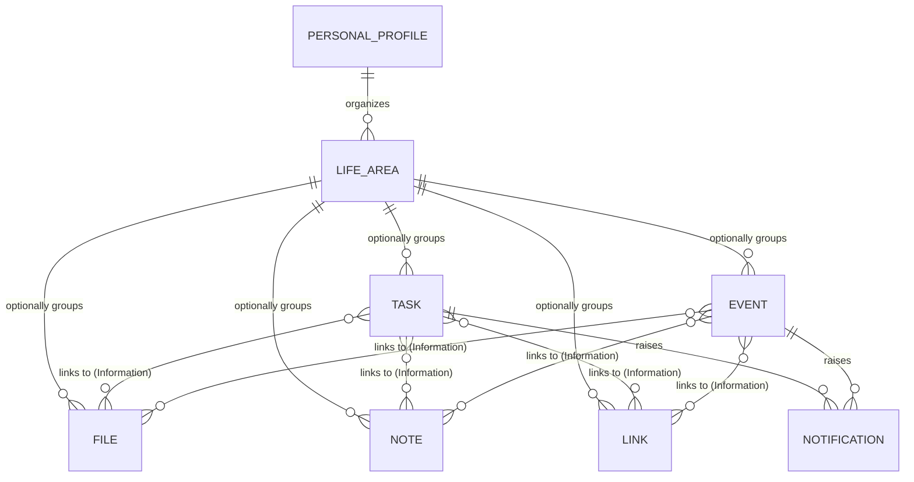
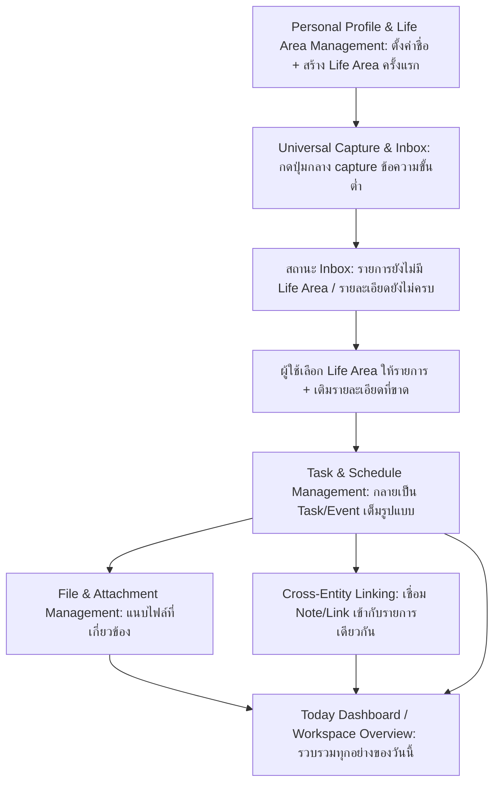
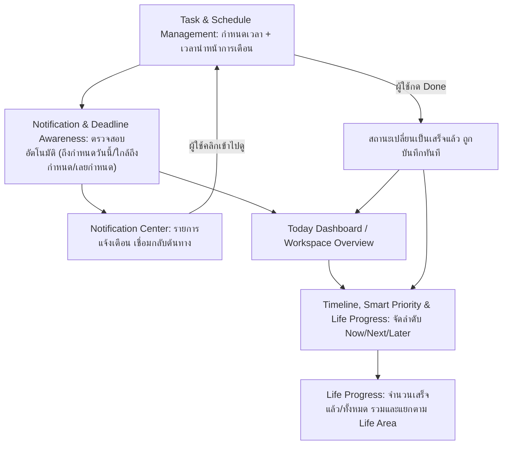

# High-Level Architecture (Conceptual)

เชื่อมโยงกลับ: [[index]]

## คำอธิบาย

เอกสารนี้เป็น **High-Level Architecture แบบ conceptual และ technology-agnostic** — อธิบาย "รูปทรง" ของระบบ (ส่วนประกอบหลักมีอะไรบ้าง, ข้อมูลอะไรมีอยู่ในระบบ, ข้อมูลไหลอย่างไร) โดยตั้งใจ **ไม่เอ่ยชื่อ framework/library/เทคโนโลยีจัดเก็บข้อมูลที่เลือกใช้จริง** แม้ codebase จริงจะเลือกใช้ไปแล้วก็ตาม เนื้อหาที่นี่พูดด้วยภาษา "ความสามารถ" (capability) และ "คุณสมบัติ" (property) เท่านั้น เช่น "ข้อมูลถูกเก็บไว้ในเครื่องผู้ใช้ ข้ามการเปิดใช้งานแต่ละครั้ง" ไม่ใช่ชื่อเทคโนโลยีที่ใช้เก็บ

เอกสารนี้เป็น **living document ที่ regenerate ใหม่ทั้งหมด** จาก spec ปัจจุบันทุกครั้งที่รัน — ไม่ใช่ประวัติสะสมแบบ append-only เหมือน [[../../01-requirements/feature-list|feature-list.md]] และ [[../../01-requirements/user-journey|user-journey.md]] เนื้อหาที่นี่ต้องตรงกับสิ่งที่ spec พูด ณ ปัจจุบันเสมอ ส่วน Database schema, API contract, และการเลือกเทคโนโลยีจริงพร้อมเหตุผล เป็นของเอกสารอื่นที่โฟลเดอร์ [[index|02-technical]] นี้อาจมีเพิ่มในอนาคต (ยังไม่มี ณ ตอนที่เขียนเอกสารนี้) — ไม่ใช่ส่วนหนึ่งของเอกสารนี้

ขอบเขตของเอกสารนี้มีตรง 3 ส่วนเท่านั้น: (1) Conceptual Components, (2) Conceptual Data Model, (3) Data Flow per User Journey

---

## 1. Conceptual Components

ส่วนประกอบหลักของระบบจัดกลุ่มตาม **ความรับผิดชอบ (responsibility)** ไม่ใช่ตามเลข Sprint ที่สร้างขึ้น — ส่วนประกอบหนึ่งอาจเริ่มต้นใน Sprint หนึ่งแล้วขยายขอบเขตต่อในหลาย Sprint ถัดมา คำอธิบายด้านล่างคือรูปทรง **ปัจจุบัน** ของแต่ละส่วนหลังรวมทุก Sprint ที่เกี่ยวข้องเข้าด้วยกันแล้ว

### 1.1 Personal Profile & Life Area Management

หน้าที่: เก็บ "ตัวตน" ของผู้ใช้คนเดียวที่ใช้งานพื้นที่ทำงานนี้ และเก็บ "บริบทชีวิต" (Life Area) ที่ผู้ใช้กำหนดเองเพื่อใช้จัดกลุ่มสิ่งต่างๆ ในระบบ เป็นกลไกกลางที่ทุกส่วนประกอบอื่นอ้างอิงถึงแบบ optional — ไม่มี hierarchy ซ้อนกันของ Life Area, มีแค่ระดับเดียว ผู้ใช้สร้าง/แก้ไข/ลบ Life Area เองได้ทั้งหมด (มีชุดตัวอย่างเริ่มต้นให้ตอนใช้งานครั้งแรกเท่านั้น) การลบ Life Area ไม่ทำให้สิ่งที่เคยผูกอยู่หายไป แค่กลายเป็น "ไม่มี Life Area" เท่านั้น ข้อมูลโปรไฟล์บังคับกรอกน้อยที่สุด (ชื่อ) ส่วนข้อมูลเสริมด้านการศึกษา/องค์กรเป็น optional ล้วน เพื่อไม่ผูกระบบไว้กับกลุ่มผู้ใช้กลุ่มเดียว
เกี่ยวข้องกับ: [[../../01-requirements/01-spec/20260806-007-my-today-sprint7-category-profile|Sprint 7]]

### 1.2 Universal Capture & Inbox

หน้าที่: เป็นทางเข้าข้อมูลที่เร็วที่สุดของระบบ — ให้ผู้ใช้บันทึกสิ่งที่นึกขึ้นได้ (งาน, นัดหมาย, ไฟล์, ข้อความที่ต้องจำ, ลิงก์) จากตำแหน่งใดก็ได้ในพื้นที่ทำงาน โดยกรอกแค่ข้อมูลขั้นต่ำแล้วบันทึกได้ทันที ไม่บังคับจัด Life Area หรือกรอกรายละเอียดครบก่อน สิ่งที่ capture มาจะพักอยู่ในสถานะ "ยังไม่จัดหมวด" (Inbox) จนกว่าผู้ใช้จะมาเลือก Life Area และเติมรายละเอียดที่ขาดในเวลาที่สะดวก ไม่มีการแยกวิเคราะห์ข้อความอิสระด้วยกลไกอัตโนมัติใดๆ — ผู้ใช้เป็นผู้กรอกฟิลด์ต่างๆ เองทั้งหมด ส่วนนี้ยังเป็นจุดที่เพิ่ม entity สองชนิดใหม่เข้าระบบ (บันทึกช่วยจำ และ ลิงก์ที่ต้องเก็บไว้)
เกี่ยวข้องกับ: [[../../01-requirements/01-spec/20260806-009-my-today-sprint8-universal-inbox-quick-capture|Sprint 8]]

### 1.3 Task & Schedule Management

หน้าที่: หัวใจของ "ต้องทำอะไร เมื่อไร" — จัดการทั้งงานที่มีกำหนดส่ง (Task) และนัดหมาย/กิจกรรมที่มีเวลาเริ่ม-สิ้นสุด (Event/Schedule) ผู้ใช้เพิ่ม/แก้ไข/ลบ/เปลี่ยนสถานะได้ครบ พร้อมมุมมองแบบวัน/สัปดาห์/เดือนสำหรับ Event ทั้งสอง entity เชื่อมกับ Life Area ได้แบบ optional (ใช้กลไกเดียวกันไม่ว่าเป็นตารางเรียนหรือประชุมงาน) และไม่มีการสร้างข้อมูลซ้ำระหว่าง Task ที่มี Deadline กับรายการใน Calendar — เป็นข้อมูลชุดเดียวกันที่มองผ่านสองมุมมอง ส่วนนี้ยังเก็บลำดับความสำคัญ (priority) และเวลานำหน้าการเตือนแบบ custom ต่อรายการที่ override ค่าเริ่มต้นของระบบได้
เกี่ยวข้องกับ: [[../../01-requirements/01-spec/20260806-002-my-today-sprint2-task-management|Sprint 2]], [[../../01-requirements/01-spec/20260806-003-my-today-sprint3-calendar-schedule|Sprint 3]], [[../../01-requirements/01-spec/20260806-007-my-today-sprint7-category-profile|Sprint 7]], [[../../01-requirements/01-spec/20260806-010-my-today-sprint9-timeline-priority-progress|Sprint 9]], [[../../01-requirements/01-spec/20260806-011-my-today-sprint10-task-event-file-linking|Sprint 10]]

### 1.4 File & Attachment Management

หน้าที่: ตอบคำถาม "ไฟล์ที่ต้องใช้กับงานนี้อยู่ไหน" — ให้ผู้ใช้เพิ่ม/ตั้งชื่อ/จัดหมวดหมู่/ระบุ Life Area ของไฟล์ ค้นหา พรีวิว (เท่าที่ทำได้) และดาวน์โหลดกลับออกไปได้ ไฟล์ทั้งหมดเก็บอยู่ในเครื่องผู้ใช้เท่านั้น ไม่ถูกส่งออกไปที่อื่น จุดสำคัญที่สุดของส่วนนี้คือความสัมพันธ์กับ Task/Event — เปิดรายการงานแล้วเห็นไฟล์ที่เกี่ยวข้องทันทีโดยไม่ต้องสลับหน้าไปค้นเอง
เกี่ยวข้องกับ: [[../../01-requirements/01-spec/20260806-004-my-today-sprint4-file-organizer|Sprint 4]], [[../../01-requirements/01-spec/20260806-011-my-today-sprint10-task-event-file-linking|Sprint 10]]

### 1.5 Notification & Deadline Awareness

หน้าที่: ตอบคำถาม "อะไรใกล้จะพลาดแล้ว" — เฝ้าสังเกตข้อมูล Task/Event ที่มีอยู่แบบอัตโนมัติ แบ่งระดับความเร่งด่วนเป็นถึงกำหนดวันนี้ / ใกล้ถึงกำหนด / เลยกำหนดไปแล้ว รวมศูนย์เป็น Notification Center ที่มีสถานะอ่านแล้ว/ยังไม่อ่าน และคลิกแล้วย้อนกลับไปที่ต้นทางได้ทันที เวลานำหน้าการเตือนมีค่าเริ่มต้นกลางของระบบ แต่ผู้ใช้ override เป็นค่าเฉพาะต่อ Task/Event แต่ละรายการได้ ความสามารถนี้ทำงานได้ครบถ้วนด้วยตัวเองอยู่แล้ว — การขอสิทธิ์แจ้งเตือนระดับอุปกรณ์ (ถ้ามี) เป็นเพียงส่วนเสริมที่ไม่จำเป็นต้องอนุญาตก็ใช้งานได้ปกติ
เกี่ยวข้องกับ: [[../../01-requirements/01-spec/20260806-005-my-today-sprint5-notification-deadline-awareness|Sprint 5]], [[../../01-requirements/01-spec/20260806-011-my-today-sprint10-task-event-file-linking|Sprint 10]]

### 1.6 Timeline, Smart Priority & Life Progress

หน้าที่: ตอบคำถาม "ตอนนี้ต้องทำอะไรก่อน" แบบไม่ต้องมองภาพรวมทั้งเดือน — รวม Task ที่มีกำหนดส่งและ Event จากทุก Life Area เข้าด้วยกันเป็นมุมมองเดียวที่แบ่ง 3 ช่วง (ถึงเวลาแล้ว/ใกล้ถึง, ที่เหลือของวันนี้, ไกลออกไปอีกของวันนี้) พร้อมจัดลำดับด้วยกฎตายตัว (เลยกำหนดมาก่อนเสมอ ตามด้วยถึงกำหนดวันนี้ ตามด้วยลำดับความสำคัญสูง แล้วจึงลำดับปกติ — ไม่มีการประมวลผลแบบปรับตัวเองหรือเรียนรู้ใดๆ) และแสดงความคืบหน้าของวันแบบไม่ตัดสิน/ไม่ให้คะแนน (จำนวนที่เสร็จแล้วเทียบทั้งหมด ทั้งแบบรวมและแยกตาม Life Area)
เกี่ยวข้องกับ: [[../../01-requirements/01-spec/20260806-010-my-today-sprint9-timeline-priority-progress|Sprint 9]]

### 1.7 Cross-Entity Linking (What / When / Information)

หน้าที่: ให้ Task หรือ Event หนึ่งรายการรวมทุกมิติที่เกี่ยวข้องไว้ในหน้าเดียว — **What** (รายละเอียดงาน+Life Area), **When** (กำหนดเวลา+การเตือน), **Information** (ไฟล์ + บันทึกช่วยจำ + ลิงก์ที่เกี่ยวข้องทั้งหมด) โดยไม่ต้องสลับไปมาหลายหน้าเพื่อประกอบข้อมูลเอง ส่วนนี้ต่อยอดจากความสัมพันธ์ Task-File พื้นฐานที่มีอยู่แล้ว ให้ครอบคลุมบันทึกช่วยจำและลิงก์ด้วย และใช้กลไกเดียวกันกับทั้ง Task และ Event
เกี่ยวข้องกับ: [[../../01-requirements/01-spec/20260806-004-my-today-sprint4-file-organizer|Sprint 4]], [[../../01-requirements/01-spec/20260806-009-my-today-sprint8-universal-inbox-quick-capture|Sprint 8]], [[../../01-requirements/01-spec/20260806-011-my-today-sprint10-task-event-file-linking|Sprint 10]]

### 1.8 Today Dashboard / Workspace Overview

หน้าที่: จุดเปิดแรกของพื้นที่ทำงานที่รวบรวมทุกส่วนประกอบด้านบนมาสรุปให้เห็นในหน้าเดียว — คำทักทาย+วันที่ปัจจุบัน, ตัวเลขสรุป (งานทั้งหมด/เสร็จแล้ว/ยังไม่เสร็จ/ใกล้ครบกำหนด), งานของวันนี้, ตารางของวันนี้, รายการที่ใกล้ถึงกำหนด, และช่องทางเพิ่มรายการใหม่แบบเร็ว เมื่อส่วนประกอบอื่นๆ ถูกเพิ่มเข้ามา (Task/Event จริง, การแจ้งเตือน, Timeline/Life Progress) หน้านี้จะดึงข้อมูลจากส่วนประกอบเหล่านั้นมาแสดงเพิ่มโดยอัตโนมัติ ไม่ใช่คำนวณซ้ำเอง หน้านี้ยังเป็นจุดที่พาไปยังประกาศเรื่องความเป็นส่วนตัว/ข้อกำหนดการใช้งาน ซึ่งเข้าถึงได้จากทุกหน้าของระบบ เพื่อบอกผู้ใช้ว่าทุกอย่างที่อธิบายในเอกสารนี้ถูกเก็บอยู่ในเครื่องของตนเองเท่านั้น
เกี่ยวข้องกับ: [[../../01-requirements/01-spec/20260806-001-my-today-sprint1-today-dashboard|Sprint 1]], [[../../01-requirements/01-spec/20260806-002-my-today-sprint2-task-management|Sprint 2]], [[../../01-requirements/01-spec/20260806-003-my-today-sprint3-calendar-schedule|Sprint 3]], [[../../01-requirements/01-spec/20260806-005-my-today-sprint5-notification-deadline-awareness|Sprint 5]], [[../../01-requirements/01-spec/20260806-006-my-today-sprint6-integration-ux-final-testing|Sprint 6]], [[../../01-requirements/01-spec/20260806-010-my-today-sprint9-timeline-priority-progress|Sprint 9]]

**หมายเหตุ:** [[../../01-requirements/01-spec/20260806-006-my-today-sprint6-integration-ux-final-testing|Sprint 6]] และ [[../../01-requirements/01-spec/20260806-012-my-today-sprint11-competition-demo-freeze|Sprint 11]] ไม่ได้เพิ่มส่วนประกอบใหม่ — ทั้งสองเป็น Sprint ปิดจบที่ทำให้ส่วนประกอบข้างต้นทำงานร่วมกันได้ครบ (integration), ปรับ UX ให้มาตรฐานเดียวกัน, และพิสูจน์ว่า 2 persona (นักศึกษา / บุคคลทั่วไป) ใช้ส่วนประกอบชุดเดียวกันได้โดยไม่มี logic แยกกัน — สอดคล้องกับ Part 3 ด้านล่าง

---

## 2. Conceptual Data Model

### รายการ Entity และคุณสมบัติ (เชิงแนวคิด — ไม่ระบุ data type)

- **Personal Profile** — ชื่อที่ใช้แสดง (ข้อมูลเดียวที่เกือบบังคับ), รูปประจำตัว (optional), อีเมล (optional), ชื่อเล่น/ชื่อที่ต้องการให้เรียก (optional), และกลุ่มข้อมูลเสริมแบบ optional ล้วนสำหรับผู้ที่ต้องการบันทึกบริบทการศึกษา (รหัสนักศึกษา, คณะ, สาขา) หรือบริบทองค์กร (หน่วยงาน, ตำแหน่ง) มีอยู่แค่ 1 ชุดต่อการติดตั้งใช้งาน เพราะพื้นที่ทำงานนี้ไม่มีระบบบัญชี/ผู้ใช้หลายคน
- **Life Area** — ชื่อที่ผู้ใช้กำหนดเอง (เช่น Work, Study, Family, Finance, Health, Personal, Project) เป็นระดับเดียว ไม่มีลำดับชั้นซ้อนกัน สร้าง/แก้ไข/ลบได้อิสระ
- **Task** — ชื่องาน, รายละเอียด, Life Area ที่เกี่ยวข้อง (optional), วันที่/เวลากำหนดส่ง, ลำดับความสำคัญ, สถานะความคืบหน้า, วันที่สร้าง, เวลานำหน้าการเตือนแบบกำหนดเอง (optional, override ค่าเริ่มต้นกลาง), และรายการไฟล์/บันทึก/ลิงก์ที่เชื่อมไว้ (optional)
- **Event / Schedule Item** — ชื่อกิจกรรม, ประเภท, วันที่, เวลาเริ่ม-สิ้นสุด, สถานที่, รายละเอียด, Life Area ที่เกี่ยวข้อง (optional), เวลานำหน้าการเตือนแบบกำหนดเอง (optional), และรายการไฟล์/บันทึก/ลิงก์ที่เชื่อมไว้ (optional) — ใช้กลไกเชื่อมโยงเดียวกับ Task ทุกประการ
- **File** — ชื่อที่ตั้งไว้, หมวดหมู่, Life Area ที่เกี่ยวข้อง (optional), เนื้อหาไฟล์จริงที่เก็บอยู่ในเครื่องผู้ใช้, และการเชื่อมโยงกลับไปยัง Task/Event ที่ต้องใช้ไฟล์นั้น (optional)
- **Note** — หัวข้อ/ชื่อ, เนื้อหาข้อความ, Life Area ที่เกี่ยวข้อง (optional), วันที่สร้าง, และการเชื่อมโยงไปยัง Task/Event (optional) — ไม่มีกำหนดส่ง/ลำดับความสำคัญ/สถานะเหมือน Task
- **Link** — ชื่อ, ที่อยู่เว็บที่ต้องการเก็บไว้, Life Area ที่เกี่ยวข้อง (optional), วันที่สร้าง, และการเชื่อมโยงไปยัง Task/Event (optional)
- **Notification** — ข้อความ, เวลาที่เกิด, การอ้างอิงกลับไปยัง Task/Event ต้นทาง, ระดับความเร่งด่วน (ถึงกำหนดวันนี้/ใกล้ถึงกำหนด/เลยกำหนด), และสถานะอ่านแล้ว/ยังไม่อ่าน
- **Inbox Item** — **ไม่ใช่ entity แยกที่เก็บข้อมูลของตัวเอง** แต่เป็น "สถานะ" ของ Task/Event/File/Note/Link รายการใดๆ ที่ยังไม่ถูกกำหนด Life Area และยังกรอกแค่ข้อมูลขั้นต่ำ (ประเภท + ชื่อ/ข้อความ) — เมื่อผู้ใช้จัดเข้า Life Area และเติมรายละเอียดที่เหลือแล้ว รายการนั้นจะกลายเป็นสมาชิกปกติของ entity ประเภทนั้น ไม่มีการสร้างข้อมูลซ้ำสองชุด

### แผนภาพความสัมพันธ์

**หมายเหตุการอ่านแผนภาพ:** ทุกความสัมพันธ์ที่ชี้ออกจาก Life Area เป็น optional ทั้งสิ้น (Task/Event/File/Note/Link ที่ไม่มี Life Area ยังใช้งานได้ปกติ) ส่วน Inbox Item ไม่ปรากฏเป็น entity ในแผนภาพนี้เพราะเป็นสถานะ "ยังไม่มีเส้นเชื่อมไปยัง LIFE_AREA" ของ 5 entity ด้านบน ไม่ใช่ entity ที่ 6 ที่แยกออกไป

---

## 3. Data Flow per User Journey

ระบบนี้เป็น **client-only ไม่มี Backend** — ทุกขั้นตอนของ data flow ด้านล่างเกิดขึ้นทั้งหมดภายในเครื่องของผู้ใช้คนเดียว ภายใต้ Personal Profile ชุดเดียวที่มีอยู่เสมอ และทั้งสอง persona ที่ [[../../01-requirements/user-journey|user-journey.md]] ติดตาม (นักศึกษา และ บุคคลทั่วไป) เดินผ่าน data flow ชุดเดียวกันนี้ทุกจุด — ต่างกันแค่ชื่อ Life Area และข้อความที่พิมพ์เข้าไป ไม่มี logic แยกตาม persona ที่จุดใดเลย

### 3.1 จาก Setup ถึงการรวมข้อมูลบน Dashboard

**คำอธิบาย:** เริ่มจากตั้งค่าโปรไฟล์และ Life Area ครั้งแรก ([[../../01-requirements/user-journey#Persona 1: นักศึกษา (Student)|Step 1]] ของทั้งสอง persona) จากนั้นผู้ใช้กดปุ่มกลาง capture ข้อความอิสระเข้า Inbox ก่อน ([[../../01-requirements/user-journey#Persona 1: นักศึกษา (Student)|Step 3]]) เปิดหน้า Inbox มาจัดรายการเข้า Life Area ที่เหมาะสม ([[../../01-requirements/user-journey#Persona 1: นักศึกษา (Student)|Step 4]]) แล้วเติมรายละเอียด (กำหนดส่ง, ลำดับความสำคัญ) จนกลายเป็น Task/Event ปกติ ([[../../01-requirements/user-journey#Persona 1: นักศึกษา (Student)|Step 5-6]]) จากนั้นแนบไฟล์และเชื่อมบันทึก/ลิงก์ที่เกี่ยวข้องเข้ากับรายการเดียวกัน ([[../../01-requirements/user-journey#Persona 1: นักศึกษา (Student)|Step 7-8]]) ทุกอย่างที่ถูกสร้าง/แก้ไขจะถูกเก็บไว้ในเครื่องผู้ใช้ทันทีและคงอยู่ข้ามการเปิดใช้งานแต่ละครั้ง แล้วไหลรวมกันขึ้นมาแสดงบน Today Dashboard โดยอัตโนมัติ — Dashboard ไม่เก็บสำเนาข้อมูลของตัวเอง เป็นแค่มุมมองที่อ่านจากที่เดียวกัน

### 3.2 การเฝ้าติดตามกำหนดเวลา และวงจรป้อนกลับเมื่อทำเสร็จ

**คำอธิบาย:** เมื่อ Task/Event มีกำหนดเวลาและเวลานำหน้าการเตือนแล้ว ระบบตรวจสอบอัตโนมัติและสร้างรายการใน Notification Center ที่ผู้ใช้คลิกย้อนกลับไปต้นทางได้ ([[../../01-requirements/user-journey#Persona 1: นักศึกษา (Student)|Step 9]]) ระหว่างวัน ผู้ใช้เปิดมุมมอง Timeline Now/Next/Later แทนการเปิด Calendar เต็มเดือน เห็นรายการเรียงตาม Smart Priority พร้อม Life Progress แยกตาม Life Area ([[../../01-requirements/user-journey#Persona 1: นักศึกษา (Student)|Step 10]]) เมื่อทำงานเสร็จและกด Done การเปลี่ยนสถานะจะถูกบันทึกและไหลย้อนกลับไปอัปเดตทั้ง Today Dashboard และ Life Progress ทันทีโดยไม่ต้องรีเฟรชหน้า ([[../../01-requirements/user-journey#Persona 1: นักศึกษา (Student)|Step 11]]) ทั้งสอง flow นี้ถูกใช้พิสูจน์ end-to-end อีกครั้งในสอง final journey ที่ยืนยันว่า Core เดียวกันรองรับทั้งสอง persona — [[../../01-requirements/user-journey#Persona 1: นักศึกษา (Student)|Step 12 (Final Journey ของ Version 1/Core)]] และ [[../../01-requirements/user-journey#Persona 1: นักศึกษา (Student)|Step 13 (Final Competition Journey ของ Version 2)]]
