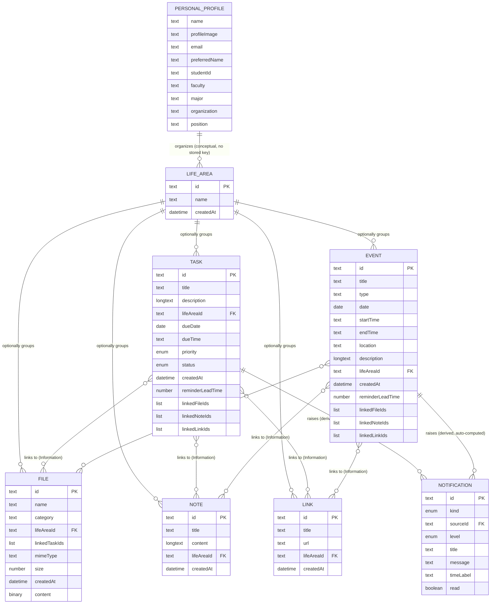

# Database Schema (Conceptual)

เชื่อมโยงกลับ: [[index]]

## คำอธิบาย

เอกสารนี้เป็น **Database Schema แบบ conceptual และ technology-agnostic** — อธิบายว่าระบบมี table/entity อะไรบ้าง แต่ละ table มี field อะไร เป็นชนิดข้อมูลเชิงแนวคิดแบบไหน (`text`, `long text`, `number`, `date`, `date+time`, `boolean`, `enum`, `reference`, `list of {type}`) จำเป็นหรือไม่ และเชื่อมกับ table อื่นอย่างไร โดยตั้งใจ **ไม่เอ่ยชื่อ storage technology ที่เลือกใช้จริง** (ไม่มีชื่อ database product, ไม่มี concrete column type แบบ `VARCHAR`/`INTEGER`, ไม่มี syntax ของภาษาโปรแกรมมิ่งใดๆ) แม้ codebase จริงจะเลือกใช้ไปแล้วก็ตาม — คำว่า "table" ในเอกสารนี้หมายถึง "ที่เก็บ record ของ entity ประเภทหนึ่ง" เท่านั้น ไม่ได้บอกเป็นนัยว่าใช้ engine ชนิดใด

เอกสารนี้เป็น **living document ที่ regenerate ใหม่ทั้งหมด** จาก spec ปัจจุบันทุกครั้งที่รัน (เหมือน [[architecture|architecture.md]]) — ไม่ใช่ประวัติสะสมแบบ append-only เอกสารคู่หูของไฟล์นี้คือ [[architecture#2. Conceptual Data Model|Conceptual Data Model ของ architecture.md]] ซึ่งให้ภาพรวม entity/relationship ระดับสูง ส่วนไฟล์นี้ลงรายละเอียดระดับ field และ ER diagram แบบเต็ม เนื้อหาทั้งหมดแปลมาจาก spec ที่ [[../../01-requirements/01-spec/index|01-requirements/01-spec/]] — อ่านที่นั่นเพื่อดูถ้อยคำต้นฉบับและ Business Rules แบบละเอียด

**สถานะ grounding ต่อ table:** Personal Profile, Life Area, Task, Event/Schedule Item, File มี code จริงรองรับแล้วใน `src/types.ts` (Sprint 1-7) — field ในเอกสารนี้แปลจาก interface จริงเป็นภาษาเชิงแนวคิด ส่วน Note, Link (Sprint 8) ยังไม่มี code รองรับ — field มาจากตัว spec เพียงอย่างเดียว และบาง field ของ Task/Event ที่ระบุใน Sprint 10 (เช่น `linkedNoteIds`, `linkedLinkIds`, `reminderLeadTime`) ก็ยังไม่ปรากฏใน code จริง ณ ตอนเขียนเอกสารนี้ — ระบุไว้ชัดเจนในแต่ละ table ด้านล่าง

---

## Personal Profile

**หน้าที่:** เก็บ "ตัวตน" ของผู้ใช้คนเดียวที่ใช้งาน workspace นี้ — มีอยู่แค่ 1 record ต่อการติดตั้งใช้งานเสมอ เพราะระบบไม่มีระบบบัญชี/ผู้ใช้หลายคน (ที่มา: [[../../01-requirements/01-spec/20260806-007-my-today-sprint7-category-profile|Sprint 7]])

| Field | Type | Required? | Description | Constraints |
|---|---|---|---|---|
| name | text | Required (ควรบังคับกรอกอย่างน้อยชื่อ — spec ปล่อยให้ทีมพัฒนาตัดสินใจระดับ UI ว่าจะบังคับตั้งแต่ต้นทันทีหรือยอมให้ว่างไว้ก่อนได้) | ชื่อที่ใช้แสดงในระบบ | ไม่มีข้อจำกัดความยาว/รูปแบบที่ระบุใน spec |
| profileImage | text (ค่าอ้างอิง/ข้อมูลรูปภาพ) | Optional | รูปประจำตัว | - |
| email | text | Optional | อีเมลติดต่อ | ไม่มีการตรวจสอบรูปแบบที่ระบุใน spec |
| preferredName | text | Optional | ชื่อเล่น/ชื่อที่ต้องการให้เรียก | - |
| studentId | text | Optional | รหัสนักศึกษา — สำหรับผู้ใช้กลุ่มนักศึกษา | ห้ามบังคับกรอกเด็ดขาด (Sprint 7 Business Rule ข้อ 4) |
| faculty | text | Optional | คณะ | ห้ามบังคับกรอกเด็ดขาด |
| major | text | Optional | สาขา | ห้ามบังคับกรอกเด็ดขาด |
| organization | text | Optional | หน่วยงาน/องค์กร — สำหรับผู้ใช้กลุ่มพนักงาน/อาชีพอื่น | ห้ามบังคับกรอกเด็ดขาด |
| position | text | Optional | ตำแหน่งงาน | ห้ามบังคับกรอกเด็ดขาด |

**หมายเหตุ:** ไม่มี field `id`/วันที่สร้าง เพราะเป็น record เดี่ยว (singleton) — ไม่จำเป็นต้องแยกแยะจาก record อื่นในประเภทเดียวกัน

**ความสัมพันธ์:** เป็น "เจ้าของ" Life Area ทั้งหมดในเชิงแนวคิดเท่านั้น (ดู [[architecture#2. Conceptual Data Model|architecture.md]]) — ไม่มี field อ้างอิงจริงระหว่าง Personal Profile กับ Life Area เพราะมี Personal Profile แค่ชุดเดียวเสมอในระบบ

---

## Life Area

**หน้าที่:** บริบทชีวิตที่ผู้ใช้กำหนดเอง (เช่น Work, Study, Family, Finance, Health, Personal, Project) ใช้จัดกลุ่ม Task/Event/File/Note/Link ข้ามทุกประเภท เป็นระดับเดียว ไม่มี hierarchy ซ้อนกัน (ที่มา: [[../../01-requirements/01-spec/20260806-007-my-today-sprint7-category-profile|Sprint 7]] — เดิมชื่อ "Category" ก่อน rename)

| Field | Type | Required? | Description | Constraints |
|---|---|---|---|---|
| id | text (ตัวระบุเฉพาะ) | Required | ตัวระบุ record | สร้างอัตโนมัติตอนสร้าง record |
| name | text | Required | ชื่อ Life Area ที่ผู้ใช้กำหนดเอง | ไม่มีชุดค่าตายตัว ผู้ใช้พิมพ์เองได้อิสระ; มีชุดตัวอย่าง seed ให้ตอนใช้งานครั้งแรกเท่านั้น (ผู้ใช้แก้ไข/ลบ/เพิ่มเองได้ภายหลัง) |
| createdAt | date+time | Required | วันเวลาที่สร้าง record | กำหนดอัตโนมัติตอนสร้าง |

**ความสัมพันธ์:** ถูกอ้างอิงแบบ **optional** จาก Task, Event, File, Note, Link (field `lifeAreaId` ของแต่ละ table) — การลบ Life Area **ไม่ลบ** record ที่เคยอ้างอิงถึง เพียงทำให้ field `lifeAreaId` ของ record เหล่านั้นกลายเป็นค่าว่าง (Sprint 7 Acceptance Criteria)

---

## Task

**หน้าที่:** งานที่มีกำหนดส่ง — ครอบคลุมมิติ "What" (รายละเอียดงาน) และ "When" (กำหนดเวลา) เริ่มจาก [[../../01-requirements/01-spec/20260806-002-my-today-sprint2-task-management|Sprint 2]] (CRUD + เก็บไว้ในเครื่องผู้ใช้ ข้ามการเปิดใช้งานแต่ละครั้ง), เพิ่ม `lifeAreaId` แทนที่ free-text "รายวิชา" เดิมใน [[../../01-requirements/01-spec/20260806-007-my-today-sprint7-category-profile|Sprint 7]], รองรับ field ขั้นต่ำตอน quick-capture ผ่าน [[../../01-requirements/01-spec/20260806-009-my-today-sprint8-universal-inbox-quick-capture|Sprint 8]], และเพิ่ม field เชื่อมโยง Note/Link + reminder เฉพาะรายการใน [[../../01-requirements/01-spec/20260806-011-my-today-sprint10-task-event-file-linking|Sprint 10]]

| Field | Type | Required? | Description | Constraints |
|---|---|---|---|---|
| id | text | Required | ตัวระบุเฉพาะของ Task | สร้างอัตโนมัติตอนสร้าง record |
| title | text | Required | ชื่องาน | ต้องมีอย่างน้อยชื่องานเสมอ แม้ capture แบบเร็วผ่าน Inbox (Sprint 8 Business Rule ข้อ 1) |
| description | long text | Required ตามที่ระบุครั้งแรกใน Sprint 2 Business Rule ข้อ 1 แต่อนุญาตให้ว่างไว้ก่อนได้ชั่วคราวหากรายการยังอยู่ในสถานะ Inbox (Sprint 8 Business Rule ข้อ 1) | รายละเอียดงาน (What) | - |
| lifeAreaId | reference (to Life Area) | Optional (Sprint 7 Business Rule ข้อ 2 override ข้อบังคับเดิมของ Sprint 2) | Life Area ที่เกี่ยวข้อง | Task ที่ไม่ระบุ Life Area ยังใช้งานได้ปกติ |
| dueDate | date | Required ตาม Sprint 2 แต่เว้นว่างไว้ก่อนได้ชั่วคราวระหว่างอยู่ใน Inbox (Sprint 8) | วันที่กำหนดส่ง (When) | - |
| dueTime | date+time (เฉพาะส่วนเวลา) | Required ตาม Sprint 2 แต่เว้นว่างไว้ก่อนได้ชั่วคราวระหว่างอยู่ใน Inbox (Sprint 8) | เวลากำหนดส่ง (When) | - |
| priority | enum (one of: High, Medium, Low) | Required ตาม Sprint 2 แต่เว้นว่างไว้ก่อนได้ชั่วคราวระหว่างอยู่ใน Inbox (Sprint 8) | ลำดับความสำคัญ | ใช้เป็นปัจจัยจัดลำดับใน Smart Priority (Sprint 9) |
| status | enum (one of: To Do, Doing, Done) | Required | สถานะความคืบหน้า | ค่าเริ่มต้นตอนสร้างคือ "To Do"; Done ใช้คำนวณ Life Progress (Sprint 9) |
| createdAt | date+time | Required | วันที่สร้าง record | กำหนดอัตโนมัติตอนสร้าง |
| reminderLeadTime | number (เวลานำหน้าก่อนกำหนด) | Optional | ค่าที่ override เวลานำหน้าการเตือนกลางของระบบ (Sprint 5) เฉพาะ Task รายการนี้ | ที่มา: [[../../01-requirements/01-spec/20260806-011-my-today-sprint10-task-event-file-linking|Sprint 10]] Business Rule ข้อ 2 — **spec-derived เท่านั้น ยังไม่ปรากฏใน code จริง** |
| linkedFileIds | list of reference (to File) | Optional | ไฟล์ที่เชื่อมไว้ (Information) | ที่มา: [[../../01-requirements/01-spec/20260806-004-my-today-sprint4-file-organizer|Sprint 4]]/[[../../01-requirements/01-spec/20260806-011-my-today-sprint10-task-event-file-linking|Sprint 10]] — **ใน code จริงปัจจุบัน ความสัมพันธ์นี้ถูก implement กลับทางจาก field `linkedTaskIds` บน table File เท่านั้น ไม่ใช่ field บน Task โดยตรง** |
| linkedNoteIds | list of reference (to Note) | Optional | บันทึกที่เชื่อมไว้ (Information) | ที่มา: [[../../01-requirements/01-spec/20260806-011-my-today-sprint10-task-event-file-linking|Sprint 10]] Business Rule ข้อ 1 — **spec-derived เท่านั้น ยังไม่ปรากฏใน code จริง** (Note เองก็ยังไม่มี code รองรับ) |
| linkedLinkIds | list of reference (to Link) | Optional | ลิงก์ที่เชื่อมไว้ (Information) | ที่มา: [[../../01-requirements/01-spec/20260806-011-my-today-sprint10-task-event-file-linking|Sprint 10]] Business Rule ข้อ 1 — **spec-derived เท่านั้น ยังไม่ปรากฏใน code จริง** (Link เองก็ยังไม่มี code รองรับ) |

**ความสัมพันธ์:**
- อ้างอิงไปยัง Life Area แบบ optional — คีย์ Life Area ที่ถูกลบแล้วจะกลายเป็นค่าว่าง ไม่ลบ record นี้ ([[../../01-requirements/01-spec/20260806-007-my-today-sprint7-category-profile|Sprint 7]])
- เชื่อมกับ File/Note/Link แบบ many-to-many ผ่าน list ของ reference ด้านบน ([[../../01-requirements/01-spec/20260806-004-my-today-sprint4-file-organizer|Sprint 4]], [[../../01-requirements/01-spec/20260806-011-my-today-sprint10-task-event-file-linking|Sprint 10]])
- ไม่สร้างข้อมูลซ้ำกับ Calendar/Event — Task ที่มี `dueDate` จะถูกดึงไปแสดงในมุมมอง Calendar โดยอัตโนมัติ เป็นข้อมูลชุดเดียวกันที่มองผ่านสองมุมมอง ไม่ใช่ record คนละชุด ([[../../01-requirements/01-spec/20260806-003-my-today-sprint3-calendar-schedule|Sprint 3]] Business Rule ข้อ 2-3)
- เป็นต้นทางที่ทำให้เกิด Notification (ดู table Notification ด้านล่าง) เมื่อใกล้/เลยกำหนดส่ง ([[../../01-requirements/01-spec/20260806-005-my-today-sprint5-notification-deadline-awareness|Sprint 5]])

---

## Event / Schedule Item

**หน้าที่:** นัดหมาย/กิจกรรม/ตารางเรียนที่มีเวลาเริ่ม-สิ้นสุด — ครอบคลุมมิติ "When" เช่นเดียวกับ Task แต่เป็นกิจกรรมไม่ใช่งานที่ต้องส่ง (ที่มา: [[../../01-requirements/01-spec/20260806-003-my-today-sprint3-calendar-schedule|Sprint 3]], เพิ่ม `lifeAreaId` ใน Sprint 3 Business Rule ข้อ 7 ตาม [[../../01-requirements/01-spec/20260806-007-my-today-sprint7-category-profile|Sprint 7]], เพิ่มการเชื่อม Note/Link/File + reminder ใน [[../../01-requirements/01-spec/20260806-011-my-today-sprint10-task-event-file-linking|Sprint 10]] Business Rule ข้อ 4)

| Field | Type | Required? | Description | Constraints |
|---|---|---|---|---|
| id | text | Required | ตัวระบุเฉพาะของ Event | สร้างอัตโนมัติตอนสร้าง record |
| title | text | Required | ชื่อกิจกรรม | - |
| type | text (free text, ไม่มีชุดค่าตายตัวใน spec) | Required | ประเภทกิจกรรม เช่น เรียน, ประชุม, นัดหมายส่วนตัว | - |
| date | date | Required | วันที่จัดกิจกรรม | - |
| startTime | date+time (เฉพาะส่วนเวลา) | Required | เวลาเริ่ม | - |
| endTime | date+time (เฉพาะส่วนเวลา) | Required | เวลาสิ้นสุด | ควรอยู่หลังเวลาเริ่ม (เป็นสมมติฐานเชิงตรรกะ — spec ไม่ได้ระบุการตรวจสอบนี้ไว้ชัดเจน) |
| location | text | Optional | สถานที่ | - |
| description | long text | Optional | รายละเอียดกิจกรรม | - |
| lifeAreaId | reference (to Life Area) | Optional | Life Area ที่เกี่ยวข้อง | Event ที่ไม่ระบุ Life Area ยังใช้งานได้ปกติ ([[../../01-requirements/01-spec/20260806-003-my-today-sprint3-calendar-schedule|Sprint 3]] Business Rule ข้อ 7) |
| createdAt | date+time | Required | วันที่สร้าง record | กำหนดอัตโนมัติตอนสร้าง |
| reminderLeadTime | number (เวลานำหน้าก่อนกำหนด) | Optional | ค่าที่ override เวลานำหน้าการเตือนกลางของระบบเฉพาะ Event รายการนี้ | ที่มา: [[../../01-requirements/01-spec/20260806-011-my-today-sprint10-task-event-file-linking|Sprint 10]] Business Rule ข้อ 4 (ขยายกลไก Business Rule ข้อ 2 ของ Task มาใช้กับ Event) — **spec-derived เท่านั้น ยังไม่ปรากฏใน code จริง** |
| linkedFileIds | list of reference (to File) | Optional | ไฟล์ที่เชื่อมไว้ (Information) | **spec-derived เท่านั้น ยังไม่ปรากฏใน code จริง** — ปัจจุบัน table File มี field เชื่อมกลับไปยัง Task เท่านั้น (`linkedTaskIds`) ยังไม่มี field เทียบเท่าสำหรับ Event |
| linkedNoteIds | list of reference (to Note) | Optional | บันทึกที่เชื่อมไว้ (Information) | **spec-derived เท่านั้น ยังไม่ปรากฏใน code จริง** (Note เองก็ยังไม่มี code รองรับ) |
| linkedLinkIds | list of reference (to Link) | Optional | ลิงก์ที่เชื่อมไว้ (Information) | **spec-derived เท่านั้น ยังไม่ปรากฏใน code จริง** (Link เองก็ยังไม่มี code รองรับ) |

**หมายเหตุ grounding เพิ่มเติม:** code จริงปัจจุบันยังมีรูปทรงข้อมูลเสริมอีกชนิดหนึ่งชื่อแนวคิด "รายการของวัน" (รวม Task+Event เข้าด้วยกันเป็นรายการเดียวสำหรับแสดงผลต่อวัน — มี ประเภท(งาน/กิจกรรม), ชื่อ, ป้ายเวลา, ป้ายรายละเอียดย่อย, และคีย์สำหรับจัดเรียง) แต่นี่เป็นเพียง **มุมมองที่คำนวณสด (derived view) สำหรับแสดงผล ไม่ใช่ table ที่เก็บข้อมูลของตัวเอง** จึงไม่มี section แยกในเอกสารนี้

**ความสัมพันธ์:**
- อ้างอิงไปยัง Life Area แบบ optional — เหมือน Task ทุกประการ (ใช้กลไกเดียวกัน)
- เชื่อมกับ File/Note/Link แบบ many-to-many เหมือน Task ([[../../01-requirements/01-spec/20260806-011-my-today-sprint10-task-event-file-linking|Sprint 10]] Business Rule ข้อ 4)
- เป็นต้นทางที่ทำให้เกิด Notification เมื่อใกล้เริ่ม/เลยเวลา เช่นเดียวกับ Task ([[../../01-requirements/01-spec/20260806-005-my-today-sprint5-notification-deadline-awareness|Sprint 5]])

---

## File

**หน้าที่:** ไฟล์ที่ผู้ใช้แนบเก็บไว้ในเครื่องของตัวเองเท่านั้น ไม่ถูกส่งออกไปที่อื่น จุดสำคัญที่สุดคือความสัมพันธ์กับ Task (Related Files) (ที่มา: [[../../01-requirements/01-spec/20260806-004-my-today-sprint4-file-organizer|Sprint 4]])

| Field | Type | Required? | Description | Constraints |
|---|---|---|---|---|
| id | text | Required | ตัวระบุเฉพาะของ File | สร้างอัตโนมัติตอนสร้าง record |
| name | text | Required | ชื่อที่ตั้งไว้ (อาจต่างจากชื่อไฟล์จริงบนเครื่องผู้ใช้) | - |
| category | text (free text, ไม่มีชุดค่าตายตัวใน spec) | Optional | หมวดหมู่ที่ผู้ใช้กำหนด | - |
| lifeAreaId | reference (to Life Area) | Optional | Life Area ที่เกี่ยวข้อง | File ที่ไม่ระบุ Life Area ยังใช้งานได้ปกติ |
| linkedTaskIds | list of reference (to Task) | Optional | Task ที่ไฟล์นี้เกี่ยวข้อง (Related Files) | ที่มา: [[../../01-requirements/01-spec/20260806-004-my-today-sprint4-file-organizer|Sprint 4]] Business Rule ข้อ 3 — เปิด Task แล้วต้องเห็น Related Files ทันที |
| mimeType | text | Required | ประเภทเนื้อหาไฟล์ | ใช้กำหนดว่า Preview ได้แค่ไหน (จำกัดตามที่ browser รองรับ) |
| size | number | Required | ขนาดไฟล์ (หน่วยไบต์) | - |
| createdAt | date+time | Required | วันที่สร้าง/เพิ่ม record | กำหนดอัตโนมัติตอนสร้าง |
| content | binary content (เนื้อหาไฟล์จริง) | Required | เนื้อหาไฟล์ที่แนบ | เก็บไว้ในเครื่องผู้ใช้เท่านั้น ไม่ถูกส่งออกไปที่อื่น ไม่มีการเข้ารหัส (Sprint 4 Business Rule ข้อ 1-2, Sprint 6 PDPA note) |

**ความสัมพันธ์:**
- อ้างอิงไปยัง Life Area แบบ optional
- เชื่อมกับ Task แบบ many-to-many ผ่าน `linkedTaskIds` — เป็น field เดียวที่ implement ความสัมพันธ์นี้ในโค้ดจริงปัจจุบัน (ฝั่ง Task ยังไม่มี field ย้อนกลับ `linkedFileIds` ในโค้ดจริง ดูหมายเหตุใน table Task ด้านบน)
- [[../../01-requirements/01-spec/20260806-011-my-today-sprint10-task-event-file-linking|Sprint 10]] Business Rule ข้อ 4 ระบุว่า Event ควรเชื่อมกับ File ได้เช่นเดียวกับ Task ด้วยกลไกเดียวกัน — **ยังไม่มี field เทียบเท่า `linkedEventIds` ใน code จริง ณ ตอนเขียนเอกสารนี้ เป็น spec-derived gap ที่ต้องเติมตอนพัฒนา Sprint 10 จริง**

---

## Note

**หน้าที่:** ข้อความที่ต้องจำ ไม่มี deadline/priority/status เหมือน Task — เพิ่มเข้าระบบเป็น entity ใหม่ครั้งแรกใน Sprint นี้ (ที่มา: [[../../01-requirements/01-spec/20260806-009-my-today-sprint8-universal-inbox-quick-capture|Sprint 8]] Business Rule ข้อ 3) **ยังไม่มี code รองรับ — field ทั้งหมดด้านล่างมาจากตัว spec เพียงอย่างเดียว**

| Field | Type | Required? | Description | Constraints |
|---|---|---|---|---|
| id | text | Required | ตัวระบุเฉพาะของ Note | สร้างอัตโนมัติตอนสร้าง record |
| title | text | Required | ชื่อ/หัวข้อ | ต้องมีอย่างน้อยหัวข้อเสมอ แม้ capture แบบเร็วผ่าน Inbox |
| content | long text | Required | เนื้อหาข้อความ | - |
| lifeAreaId | reference (to Life Area) | Optional | Life Area ที่เกี่ยวข้อง | Note ที่ไม่ระบุ Life Area ยังใช้งานได้ปกติ |
| createdAt | date+time | Required | วันที่สร้าง record | กำหนดอัตโนมัติตอนสร้าง |

**ความสัมพันธ์:**
- อ้างอิงไปยัง Life Area แบบ optional
- ถูกเชื่อมจาก Task/Event แบบ many-to-many ผ่าน field `linkedNoteIds` ของ table นั้นๆ ([[../../01-requirements/01-spec/20260806-011-my-today-sprint10-task-event-file-linking|Sprint 10]])

---

## Link

**หน้าที่:** ลิงก์ที่ต้องเก็บไว้ — เพิ่มเข้าระบบเป็น entity ใหม่ครั้งแรกพร้อมกับ Note (ที่มา: [[../../01-requirements/01-spec/20260806-009-my-today-sprint8-universal-inbox-quick-capture|Sprint 8]] Business Rule ข้อ 4) **ยังไม่มี code รองรับ — field ทั้งหมดด้านล่างมาจากตัว spec เพียงอย่างเดียว**

| Field | Type | Required? | Description | Constraints |
|---|---|---|---|---|
| id | text | Required | ตัวระบุเฉพาะของ Link | สร้างอัตโนมัติตอนสร้าง record |
| title | text | Required | ชื่อของลิงก์ | ต้องมีอย่างน้อยชื่อเสมอ แม้ capture แบบเร็วผ่าน Inbox |
| url | text | Required | ที่อยู่เว็บที่ต้องการเก็บไว้ | ไม่มีการตรวจสอบรูปแบบที่ระบุใน spec |
| lifeAreaId | reference (to Life Area) | Optional | Life Area ที่เกี่ยวข้อง | Link ที่ไม่ระบุ Life Area ยังใช้งานได้ปกติ |
| createdAt | date+time | Required | วันที่สร้าง record | กำหนดอัตโนมัติตอนสร้าง |

**ความสัมพันธ์:**
- อ้างอิงไปยัง Life Area แบบ optional
- ถูกเชื่อมจาก Task/Event แบบ many-to-many ผ่าน field `linkedLinkIds` ของ table นั้นๆ ([[../../01-requirements/01-spec/20260806-011-my-today-sprint10-task-event-file-linking|Sprint 10]])

---

## Notification

**หน้าที่:** ตอบคำถาม "อะไรใกล้จะพลาดแล้ว" (ที่มา: [[../../01-requirements/01-spec/20260806-005-my-today-sprint5-notification-deadline-awareness|Sprint 5]]) **ลักษณะพิเศษของ table นี้:** ตาม [[architecture#2. Conceptual Data Model|architecture.md]] Notification เป็น record ที่ **derive/คำนวณโดยอัตโนมัติ** จากสถานะ Task/Event ที่มีอยู่ (ไม่ใช่สิ่งที่ผู้ใช้พิมพ์สร้างเองแบบ Task/Note) — field ที่ผู้ใช้เป็นผู้เปลี่ยนแปลงจริงมีเพียง `read` เท่านั้น ส่วนที่เหลือคำนวณซ้ำจากข้อมูล Task/Event ต้นทางทุกครั้งที่ระบบตรวจสอบ Deadline อัตโนมัติ

| Field | Type | Required? | Description | Constraints |
|---|---|---|---|---|
| id | text | Required | ตัวระบุ notification instance | มักผูกกับ `sourceId` + `level` เพื่อไม่ให้ซ้ำต่อรอบการตรวจสอบ |
| kind | enum (one of: task, event) | Required | ระบุว่าการแจ้งเตือนนี้มาจาก Task หรือ Event | - |
| sourceId | reference (to Task หรือ Event ตามค่า `kind`) | Required | ตัวอ้างอิงกลับไปยัง Task/Event ต้นทาง | ใช้พาผู้ใช้ย้อนกลับไปต้นทางเมื่อคลิก (Sprint 5 Business Rule ข้อ 1) |
| level | enum (one of: Overdue, DueToday, DueSoon) | Required | ระดับความเร่งด่วน | คำนวณจากเวลาปัจจุบันเทียบกับกำหนดของ Task/Event ต้นทาง |
| title | text | Required | หัวข้อการแจ้งเตือน | มักดึงมาจากชื่อ Task/Event ต้นทาง |
| message | text | Required | ข้อความแจ้งเตือน | - |
| timeLabel | text | Required | ข้อความเวลาที่แสดง (เช่น "อีก 1 ชั่วโมง", "เลยกำหนดมา 2 วัน") | - |
| read | boolean | Required | สถานะอ่านแล้ว/ยังไม่อ่าน | ค่าเริ่มต้น false ตอนสร้าง — เป็น field เดียวที่ผู้ใช้เปลี่ยนแปลงโดยตรง |

**ความสัมพันธ์:**
- อ้างอิง Task หรือ Event ต้นทางแบบ required ผ่าน `sourceId` (Task/Event หนึ่งรายการอาจก่อให้เกิด Notification ได้หลายรายการตามระดับความเร่งด่วนที่เปลี่ยนไปตามเวลา)
- Browser-level notification permission (ถ้ามี) เป็นเพียงส่วนเสริม (progressive enhancement) ไม่ใช่ส่วนหนึ่งของโครงสร้างข้อมูลนี้ (Sprint 5 Business Rule ข้อ 2)

---

## Inbox Status (ไม่ใช่ table แยก)

"My Inbox" **ไม่ใช่ entity ที่เก็บข้อมูลของตัวเอง** แต่เป็น **สถานะ** ของ record ใดๆ ใน table Task, Event, File, Note, หรือ Link ที่ยังไม่ถูกกำหนด `lifeAreaId` และยังกรอกแค่ field ขั้นต่ำ (ประเภท + ชื่อ/ข้อความ) ตามที่กำหนดไว้ (ที่มา: [[../../01-requirements/01-spec/20260806-009-my-today-sprint8-universal-inbox-quick-capture|Sprint 8]] Business Rule ข้อ 1-2)

เมื่อผู้ใช้จัดรายการเข้า Life Area และเติม field ที่เหลือ (เช่น กำหนดส่งของ Task, เวลาเริ่ม-สิ้นสุดของ Event) รายการนั้นจะกลายเป็นสมาชิกปกติของ table ประเภทนั้นทันที **ไม่มีการสร้าง record ซ้ำสองชุด** — record เดียวกันแค่ถูกเติม field ให้ครบขึ้น (Sprint 8 Business Rule ข้อ 2)

---

## แผนภาพความสัมพันธ์ระดับ Field (Mermaid erDiagram)

**หมายเหตุการอ่านแผนภาพ:**
- ทุกความสัมพันธ์ที่ชี้ออกจาก `LIFE_AREA` เป็น optional ทั้งสิ้น (ลบ Life Area แล้ว record ปลายทางยังอยู่ แค่ `lifeAreaId` กลายเป็นค่าว่าง)
- ความสัมพันธ์ `PERSONAL_PROFILE ||--o{ LIFE_AREA` เป็นความสัมพันธ์เชิงแนวคิดเท่านั้น ไม่มี field คีย์จริงรองรับ เพราะมี Personal Profile แค่ชุดเดียวเสมอ
- `Inbox Status` ไม่ปรากฏเป็น entity ในแผนภาพนี้เพราะเป็นสถานะ "ยังไม่มีเส้นเชื่อมไปยัง LIFE_AREA" ของ 5 entity ด้านบน ไม่ใช่ entity ที่ 6 ที่แยกออกไป (ดูหัวข้อ "Inbox Status" ด้านบน)
- field ที่ระบุว่า "spec-derived เท่านั้น ยังไม่ปรากฏใน code จริง" ในตารางแต่ละ table ด้านบน (`reminderLeadTime`, `linkedNoteIds`, `linkedLinkIds` ของ TASK/EVENT, และทุก field ของ NOTE/LINK) ยังคงแสดงอยู่ในแผนภาพนี้เพราะแผนภาพนี้สะท้อนภาพรวมทั้ง roadmap Sprint 1-11 ไม่ใช่แค่ code ปัจจุบัน — ให้ดู field table ของแต่ละ entity ด้านบนเพื่อดูสถานะ grounding ที่แม่นยำ
