# Detailed Design (Conceptual)

เชื่อมโยงกลับ: [[index]]

## คำอธิบาย

เอกสารนี้เป็น **Detailed Design แบบ conceptual และ technology-agnostic** — ลงรายละเอียดกว่า [[architecture|architecture.md]] อีกหนึ่งขั้น: [[architecture#3. Data Flow per User Journey|architecture.md ส่วนที่ 3]] แสดงข้อมูลไหล**ข้าม** User Journey ทั้งเส้นทาง (ภาพกว้าง หลาย operation ต่อกัน) ส่วนเอกสารนี้แสดงลำดับขั้นตอนการโต้ตอบ**ภายใน** operation เดียวที่มีหลายขั้นตอนและ/หรือข้าม Conceptual Component มากกว่าหนึ่งตัว — ใช้คำศัพท์ Conceptual Component และ Entity เดียวกับ [[architecture|architecture.md]] และอ้าง signature/หมายเหตุ side-effect จาก [[api-spec|api-spec.md]] โดยตรง ส่วน field/type ระดับละเอียดของแต่ละ Entity อ้างอิงจาก [[database-schema|database-schema.md]]

**ขอบเขตของเอกสารนี้มีตรง 2 อย่างเท่านั้น** (ตกลงระดับความลึกของเอกสารนี้ไว้แบบนี้ เพื่อไม่ให้ซ้ำเนื้อหาที่มีอยู่แล้วใน Business Rules ของแต่ละ spec และใน side-effect notes ของ [[api-spec|api-spec.md]]):

1. **Sequence Diagram** — หนึ่งภาพต่อ operation ที่มีหลายขั้นตอนและ/หรือข้าม Conceptual Component มากกว่าหนึ่งตัว — ข้าม CRUD เดี่ยวๆ ที่ไม่ข้าม Component (เช่น `renameFile`, `deleteLink`, `updateLifeArea`) เพราะไม่มีลำดับขั้นตอนที่มีนัยสำคัญให้แสดง
2. **State/Lifecycle Diagram** — หนึ่งภาพต่อ Entity ที่มี field สถานะ/วงจรชีวิต (Task `status`, สถานะ Inbox ที่ Task/Event/File/Note/Link ใช้ร่วมกัน, และ Notification `level`/`read`)

เอกสารนี้**ไม่มี**หัวข้อ "Decision/Branching Logic" แยกต่างหาก — เงื่อนไข/branch ที่เกิดภายใน operation หนึ่ง (เช่น "ถ้ารายการอยู่ในสถานะ Inbox ให้ข้าม validation field บังคับ") แสดงเป็น `alt`/`opt` block อยู่ **ภายใน** sequence diagram นั้นเองเท่านั้น

**สถานะ grounding:** เอกสารนี้สืบทอดสถานะ grounding เดียวกันกับ [[api-spec|api-spec.md]] และ [[database-schema|database-schema.md]] — operation/field ที่มี code จริงรองรับแล้ว (Personal Profile, Life Area, Task, Event, File จาก Sprint 1-7) แสดงเป็นลำดับขั้นตอนปกติ ส่วน operation/field ที่ยังเป็น spec-derived เท่านั้น (Note, Link ทั้งหมด, `reminderLeadTime`, `linkedNoteIds`, `linkedLinkIds`, การเชื่อม File↔Event) จะมีหมายเหตุ **"spec-derived เท่านั้น"** กำกับไว้ในขั้นตอนที่เกี่ยวข้องของแต่ละ diagram

เอกสารนี้เป็น **living document ที่ regenerate ใหม่ทั้งหมด** จาก spec ปัจจุบันทุกครั้งที่รัน (เหมือน [[architecture|architecture.md]], [[database-schema|database-schema.md]], [[api-spec|api-spec.md]]) — ไม่ใช่ประวัติสะสมแบบ append-only โครงสร้างหัวข้อ (`##` ต่อ Conceptual Component) ใช้ชุดเดียวกับ [[api-spec|api-spec.md]]

---

## Personal Profile & Life Area Management

ที่มา: [[../../01-requirements/01-spec/20260806-007-my-today-sprint7-category-profile|Sprint 7]]

### ลบ Life Area (cascading unset ข้าม 5 Entity)

`deleteLifeArea(lifeAreaId)` เป็น operation เดียวในกลุ่มนี้ที่ข้าม Component มากกว่าหนึ่งตัว — Life Area ถูกอ้างอิงแบบ optional จาก Task/Event/File/Note/Link ทั้งหมด การลบจึงต้องไล่เคลียร์ค่าอ้างอิงก่อนลบตัว record เอง ไม่ใช่ CRUD เดี่ยวๆ

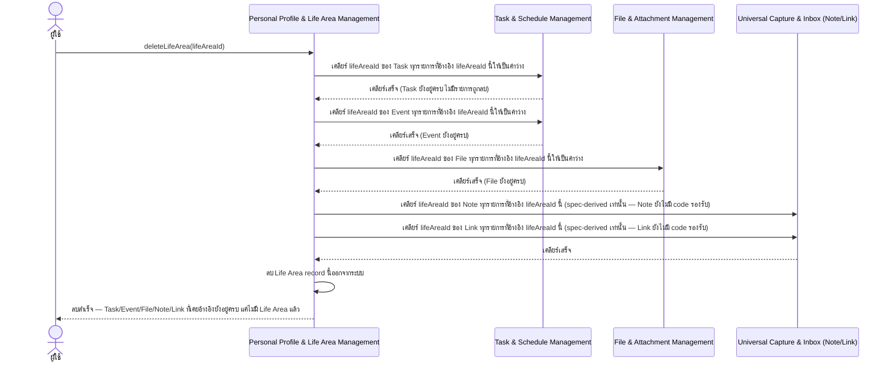

**คำอธิบาย:** ลำดับเคลียร์ค่าอ้างอิงต้องเกิด **ก่อน** การลบ record ของ Life Area เอง เพื่อไม่ให้เหลือ `lifeAreaId` ที่ชี้ไปยัง record ที่ไม่มีอยู่แล้ว (orphaned reference) — สอดคล้องกับ [[../../01-requirements/01-spec/20260806-007-my-today-sprint7-category-profile|Sprint 7]] Acceptance Criteria ที่ระบุว่า "Task ที่เคยผูกกับ Life Area ที่ถูกลบยังคงอยู่ ไม่หาย แค่ไม่มี Life Area แล้ว" การลบ**ไม่มีการ cascade ลบ**ต่อ record ใดๆ เลย มีแต่การเคลียร์ field อ้างอิงเท่านั้น

---

## Universal Capture & Inbox

ที่มา: [[../../01-requirements/01-spec/20260806-009-my-today-sprint8-universal-inbox-quick-capture|Sprint 8]]

### Quick Capture → Inbox → จัดเข้า Life Area

รวม 3 operation ที่ต่อเนื่องกันเป็น flow เดียว: `quickCapture`, `listInboxItems`, `assignInboxItemToLifeArea` — ข้าม Component ตามประเภทของสิ่งที่ capture (Task/Event ไปที่ Task & Schedule Management, File ไปที่ File & Attachment Management, Note/Link อยู่ภายใน Universal Capture & Inbox เอง)

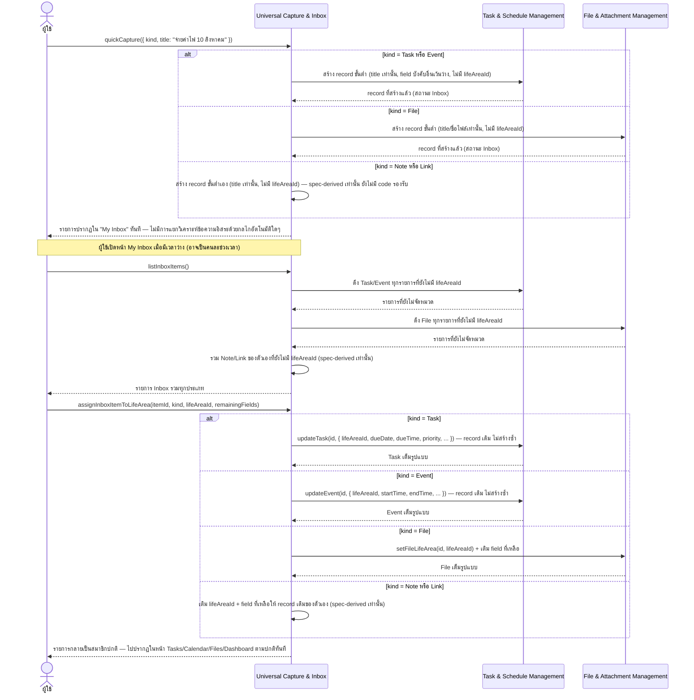

**คำอธิบาย:** ขั้นตอนสำคัญคือ **ไม่มีการสร้าง record ซ้ำสองชุด** ระหว่างขั้นตอน capture กับขั้นตอน assign — เป็น record เดียวกันที่ถูกเติม field ให้ครบขึ้นเท่านั้น ([[../../01-requirements/01-spec/20260806-009-my-today-sprint8-universal-inbox-quick-capture|Sprint 8]] Business Rule ข้อ 1-2) การมอบหมายงานให้ Task/Event/File ใช้ operation ที่มี code รองรับอยู่แล้วตั้งแต่ Sprint 2/3/4 ส่วนการจัดการ Note/Link ทั้ง flow ยังเป็น spec-derived เท่านั้น (สอดคล้องกับ grounding note ของ [[api-spec#Universal Capture & Inbox|api-spec.md]])

---

## Task & Schedule Management

ที่มา: [[../../01-requirements/01-spec/20260806-002-my-today-sprint2-task-management|Sprint 2]], [[../../01-requirements/01-spec/20260806-003-my-today-sprint3-calendar-schedule|Sprint 3]], [[../../01-requirements/01-spec/20260806-010-my-today-sprint9-timeline-priority-progress|Sprint 9]]

**หมายเหตุ operation ที่ข้ามไป (single-step/ไม่ข้าม Component):** `createTask`/`updateTask`/`deleteTask`/`setTaskStatus`/`listTasks`/`searchTasks`/`sortTasksByDeadline`/`setTaskReminderLeadTime`/`createEvent`/`updateEvent`/`deleteEvent`/`listEventsByView`/`setEventReminderLeadTime` เป็น CRUD/query เดี่ยวๆ ภายใน Component เดียวกัน ไม่มีลำดับขั้นตอนข้าม Component ให้แสดง

### รวมมุมมอง Calendar สำหรับหนึ่งวัน (`listCalendarItemsForDate`)

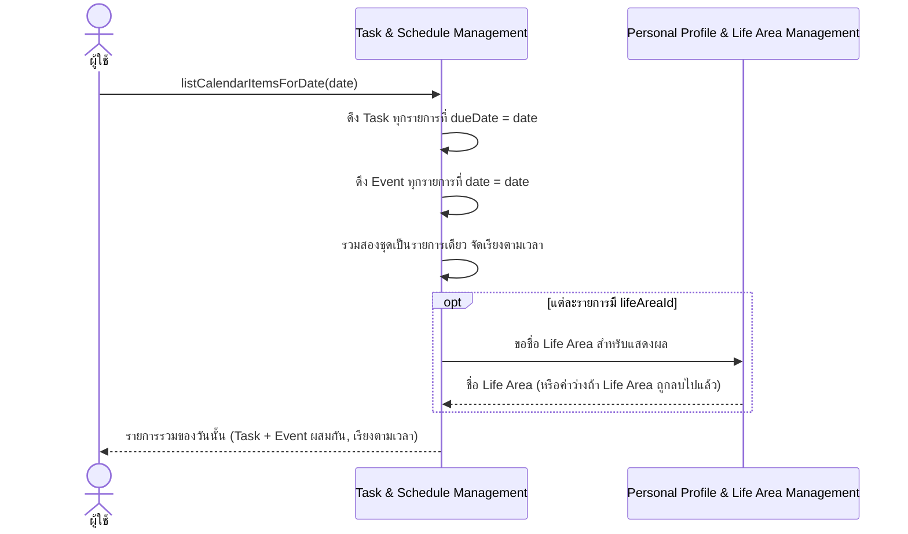

**คำอธิบาย:** ขั้นตอนนี้**ไม่สร้างข้อมูลซ้ำ** — Task ที่มี `dueDate` ถูกดึงมาแสดงในมุมมอง Calendar โดยตรงจากข้อมูลชุดเดียวกับหน้า Tasks ไม่ใช่ record ใหม่คนละชุด ([[../../01-requirements/01-spec/20260806-003-my-today-sprint3-calendar-schedule|Sprint 3]] Business Rule ข้อ 2-3) การขอชื่อ Life Area เป็นขั้นตอนเสริมสำหรับการแสดงผลเท่านั้น ไม่กระทบข้อมูลต้นทาง

### ทำ Task เป็น "เสร็จแล้ว" → ผลกระทบต่อ Dashboard และ Life Progress

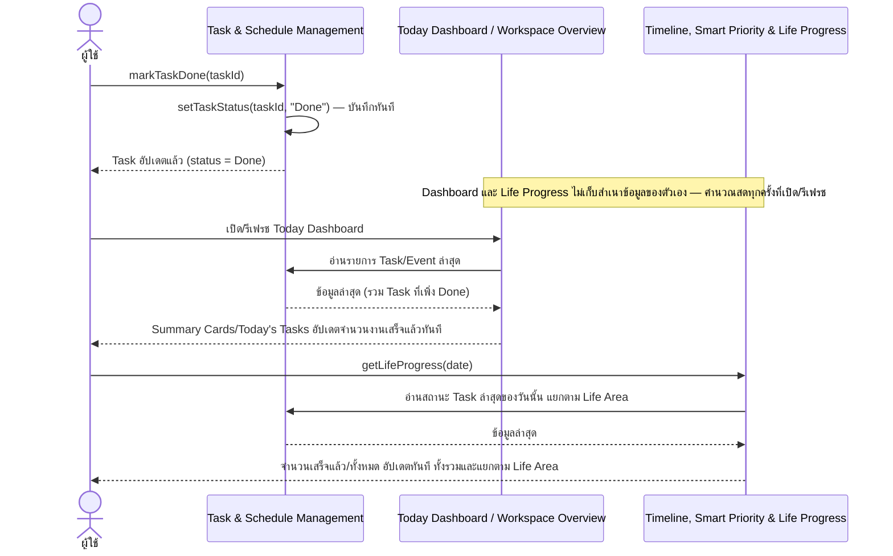

**คำอธิบาย:** สถานะ Done ของ Task มีผลต่อการคำนวณ Life Progress **ทันที** โดยไม่ต้องมี operation แจ้งเตือนแยก เพราะทั้ง Dashboard และ Life Progress เป็นมุมมองที่อ่านข้อมูลสดจากที่เดียวกันเสมอ ไม่ใช่สำเนาที่ต้อง sync ([[../../01-requirements/01-spec/20260806-010-my-today-sprint9-timeline-priority-progress|Sprint 9]] Business Rule ข้อ 3, [[architecture#1.8 Today Dashboard / Workspace Overview|architecture.md]])

---

## File & Attachment Management

ที่มา: [[../../01-requirements/01-spec/20260806-004-my-today-sprint4-file-organizer|Sprint 4]], [[../../01-requirements/01-spec/20260806-011-my-today-sprint10-task-event-file-linking|Sprint 10]]

**ไม่มี sequence diagram ในหัวข้อนี้** — operation ทั้งหมดของ Component นี้ (`addFile`, `renameFile`, `setFileCategory`, `setFileLifeArea`, `deleteFile`, `listFiles`, `listRecentFiles`, `previewFile`, `downloadFile`, `linkFileToTask`/`unlinkFileFromTask`, `listFilesLinkedToTask`, และคู่ Event ของ Sprint 10) เป็น CRUD เดี่ยวๆ หรือการตั้ง/ยกเลิกค่าความสัมพันธ์แบบขั้นตอนเดียว ไม่ข้าม Component ด้วยตัวเอง — ปฏิสัมพันธ์ข้าม Component ที่เกี่ยวกับ File ถูกแสดงไว้แล้วในที่อื่น: การรวม File เข้า Inbox flow (ดูหัวข้อ Universal Capture & Inbox ด้านบน) และการประกอบ Related Files เข้าไปใน Task/Event Detail (ดูหัวข้อ Cross-Entity Linking ด้านล่าง)

---

## Notification & Deadline Awareness

ที่มา: [[../../01-requirements/01-spec/20260806-005-my-today-sprint5-notification-deadline-awareness|Sprint 5]], [[../../01-requirements/01-spec/20260806-011-my-today-sprint10-task-event-file-linking|Sprint 10]]

### ตรวจสอบ Deadline อัตโนมัติ → สร้าง Notification → คลิกย้อนกลับต้นทาง

```mermaid
sequenceDiagram
    participant NDA as Notification & Deadline Awareness
    participant TSM as Task & Schedule Management
    actor U as ผู้ใช้

    Note over NDA: ตรวจสอบอัตโนมัติทุกครั้งที่เปิด/รีเฟรชพื้นที่ทำงาน ไม่ต้องมีผู้ใช้สั่ง
    NDA->>TSM: อ่าน Task/Event ทั้งหมด (พร้อมกำหนดเวลาและ reminderLeadTime ถ้ามี)
    TSM-->>NDA: รายการ Task/Event ปัจจุบัน
    loop สำหรับ Task/Event แต่ละรายการที่มีกำหนดเวลา
        opt รายการนี้ตั้งค่า reminderLeadTime เฉพาะตัวไว้ (Sprint 10, spec-derived เท่านั้น)
            NDA->>NDA: ใช้เวลานำหน้าที่ผู้ใช้ตั้งเฉพาะรายการนี้
        else ไม่ได้ตั้งค่าเฉพาะตัว
            NDA->>NDA: ใช้เวลานำหน้าเริ่มต้นกลางของระบบ
        end
        alt เลยกำหนดเวลาไปแล้ว
            NDA->>NDA: จัดระดับ Overdue
        else ถึงวันกำหนดแล้วแต่ยังไม่เลยเวลา
            NDA->>NDA: จัดระดับ DueToday
        else ใกล้ถึงกำหนดภายในเวลานำหน้าที่ตั้งไว้
            NDA->>NDA: จัดระดับ DueSoon
        else ยังไม่เข้าเงื่อนไขใดเลย
            NDA->>NDA: ไม่สร้าง Notification สำหรับรายการนี้
        end
        NDA->>NDA: สร้าง/คงไว้ Notification (id ผูกกับ sourceId+level เพื่อไม่ให้ซ้ำ)
    end
    NDA-->>U: รายการ Notification ปรากฏใน Notification Center (และส่วนแจ้งเตือนบน Dashboard)

    U->>NDA: คลิก Notification รายการหนึ่ง
    NDA->>NDA: markNotificationRead(notificationId)
    NDA->>NDA: resolveNotificationSource(notificationId)
    NDA->>TSM: ขอรายละเอียด Task/Event ต้นทาง
    TSM-->>NDA: Task/Event ต้นทาง
    NDA-->>U: พาไปยังหน้ารายละเอียดของ Task/Event ต้นทางนั้นทันที
```

**คำอธิบาย:** `checkDeadlines` เป็น operation ที่ **derive/คำนวณ** ผลลัพธ์จากข้อมูล Task/Event ที่มีอยู่ ไม่ใช่รับข้อมูลจากผู้ใช้ตรงๆ ([[api-spec#Notification & Deadline Awareness|api-spec.md]]) การอ้างอิงเวลานำหน้าเฉพาะรายการ (override) เป็นความสามารถของ [[../../01-requirements/01-spec/20260806-011-my-today-sprint10-task-event-file-linking|Sprint 10]] Business Rule ข้อ 2 และ 4 ที่ยังเป็น spec-derived เท่านั้น ส่วนการคลิกย้อนกลับต้นทางอ้างอิง [[../../01-requirements/01-spec/20260806-005-my-today-sprint5-notification-deadline-awareness|Sprint 5]] Business Rule ข้อ 1 การขอสิทธิ์แจ้งเตือนระดับอุปกรณ์ (`requestBrowserNotificationPermission`) ไม่ปรากฏใน diagram นี้เพราะเป็น operation ขั้นตอนเดียวที่ไม่กระทบ flow นี้เลยไม่ว่าผลลัพธ์จะเป็นอย่างไร ([[../../01-requirements/01-spec/20260806-005-my-today-sprint5-notification-deadline-awareness|Sprint 5]] Business Rule ข้อ 2)

---

## Timeline, Smart Priority & Life Progress

ที่มา: [[../../01-requirements/01-spec/20260806-010-my-today-sprint9-timeline-priority-progress|Sprint 9]]

### ประกอบมุมมอง Timeline Now/Next/Later (`getTimeline`)

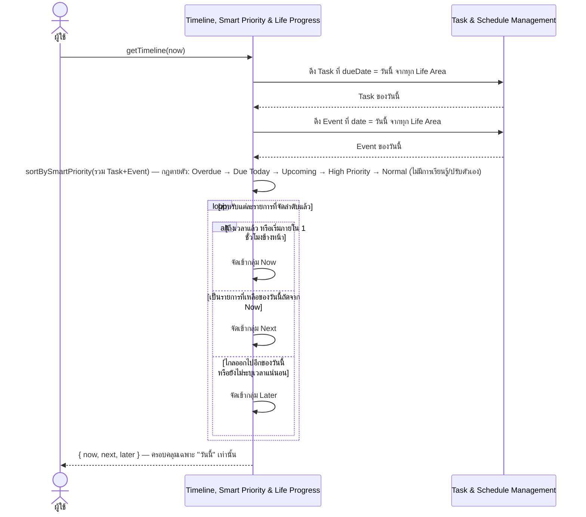

**คำอธิบาย:** Timeline รวม Task ที่มีกำหนดส่งของวันนี้กับ Event ของวันนี้จากทุก Life Area เข้าด้วยกันเป็นมุมมองเดียว โดยไม่แยกว่ามาจากด้านไหนของชีวิต ([[../../01-requirements/01-spec/20260806-010-my-today-sprint9-timeline-priority-progress|Sprint 9]] Business Rule ข้อ 1) การจัดลำดับ Smart Priority ใช้กฎตายตัวชุดเดียวกันนี้ร่วมกันกับ `getTodayTasks()` ของ Today Dashboard ด้วย (ดูหัวข้อ Today Dashboard ด้านล่าง) — ไม่มีการประมวลผลแบบปรับตัวเองหรือ machine learning ใดๆ ([[../../01-requirements/01-spec/20260806-010-my-today-sprint9-timeline-priority-progress|Sprint 9]] Business Rule ข้อ 2)

### คำนวณ Life Progress (`getLifeProgress`)

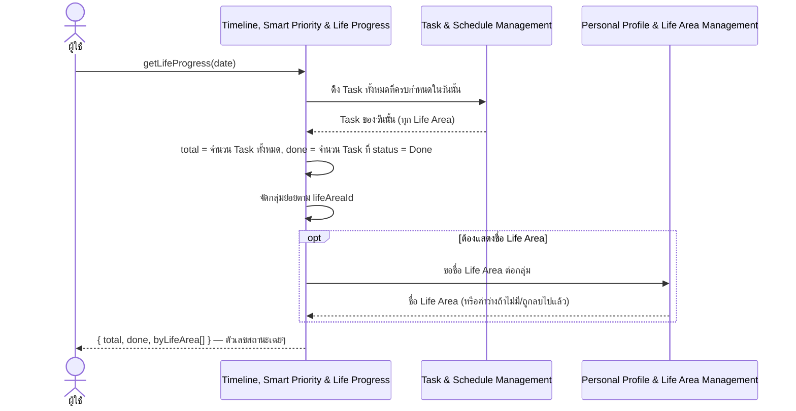

**คำอธิบาย:** ผลลัพธ์เป็นตัวเลขสถานะเฉยๆ **ห้ามนำไปแสดงเป็นคะแนน/การตัดสินผู้ใช้ในชั้น UI ใดๆ** เช่น ห้ามใช้คำว่า "Score" ([[../../01-requirements/01-spec/20260806-010-my-today-sprint9-timeline-priority-progress|Sprint 9]] Business Rule ข้อ 3) — ข้อความ UI ต้องไม่มีลักษณะตัดสิน/เปรียบเทียบผู้ใช้ตาม Acceptance Criteria ของ Sprint นี้

---

## Cross-Entity Linking (What / When / Information)

ที่มา: [[../../01-requirements/01-spec/20260806-004-my-today-sprint4-file-organizer|Sprint 4]], [[../../01-requirements/01-spec/20260806-009-my-today-sprint8-universal-inbox-quick-capture|Sprint 8]], [[../../01-requirements/01-spec/20260806-011-my-today-sprint10-task-event-file-linking|Sprint 10]]

**หมายเหตุ operation ที่ข้ามไป (single-step/ไม่ข้าม Component ด้วยตัวเอง):** `linkNoteToTask`/`unlinkNoteFromTask`, `linkLinkToTask`/`unlinkLinkFromTask`, `linkNoteToEvent`/`unlinkNoteFromEvent`, `linkLinkToEvent`/`unlinkLinkFromEvent` เป็นการตั้ง/ยกเลิกค่าความสัมพันธ์ขั้นตอนเดียว — ผลของการเชื่อมเหล่านี้ถูกแสดงรวมอยู่ใน diagram ด้านล่างแล้ว (เป็นข้อมูลที่ `getTaskDetail`/`getEventDetail` อ่านกลับมาประกอบผล)

### ประกอบ What/When/Information ของ Task (`getTaskDetail`)

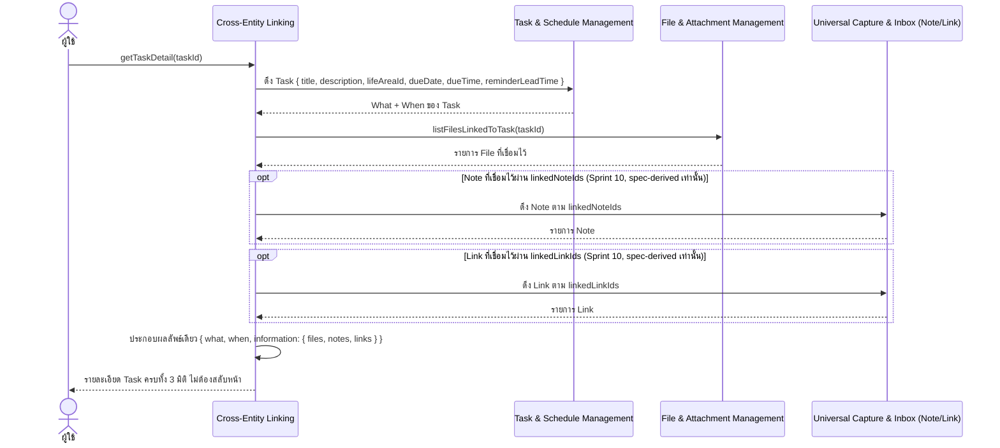

**คำอธิบาย:** จุดประสงค์คือให้หน้า Task Detail ไม่ต้องสลับไปมาหลายหน้าเพื่อประกอบข้อมูลเอง ([[../../01-requirements/01-spec/20260806-011-my-today-sprint10-task-event-file-linking|Sprint 10]] Business Rule ข้อ 3) `information.files` มาจาก `linkFileToTask`/`listFilesLinkedToTask` ที่มี code รองรับแล้วตั้งแต่ [[../../01-requirements/01-spec/20260806-004-my-today-sprint4-file-organizer|Sprint 4]] ส่วนขั้นตอนที่ดึง Note/Link เป็น spec-derived เท่านั้น (ทั้ง entity เองและ field เชื่อมโยงยังไม่มี code รองรับ)

### ประกอบ What/When/Information ของ Event (`getEventDetail`)

ใช้กลไกเดียวกับ `getTaskDetail` ทุกประการ เพียงสลับต้นทางจาก Task เป็น Event ([[../../01-requirements/01-spec/20260806-011-my-today-sprint10-task-event-file-linking|Sprint 10]] Business Rule ข้อ 4) — ดู diagram ด้านบนแล้วอ่าน `TSM` เป็นฝั่ง Event ของ Component เดียวกัน โดยมีข้อแตกต่างหนึ่งจุดที่ต้องระบุเพิ่ม: การเชื่อม File↔Event (`linkFileToEvent`/`listFilesLinkedToEvent`) **ยังไม่มี field/code รองรับ** ณ ตอนเขียนเอกสารนี้ (มีแค่ File↔Task ผ่าน `linkedTaskIds` ในโค้ดจริง) จึงเป็นช่องว่าง (spec-derived gap) เพิ่มเติมจากที่ Note/Link ก็เป็น spec-derived เท่านั้นอยู่แล้ว:

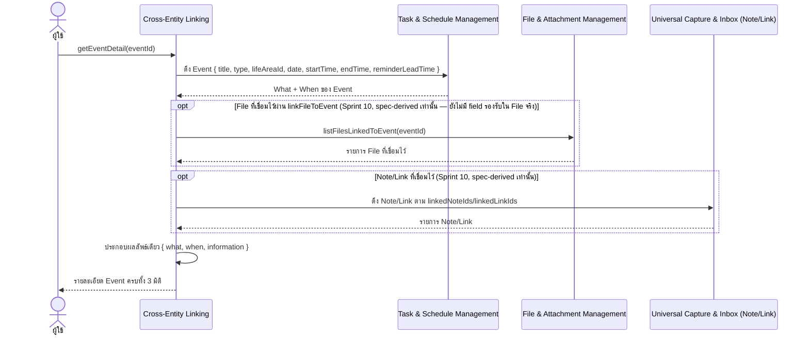

---

## Today Dashboard / Workspace Overview

ที่มา: [[../../01-requirements/01-spec/20260806-001-my-today-sprint1-today-dashboard|Sprint 1]], [[../../01-requirements/01-spec/20260806-002-my-today-sprint2-task-management|Sprint 2]], [[../../01-requirements/01-spec/20260806-003-my-today-sprint3-calendar-schedule|Sprint 3]], [[../../01-requirements/01-spec/20260806-005-my-today-sprint5-notification-deadline-awareness|Sprint 5]], [[../../01-requirements/01-spec/20260806-010-my-today-sprint9-timeline-priority-progress|Sprint 9]]

### เปิด Today Dashboard → รวมทุกส่วนประกอบมาแสดงในหน้าเดียว

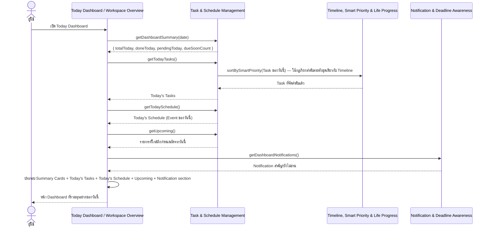

**คำอธิบาย:** Today Dashboard **ไม่เก็บข้อมูลของตัวเอง** — ทุก operation เป็นมุมมองที่คำนวณสด (derived read) จากข้อมูล Task/Event/Notification/Life Progress ที่นิยามไว้ใน Component อื่นเท่านั้น ([[api-spec#Today Dashboard / Workspace Overview|api-spec.md]]) `getTodayTasks()` ใช้ `sortBySmartPriority` ร่วมกับ Timeline เพื่อให้ลำดับ Overdue/Due Today/Upcoming/High Priority/Normal เป็นกฎเดียวกันทั้งสองที่ ([[../../01-requirements/01-spec/20260806-010-my-today-sprint9-timeline-priority-progress|Sprint 9]] Business Rule ข้อ 2) `getDashboardSummary` คำนวณจากข้อมูล Task/Event จริงตั้งแต่ [[../../01-requirements/01-spec/20260806-002-my-today-sprint2-task-management|Sprint 2]] เป็นต้นไป (Sprint 1 เดิมใช้ข้อมูลตัวอย่างสำหรับทดสอบ UI เท่านั้น) ปุ่ม Quick Capture กลางที่เข้าถึงได้จากหน้านี้ไม่ปรากฏเป็นขั้นตอนแยกใน diagram นี้ เพราะ flow เต็มของมันถูกแสดงไว้แล้วในหัวข้อ Universal Capture & Inbox ด้านบน

---

## Entity Lifecycles (State / Status Diagrams)

### Task — `status`

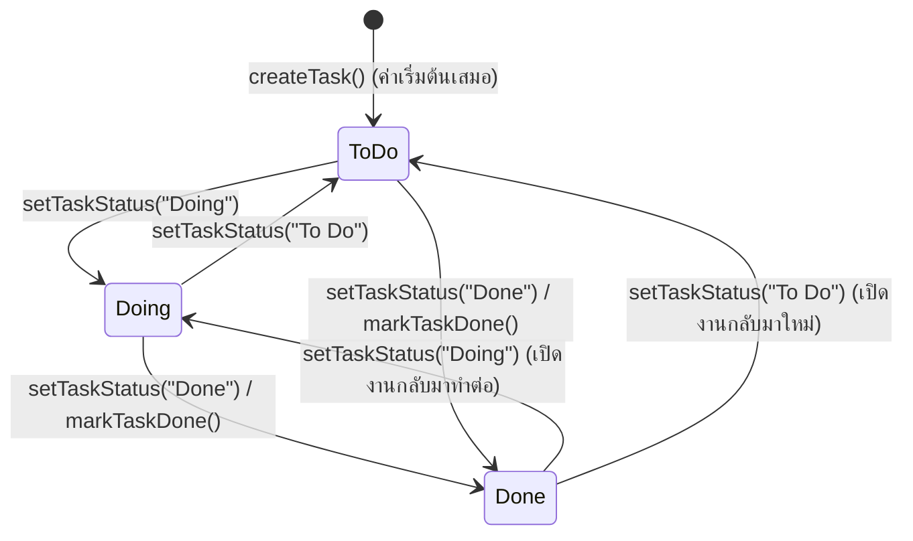

**สิ่งที่ทำให้เปลี่ยนสถานะ:** ผู้ใช้เปลี่ยนเองผ่าน `setTaskStatus`/`markTaskDone` เท่านั้น — spec ไม่ได้จำกัดลำดับการเปลี่ยนสถานะไว้ตายตัว (ไม่บังคับว่าต้องผ่าน Doing ก่อนถึง Done) ค่าเริ่มต้นตอนสร้างเสมอคือ **To Do** ([[../../01-requirements/01-spec/20260806-002-my-today-sprint2-task-management|Sprint 2]] Business Rule ข้อ 1, [[api-spec#Task & Schedule Management|api-spec.md]]) สถานะ **Done** มีผลทันทีต่อการคำนวณ Life Progress ([[../../01-requirements/01-spec/20260806-010-my-today-sprint9-timeline-priority-progress|Sprint 9]] Business Rule ข้อ 3) และต่อตัวเลขสรุปบน Today Dashboard ([[../../01-requirements/01-spec/20260806-002-my-today-sprint2-task-management|Sprint 2]] Business Rule ข้อ 3)

### สถานะ Inbox (ใช้ร่วมกันโดย Task/Event/File/Note/Link)

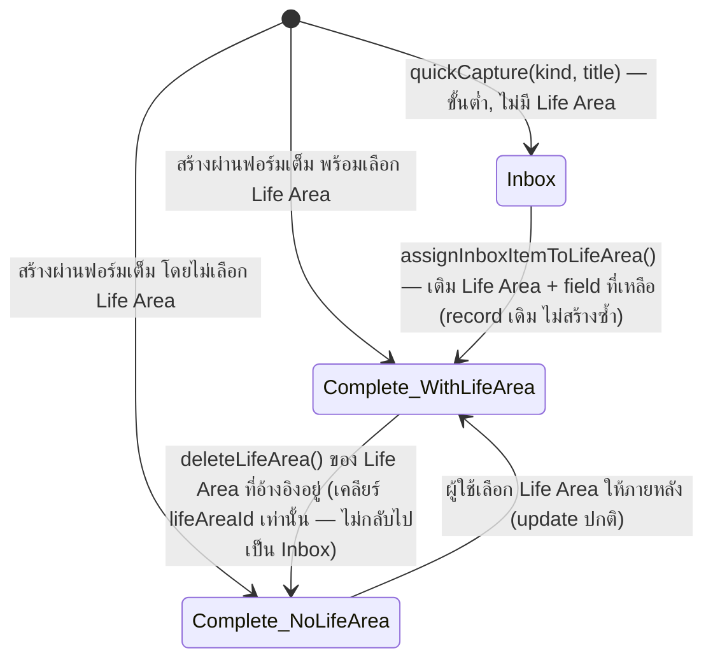

**สิ่งที่ทำให้เปลี่ยนสถานะ:** สถานะ **Inbox** หมายถึง record ที่ทั้งยังไม่มี `lifeAreaId` **และ** ยังกรอกแค่ field ขั้นต่ำ (ประเภท + ชื่อ/ข้อความ) เท่านั้น ([[database-schema#Inbox Status (ไม่ใช่ table แยก)|database-schema.md]]) — `assignInboxItemToLifeArea` เป็นทางเดียวที่พารายการออกจากสถานะนี้ (ไม่มี operation ที่พารายการกลับเข้า Inbox) ข้อที่ควรสังเกต: การลบ Life Area ที่รายการหนึ่งอ้างอิงอยู่ (ดู sequence diagram ในหัวข้อ Personal Profile & Life Area Management ด้านบน) เพียงเคลียร์ `lifeAreaId` ให้กลายเป็นค่าว่างเท่านั้น **ไม่ทำให้รายการกลับไปเป็นสถานะ Inbox** เพราะรายการนั้นมี field ครบแล้วตั้งแต่ก่อนถูกลบ Life Area ([[../../01-requirements/01-spec/20260806-007-my-today-sprint7-category-profile|Sprint 7]] Acceptance Criteria, [[../../01-requirements/01-spec/20260806-009-my-today-sprint8-universal-inbox-quick-capture|Sprint 8]] Business Rule ข้อ 1-2)

### Notification — ระดับความเร่งด่วน (`level`) และสถานะอ่าน (`read`)

Notification มี 2 มิติที่เป็นอิสระจากกัน — ระดับความเร่งด่วนคำนวณอัตโนมัติจากเวลา และสถานะอ่าน/ยังไม่อ่านที่ผู้ใช้เปลี่ยนเอง:

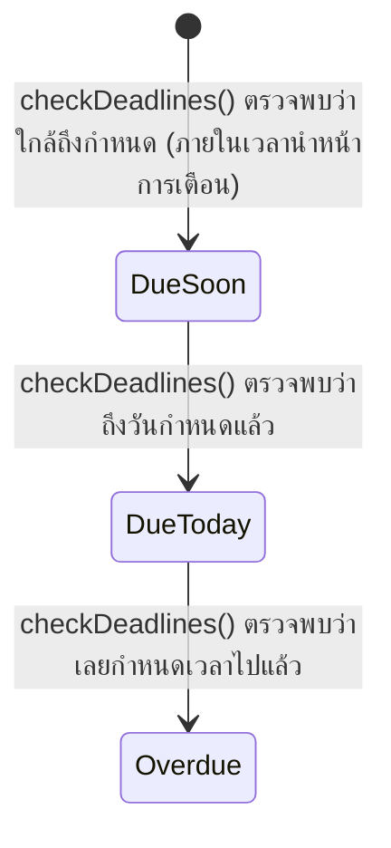

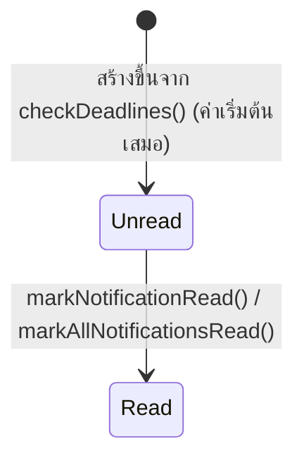

**สิ่งที่ทำให้เปลี่ยนสถานะ:** `level` เปลี่ยนอัตโนมัติทุกครั้งที่ `checkDeadlines()` รันซ้ำ ตามเวลาปัจจุบันเทียบกับกำหนดของ Task/Event ต้นทาง ([[../../01-requirements/01-spec/20260806-005-my-today-sprint5-notification-deadline-awareness|Sprint 5]] Feature Requirements) **ข้อสำคัญ:** เนื่องจาก id ของ Notification ผูกกับ `sourceId` + `level` การข้ามระดับ (เช่นจาก DueSoon ไป Overdue) จะถูกมองเป็น Notification **รายการใหม่** (unread อีกครั้ง) ไม่ใช่การแก้ record เดิม แม้ระดับก่อนหน้าจะถูกอ่านไปแล้วก็ตาม ส่วน `read` เป็น field เดียวของ Notification ที่ผู้ใช้เปลี่ยนแปลงโดยตรง ([[api-spec#Notification & Deadline Awareness|api-spec.md]]) และไม่มี operation ที่เปลี่ยนกลับจาก Read เป็น Unread
