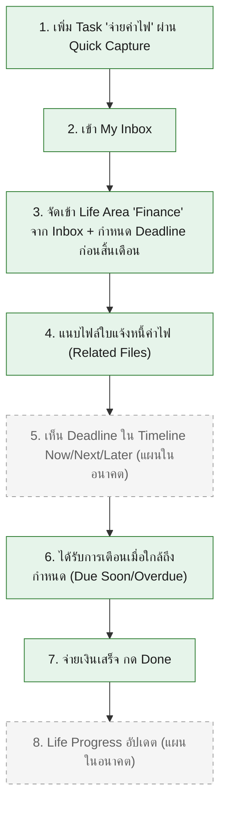

# User Journey: บุคคลทั่วไป (General Person)

เชื่อมโยงกลับ: [[../../01-requirements/01-spec/20260806-008-my-today-functional-requirements-master|FR master list]], [[../../01-requirements/feature-list|feature-list]]

## Persona

**บุคคลทั่วไป** — ผู้ใช้ที่ต้องบริหารจัดการภารกิจในชีวิตประจำวันหลายบทบาท (ไม่ใช่นักศึกษาเท่านั้น) ตามการ generalize target user ใน [[../../01-requirements/01-spec/20260806-007-my-today-sprint7-category-profile|Sprint 7]] — เช่น พนักงาน, ผู้ประกอบอาชีพอิสระ, ผู้ปกครอง ฯลฯ

**Life Area หลักของ Persona นี้:** Finance

**Scenario:** บุคคลทั่วไปมีบิลค่าไฟที่ต้องจ่ายก่อนสิ้นเดือน จึงบันทึกเป็น Task "จ่ายค่าไฟ" ผ่านขั้นตอนตาม Final Competition User Journey ที่ระบุใน [[../../01-requirements/01-spec/20260806-012-my-today-sprint11-competition-demo-freeze|Sprint 11]] (Business Rule ข้อ 2, persona บุคคลทั่วไป): เพิ่ม Task ผ่าน Quick Capture → เข้า Inbox → จัดเข้า Life Area "Finance" → แนบใบแจ้งหนี้ → เห็น Deadline ใน Timeline → ได้รับการเตือน → จ่ายเงินเสร็จกด Done → Life Progress อัปเดต

**หมายเหตุสถานะ ณ วันที่เขียนเอกสารนี้ (20260823):** ตาม `backlog.md` ตอนนี้ Sprint 1-8 build เสร็จแล้วทั้งหมด ("เสร็จแล้ว") รวมถึง Sprint 8 (Quick Capture/Inbox) ที่เพิ่งยืนยันเสร็จในรอบ backlog-sync-check วันที่ 20260823 เหลือเพียง Sprint 9-10 (Timeline/Life Progress, custom Reminder lead time) ที่ยังมีสถานะ "ยังไม่เริ่ม" ไดอะแกรมด้านล่างจึงแยกสไตล์ node ที่ทำได้จริงวันนี้ (เส้นทึบ) ออกจาก node ที่เป็นแผนในอนาคต (เส้นประ — เหลือเฉพาะขั้นตอนที่ 5, 8) อย่างชัดเจน เพื่อไม่ให้สื่อว่าแอปมีความสามารถนั้นอยู่แล้วก่อนถูก build จริง

## Diagram

## รายการขั้นตอน (อ้างอิง FR + Spec)

1. เพิ่ม Task "จ่ายค่าไฟ" ผ่าน Quick Capture — อ้างอิง FR-13 ([[../../01-requirements/01-spec/20260806-009-my-today-sprint8-universal-inbox-quick-capture|Sprint 8]]) — เสร็จแล้ว
2. เข้า My Inbox ดูรายการที่ยังไม่จัด Life Area — อ้างอิง FR-14 ([[../../01-requirements/01-spec/20260806-009-my-today-sprint8-universal-inbox-quick-capture|Sprint 8]]) — เสร็จแล้ว
3. จัดรายการเข้า Life Area "Finance" จาก Inbox พร้อมเติม Deadline ที่ขาด — อ้างอิง FR-14 ([[../../01-requirements/01-spec/20260806-009-my-today-sprint8-universal-inbox-quick-capture|Sprint 8]]) — เสร็จแล้ว
4. แนบไฟล์ใบแจ้งหนี้ค่าไฟ (Related Files) — อ้างอิง FR-09 ([[../../01-requirements/01-spec/20260806-004-my-today-sprint4-file-organizer|Sprint 4]]) — เสร็จแล้ว
5. เห็น Deadline ใน Timeline แบบ Now/Next/Later — อ้างอิง FR-16 ([[../../01-requirements/01-spec/20260806-010-my-today-sprint9-timeline-priority-progress|Sprint 9]]) — **แผนในอนาคต** (วันนี้ยังเห็น Deadline ผ่าน Calendar และ Today Dashboard ได้ตามปกติจาก FR-07/FR-12)
6. ได้รับการเตือนเมื่อใกล้ถึงกำหนด (Due Today/Due Soon/Overdue) — อ้างอิง FR-10 ([[../../01-requirements/01-spec/20260806-005-my-today-sprint5-notification-deadline-awareness|Sprint 5]]) — เสร็จแล้ว
7. จ่ายเงินเสร็จ กด Done — อ้างอิง FR-03, FR-11 ([[../../01-requirements/01-spec/20260806-002-my-today-sprint2-task-management|Sprint 2]]) — เสร็จแล้ว
8. Life Progress อัปเดต — อ้างอิง FR-17 ([[../../01-requirements/01-spec/20260806-010-my-today-sprint9-timeline-priority-progress|Sprint 9]]) — **แผนในอนาคต**

## หมายเหตุปิดท้าย

ตาม Business Rule ข้อ 2 ของ [[../../01-requirements/01-spec/20260806-012-my-today-sprint11-competition-demo-freeze|Sprint 11]] Journey นี้ของบุคคลทั่วไปต้องใช้ **กลไกหลักชุดเดียวกัน** (Quick Capture, Inbox, Life Area, Task, Timeline, Notification, Life Progress) กับ Journey ของนักศึกษา (ดู [[user-journey-student|User Journey: นักศึกษา]]) โดยไม่มี code path แยกตาม persona ที่ไหนเลย — นี่คือประเด็นสำคัญของการ retrofit Life Area ใน Sprint 7 ([[../../01-requirements/01-spec/20260806-007-my-today-sprint7-category-profile|Sprint 7]]) ที่ทำให้ Core เดิม (Sprint 1-6) รองรับทั้งสอง persona ได้โดยไม่ต้องแยกระบบ
