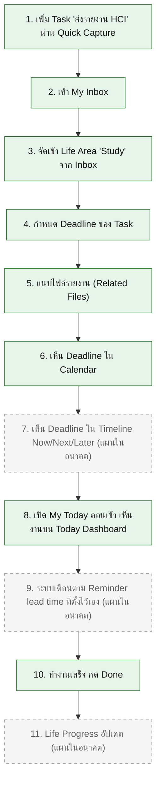

# User Journey: นักศึกษา (Student)

เชื่อมโยงกลับ: [[../../01-requirements/01-spec/20260806-008-my-today-functional-requirements-master|FR master list]], [[../../01-requirements/feature-list|feature-list]]

## Persona

**นักศึกษา** — หนึ่งในกลุ่มผู้ใช้เป้าหมายของ My Today (ไม่ใช่กลุ่มเดียวที่รองรับ ดู [[../../01-requirements/01-spec/20260806-007-my-today-sprint7-category-profile|Sprint 7]]) มีภารกิจด้านการเรียนที่ต้องจัดการควบคู่กับด้านอื่นของชีวิต

**Life Area หลักของ Persona นี้:** Study

**Scenario:** นักศึกษาได้รับมอบหมายรายงาน HCI ที่ต้องส่ง จึงบันทึกเป็น Task "ส่งรายงาน HCI" ผ่านขั้นตอนตาม Final Competition User Journey ที่ระบุใน [[../../01-requirements/01-spec/20260806-012-my-today-sprint11-competition-demo-freeze|Sprint 11]] (Business Rule ข้อ 2, persona นักศึกษา): เพิ่ม Task ผ่าน Quick Capture → เข้า Inbox → จัดเข้า Life Area "Study" → กำหนด Deadline → แนบไฟล์ → เห็น Deadline ใน Calendar และ Timeline → เปิด My Today ตอนเช้าเห็นงานบน Dashboard → ระบบเตือนตาม Reminder ที่ตั้งไว้ → ทำงานเสร็จกด Done → Life Progress อัปเดต

**หมายเหตุสถานะ ณ วันที่เขียนเอกสารนี้ (20260823):** ตาม `backlog.md` ตอนนี้ Sprint 1-8 build เสร็จแล้วทั้งหมด ("เสร็จแล้ว") รวมถึง Sprint 8 (Quick Capture/Inbox) ที่เพิ่งยืนยันเสร็จในรอบ backlog-sync-check วันที่ 20260823 เหลือเพียง Sprint 9-10 (Timeline/Life Progress, custom Reminder lead time) ที่ยังมีสถานะ "ยังไม่เริ่ม" ไดอะแกรมด้านล่างจึงแยกสไตล์ node ที่ทำได้จริงวันนี้ (เส้นทึบ) ออกจาก node ที่เป็นแผนในอนาคต (เส้นประ — เหลือเฉพาะขั้นตอนที่ 7, 9, 11) อย่างชัดเจน เพื่อไม่ให้สื่อว่าแอปมีความสามารถนั้นอยู่แล้วก่อนถูก build จริง

## Diagram

## รายการขั้นตอน (อ้างอิง FR + Spec)

1. เพิ่ม Task "ส่งรายงาน HCI" ผ่าน Quick Capture — อ้างอิง FR-13 ([[../../01-requirements/01-spec/20260806-009-my-today-sprint8-universal-inbox-quick-capture|Sprint 8]]) — เสร็จแล้ว
2. เข้า My Inbox ดูรายการที่ยังไม่จัด Life Area — อ้างอิง FR-14 ([[../../01-requirements/01-spec/20260806-009-my-today-sprint8-universal-inbox-quick-capture|Sprint 8]]) — เสร็จแล้ว
3. จัดรายการเข้า Life Area "Study" จาก Inbox — อ้างอิง FR-14 ([[../../01-requirements/01-spec/20260806-009-my-today-sprint8-universal-inbox-quick-capture|Sprint 8]]) — เสร็จแล้ว
4. กำหนด Deadline ของ Task — อ้างอิง FR-04 ([[../../01-requirements/01-spec/20260806-002-my-today-sprint2-task-management|Sprint 2]]) — เสร็จแล้ว
5. แนบไฟล์รายงาน (Related Files) — อ้างอิง FR-09 ([[../../01-requirements/01-spec/20260806-004-my-today-sprint4-file-organizer|Sprint 4]]) — เสร็จแล้ว
6. เห็น Deadline ของ Task ปรากฏใน Calendar โดยอัตโนมัติ — อ้างอิง FR-07 ([[../../01-requirements/01-spec/20260806-003-my-today-sprint3-calendar-schedule|Sprint 3]]) — เสร็จแล้ว
7. เห็น Deadline ใน Timeline แบบ Now/Next/Later — อ้างอิง FR-16 ([[../../01-requirements/01-spec/20260806-010-my-today-sprint9-timeline-priority-progress|Sprint 9]]) — **แผนในอนาคต**
8. เปิด My Today ตอนเช้า เห็นงานบน Today Dashboard — อ้างอิง FR-05, FR-12 ([[../../01-requirements/01-spec/20260806-001-my-today-sprint1-today-dashboard|Sprint 1]]) — เสร็จแล้ว
9. ระบบเตือนตาม Reminder lead time ที่ตั้งไว้เอง — อ้างอิง FR-19 ([[../../01-requirements/01-spec/20260806-011-my-today-sprint10-task-event-file-linking|Sprint 10]]) — **แผนในอนาคต** (การแจ้งเตือนพื้นฐานแบบ Due Today/Due Soon/Overdue ด้วยค่า default ทำงานได้แล้วจาก FR-10, [[../../01-requirements/01-spec/20260806-005-my-today-sprint5-notification-deadline-awareness|Sprint 5]] — แต่การ "ตั้งค่า Reminder lead time เอง" แทนค่า default ยังไม่ build)
10. ทำงานเสร็จ กด Done — อ้างอิง FR-03, FR-11 ([[../../01-requirements/01-spec/20260806-002-my-today-sprint2-task-management|Sprint 2]]) — เสร็จแล้ว
11. Life Progress อัปเดต — อ้างอิง FR-17 ([[../../01-requirements/01-spec/20260806-010-my-today-sprint9-timeline-priority-progress|Sprint 9]]) — **แผนในอนาคต**

## หมายเหตุปิดท้าย

ตาม Business Rule ข้อ 2 ของ [[../../01-requirements/01-spec/20260806-012-my-today-sprint11-competition-demo-freeze|Sprint 11]] Journey นี้ของนักศึกษาต้องใช้ **กลไกหลักชุดเดียวกัน** (Quick Capture, Inbox, Life Area, Task, Timeline, Notification, Life Progress) กับ Journey ของบุคคลทั่วไป (ดู [[user-journey-general-person|User Journey: บุคคลทั่วไป]]) โดยไม่มี code path แยกตาม persona ที่ไหนเลย — นี่คือประเด็นสำคัญของการ retrofit Life Area ใน Sprint 7 ([[../../01-requirements/01-spec/20260806-007-my-today-sprint7-category-profile|Sprint 7]]) ที่ทำให้ Core เดิม (Sprint 1-6) รองรับทั้งสอง persona ได้โดยไม่ต้องแยกระบบ
