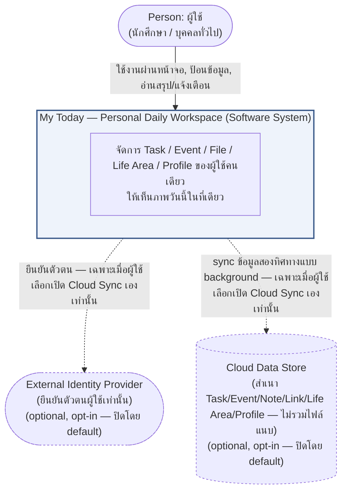
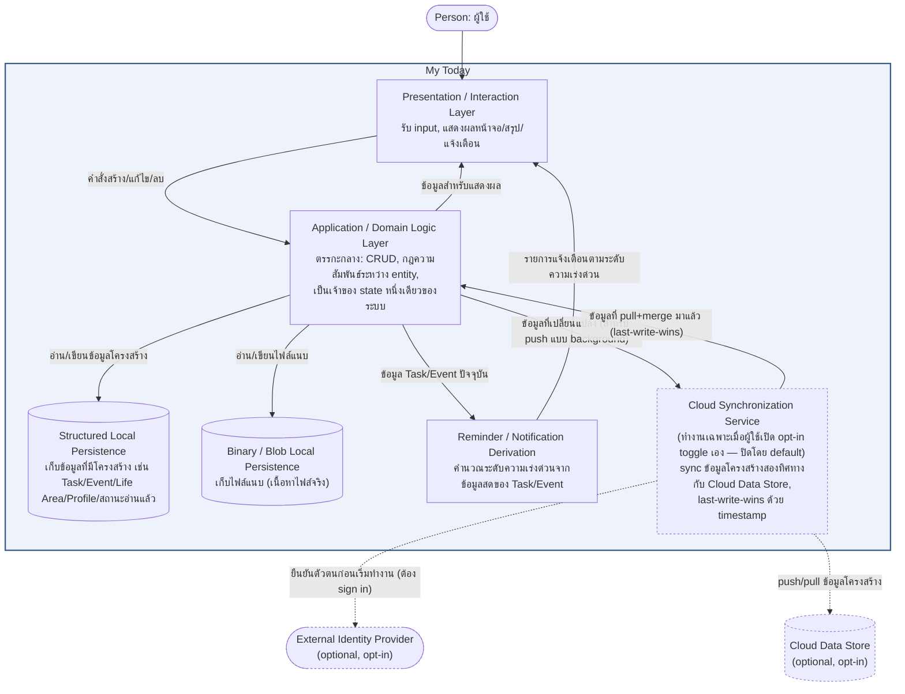
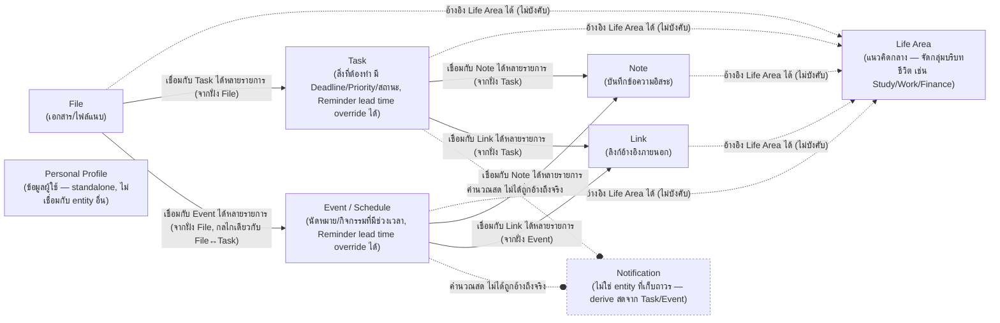

# My Today — High-Level Architecture (Conceptual)

เชื่อมโยงกลับ: [[index|02-technical]], [[../../01-requirements/01-spec/20260806-008-my-today-functional-requirements-master|FR master list]], [[../../01-requirements/01-spec/20260823-013-my-today-non-functional-requirements-master|NFR master list]], [[../../01-requirements/feature-list|feature-list]]

## ขอบเขตของเอกสารนี้

เอกสารนี้เป็น **High-Level Architecture แบบ conceptual และไม่ผูกกับ technology stack** (stack-agnostic) อธิบายระบบในระดับ **C4 Model — Context (Level 1) + Container (Level 2)** เท่านั้น ไม่ลงถึงระดับ Component/Code เจตนาของเอกสารนี้คือให้ยังคงถูกต้องแม้ทีมจะเปลี่ยนไปสร้างแอปนี้ด้วย stack เทคโนโลยีอื่นทั้งหมดในวันพรุ่งนี้ — เนื้อหาหลักจึงจะไม่เอ่ยชื่อภาษา, framework, library, หรือ Web API ใดๆ โดยตรง (รายละเอียดการ implement จริงปัจจุบัน ถ้าเป็นประโยชน์ จะอยู่ในหมายเหตุท้ายหัวข้อที่ระบุชัดเจนว่า "หมายเหตุการ implement ปัจจุบัน" เท่านั้น)

เอกสารเชิงเทคนิคที่ผูกกับ stack จริง (เช่น เลือกใช้ library อะไร, data schema ระดับ field) อาจตามมาเป็นเอกสารแยกอีกฉบับในโฟลเดอร์ [[index|02-technical]] นี้ในภายหลัง — เอกสารนี้ไม่ใช่เอกสารนั้น

## 1. System Context (C4 Level 1)

**ไม่มี external system dependency แบบบังคับ — และผู้ใช้ที่ไม่เปิด Cloud Sync จะไม่มี external dependency เลยแม้แต่น้อย เหมือนเดิมทุกประการ** ระบบนี้ยังคงไม่เรียก third-party API ใดๆ โดยบังคับ ไม่มี backend server ของตัวเอง และไม่ผูกกับบริการภายนอกที่จำเป็นต่อการใช้งานหลัก (เช่น Google Calendar, ระบบมหาวิทยาลัย, ธนาคาร, GPS/LMS) — นี่ยังคงเป็น**ข้อกำหนดผลิตภัณฑ์โดยตรง** (client-only by design ตาม Project purpose) สำหรับผู้ใช้ทุกคนที่ไม่ยุ่งกับ Cloud Sync

อย่างไรก็ตาม ผู้ใช้ที่**เลือกเปิดใช้ความสามารถ Cloud Sync เอง** (opt-in, ปิดอยู่โดย default แม้ยืนยันตัวตนแล้วก็ตาม) จะมี external system เพิ่มเข้ามาสองกล่องตามที่วาดไว้ด้วยเส้นประด้านบน (สื่อว่าเป็น optional ไม่ใช่ dependency บังคับ):

- **External Identity Provider** — ใช้ยืนยันตัวตนผู้ใช้เท่านั้น ก่อนจะเริ่มความสามารถ sync ได้
- **Cloud Data Store** — เก็บสำเนาข้อมูลที่มีโครงสร้าง (ไม่รวมไฟล์แนบ) เพื่อให้ผู้ใช้เข้าถึงข้อมูลเดียวกันได้จากหลายอุปกรณ์

ผู้ใช้ที่ไม่เปิด Cloud Sync ต้องไม่เห็นความแตกต่างใดๆ เลยจากก่อนที่ความสามารถนี้จะมีอยู่ (non-regression) — นี่คือเหตุผลที่กล่องทั้งสองถูกวาดด้วย style ที่สื่อว่า "มีอยู่ก็ต่อเมื่อผู้ใช้เลือกเอง" ไม่ใช่ external system ที่ระบบพึ่งพาเสมอแบบ Context diagram ทั่วไป

## 2. Container View (C4 Level 2)

Container ทั้งหมดตั้งชื่อตาม**หน้าที่รับผิดชอบ** ไม่ใช่ตามเทคโนโลยีที่ใช้ implement — **Cloud Synchronization Service** ถูกวาดด้วยเส้นประเช่นเดียวกับ external system ทั้งสองกล่อง เพื่อสื่อว่าเป็น container ที่มีอยู่ในสถาปัตยกรรมเสมอ (โค้ดถูก build แล้ว) แต่**ทำงานจริง (active)** ก็ต่อเมื่อผู้ใช้เปิด opt-in toggle เองเท่านั้น — เชื่อมต่อกับ Application/Domain Logic Layer โดยตรง (ไม่ใช่ Structured Local Persistence โดยตรง) เพื่อรักษาหลักการ "จุดเดียวเป็นเจ้าของ state" (ดูหัวข้อ 5) ไว้ — ข้อมูลที่ pull+merge มาจาก Cloud Data Store แล้วจะถูกส่งกลับเข้า Domain Logic Layer ให้เป็นผู้ apply ลง Structured Local Persistence เอง ไม่ใช่ Cloud Synchronization Service เขียนตรงเข้าที่เก็บข้อมูลเอง:

- **Presentation / Interaction Layer** — ทุกสิ่งที่ผู้ใช้เห็นและโต้ตอบด้วย (หน้าจอ Dashboard/Tasks/Calendar/Files/Notifications/Life Areas/Profile ฯลฯ)
- **Application / Domain Logic Layer** — จุดเดียวที่ถือ state ของระบบและบังคับกฎทางธุรกิจ (เช่น การลบ Life Area ต้องไม่ลบ Task/Event/File ที่อ้างถึงมัน แค่เคลียร์การอ้างอิงทิ้ง) — Presentation Layer ไม่แก้ข้อมูลตรงๆ ต้องผ่านชั้นนี้เสมอ; นอกเหนือจาก CRUD และกฎความสัมพันธ์ระหว่าง entity แล้ว ชั้นนี้ยังทำหน้าที่ **derive มุมมองที่จัดลำดับความสำคัญแล้ว (Now/Next/Later)** และ **สรุปความคืบหน้าการทำงานให้เสร็จ (completion-progress aggregate)** จาก Task/Event ที่มีอยู่แล้วโดยไม่มี state ใหม่ที่ persist เพิ่ม — เป็นตรรกะ derive ที่อยู่ภายในชั้นนี้เอง ในลักษณะเดียวกับที่ Reminder/Notification Derivation derive ระดับความเร่งด่วน แต่ไม่แยกออกไปเป็น container ใหม่ เพราะไม่มี read-state ที่ต้อง persist แยกต่างหากมารองรับ (ต่างจาก Notification ที่มีสถานะ "อ่านแล้ว" ต้อง persist)
- **Structured Local Persistence** — ที่เก็บข้อมูลที่มีโครงสร้างชัดเจน (record/field) แบบถาวรบนเครื่องผู้ใช้เอง
- **Binary / Blob Local Persistence** — ที่เก็บเนื้อหาไฟล์แนบ (ขนาดใหญ่กว่าและมีลักษณะไบนารี จึงแยกจาก Structured Persistence)
- **Reminder / Notification Derivation** — ไม่ใช่ที่เก็บข้อมูลถาวร แต่เป็นตรรกะที่คำนวณ "อะไรใกล้ถึงกำหนด/เลยกำหนดแล้ว" จากข้อมูล Task/Event สดทุกครั้งที่ต้องแสดงผล
- **Cloud Synchronization Service** — container ที่**เสริม ไม่แทน** Structured Local Persistence (local ยังเป็น source of truth หลักเสมอ ทุกการเขียนต้องลง local ก่อนเสมอ) ทำหน้าที่ pull ข้อมูลจาก Cloud Data Store มา merge เข้ากับ Domain Logic Layer ครั้งเดียวเมื่อผู้ใช้เพิ่งเปิด sync+ยืนยันตัวตนสำเร็จ แล้วจากนั้น push การเปลี่ยนแปลงข้อมูล local แบบ background/best-effort ทุกครั้งที่ข้อมูลเปลี่ยน — ใช้นโยบาย conflict resolution เดียวคือ last-write-wins ด้วย timestamp ไม่มีการ merge แบบ field-by-field — ต้องผ่าน External Identity Provider ก่อนเสมอจึงจะเริ่มทำงานได้ และทำงานก็ต่อเมื่อผู้ใช้เปิด opt-in toggle เองเท่านั้น (ปิดอยู่โดย default แม้ยืนยันตัวตนสำเร็จแล้วก็ตาม) — ความล้มเหลวของ container นี้ (เช่น ไม่มีเครือข่าย) ต้องไม่บล็อกการทำงานของ container อื่นใดเลย

Application/Domain Logic Layer ยังเป็นเจ้าของ**แนวคิดสถานะการจัดระเบียบข้อมูล (organization state)** ด้วย — record หนึ่งรายการสามารถอยู่ในสถานะ "รอการจัดระเบียบ" ชั่วคราวได้ โดยฟิลด์ที่ปกติต้องมีค่าถูกเลื่อนให้ยังไม่ต้องระบุตอนสร้าง จนกว่าจะมีการกระทำ "จัดระเบียบ" อย่างชัดเจนมาเติมค่าที่ขาดและล้างสถานะนั้นออก ทำให้ผู้ใช้บันทึกสิ่งที่นึกขึ้นได้ทันทีโดยยังไม่ต้องตัดสินใจรายละเอียดทั้งหมดในตอนนั้น แล้วค่อยกลับมาจัดระเบียบทีหลังได้

> **หมายเหตุการ implement ปัจจุบัน (อ้างอิงรายละเอียดฉบับเต็มที่ [[tech-stack|tech-stack.md]]):** รายละเอียดด้านล่างระบุเทคโนโลยี/เวอร์ชันจริงต่อ container เพื่อความแม่นยำ — ไม่ใช่ส่วนหนึ่งของสถาปัตยกรรมเชิงแนวคิดด้านบน และไม่ผูกมัดว่าต้องคงไว้แบบนี้ตลอดไป
>
> - **Presentation / Interaction Layer** — React `^18.3.1` (+ `react-dom` `^18.3.1`) components ใน `src/pages/` และ `src/components/`; routing ด้วย `react-router-dom` `^7.18.2` (`BrowserRouter`, ประกอบใน `src/main.tsx`); styling เป็น Tailwind CSS `^3.4.4` utility classes ล้วน (ไม่มี CSS-in-JS หรือ component library, ผ่าน `postcss` `^8.4.38` + `autoprefixer` `^10.4.19`); เขียนด้วย TypeScript `^5.5.2` (`strict: true`) และ build/served ผ่าน Vite `^5.3.1` (`@vitejs/plugin-react` `^4.3.1`)
> - **Application / Domain Logic Layer** — `src/App.tsx` (เจ้าของ state เดียวของระบบ กระจายลง props ให้ทุก route โดยไม่มี context/store แยก) ร่วมกับ hooks ใน `src/hooks/` (`useTasks`, `useEvents`, `useFiles`, `useLifeAreas`, `useProfile`, `useNotifications`, และล่าสุด `useNotes`/`useLinks`) และ pure logic ใน `src/lib/`; ทั้งหมดเป็น TypeScript `^5.5.2` (`strict: true`) — React hooks/props ไม่ใช่ Redux/Context หรือ state library ภายนอกใดๆ
> - **Structured Local Persistence** — Browser LocalStorage ผ่าน generic typed read/write helper ที่ `src/lib/storage.ts`; แยก key ต่อ entity (เช่น Task ใช้ key `my-today:tasks:v2` หลัง breaking shape change ของ Sprint 7)
> - **Binary / Blob Local Persistence** — Browser IndexedDB ผ่าน raw wrapper ที่ `src/lib/fileDb.ts` (object store ชื่อ `files` เพียงชุดเดียว เก็บ metadata และ `Blob` เนื้อหาไฟล์รวมกันใน record เดียวกัน คีย์ด้วย id) — เลือกแยกจาก LocalStorage เพราะ LocalStorage มี quota แบบ string-only ประมาณ 5-10MB ไม่พอสำหรับเนื้อหาไฟล์จริง
> - **Reminder / Notification Derivation** — `src/lib/notificationUtils.ts` (ฟังก์ชัน `buildNotifications`) เป็น pure TypeScript function ที่คำนวณใหม่ทุก render จาก `tasks`/`events` สด ไม่ได้เก็บเป็น record แยก — มีเพียงสถานะ "อ่านแล้ว/แจ้งเตือนแล้ว" (`my-today:notifications-read`, `my-today:notifications-notified`) เท่านั้นที่ persist ไปที่ LocalStorage เดียวกันกับ Structured Local Persistence
> - **Cloud Synchronization Service (Sprint 12)** — `src/lib/firebase.ts` (init app/auth/Firestore), `src/hooks/useAuth.ts` (Google Sign-In ผ่าน `signInWithPopup` พร้อม fallback `signInWithRedirect` เมื่อ popup ถูกบล็อก), `src/lib/cloudSync.ts` (`pullAndMerge`/`pushDiff` generic ต่อ collection บวก `pullProfile`/`pushProfile` สำหรับ Profile ซึ่งเป็น single-record), `src/hooks/useCloudSync.ts` (orchestrator: opt-in flag เก็บที่ LocalStorage key `my-today:sync-enabled` แยกต่างหากจาก Profile — pull ครั้งเดียวต่อ entity ตอนเปิด sync+login แล้ว push แบบ debounce 800ms ต่อ entity เมื่อ array เปลี่ยน) — เทคโนโลยีจริงคือ **Firebase Authentication (Google Sign-In provider) + Cloud Firestore**; ครอบคลุมเฉพาะ 6 entity ที่เป็น structured data ล้วน (Task/CalendarEvent/Note/Link/LifeArea/Profile — ไม่รวม FileRecord/blob เพราะ Firestore จำกัด 1MB/document); สิทธิ์การเข้าถึงถูกจำกัดด้วย `firestore.rules` ที่ repo root (`request.auth.uid == uid` ต่อ path `users/{uid}/**`) — **หมายเหตุ:** `tech-stack.md` (เขียนไว้ 2026-08-23, ก่อน Sprint 12 จะเริ่ม) ยังไม่ครอบคลุมรายละเอียดนี้ รายละเอียดข้างต้นดึงมาจาก spec doc ([[../../01-requirements/01-spec/20260829-014-my-today-sprint12-cloud-sync|Sprint 12 spec]]) และ `backlog.md`/log การ implement จริงโดยตรงแทน — ควรรัน `tech-stack-advisor` อีกรอบเพื่อให้หมายเหตุนี้แม่นยำและมี source-of-truth เดียวในอนาคต
> - **External Identity Provider / Cloud Data Store (Sprint 12, external ต่อ container view)** — คือ Firebase Authentication (เฉพาะ Google Sign-In provider ในรอบนี้ ไม่มี Email/Password) และ Cloud Firestore ตามลำดับ — Firebase project จริงชื่อ `my-today-a25d9`
> - **ภาพรวม deployment (นอกเหนือจาก container ใดๆ โดยเฉพาะ)** — ทั้งระบบ build เป็น static SPA ด้วย Vite แล้ว deploy บน Vercel free tier พร้อม `vercel.json` (SPA rewrite `/(.*)` → `/index.html` เพื่อรองรับ client-side route ของ `BrowserRouter`); lint ด้วย ESLint `^8.57.0`; ยังไม่มี test runner (ยังไม่มี Sprint ใดต้องการ)
> - แนวคิด "organization state" ที่กล่าวถึงข้างต้นถูก implement เป็นฟิลด์ `inInbox: boolean` บน `Task`/`CalendarEvent`/`FileRecord`/`Note`/`Link` ทุกตัว (เพิ่มโดย Sprint 8)
>
> รายละเอียดครบถ้วน รวมถึงเหตุผลการเลือก ตัวเลือกที่พิจารณา และ trade-off ที่ยอมรับ อยู่ที่ [[tech-stack|tech-stack.md]]

## 3. Core Domain Concepts

แนวคิดโดเมนหลักของระบบวางอยู่บน **Life Area เป็นศูนย์กลางการจัดกลุ่ม** — ทุก entity ที่เป็น "เรื่องที่ต้องทำ/เกิดขึ้น/เกี่ยวข้อง" อ้างอิงกลับไปยัง Life Area เดียวกันได้ (แต่ไม่บังคับ):

ประเด็นสำคัญของความสัมพันธ์:

- **Life Area** เป็นแนวคิดเดี่ยว (standalone) ที่ไม่ขึ้นกับ entity อื่น — ลบ Life Area ได้โดยไม่ลบ Task/Event/File ที่เคยอ้างถึงมัน (แค่เคลียร์การอ้างอิงทิ้ง เพราะเป็นความสัมพันธ์แบบ many-to-one ที่ไม่บังคับ)
- **Task / Event / File / Note / Link** แต่ละอย่างอ้างอิง Life Area ได้อย่างมากหนึ่งอัน (optional many-to-one) — **Note และ Link** ถูกสร้างขึ้นจริงแล้ว (Sprint 8) และเข้าสู่โมเดลความสัมพันธ์เดียวกันกับ Task/Event/File ตั้งแต่ต้น ไม่ได้มีรูปแบบความสัมพันธ์แยกต่างหาก
- **File ↔ Task** และ **File ↔ Event** เป็นความสัมพันธ์ many-to-many แบบเดียวกันทั้งคู่ ที่ File เป็นฝ่ายถือรายการ Task/Event ที่เชื่อมด้วย — Task/Event เองไม่ได้เก็บรายการไฟล์ของตัวเอง "ไฟล์ที่เกี่ยวข้องกับ Task/Event นี้" เป็นสิ่งที่คำนวณจากฝั่ง File เสมอ ไม่ใช่ field ที่เก็บไว้บน Task/Event — File↔Event เป็นความสัมพันธ์ที่เพิ่มเข้ามาใหม่ (Sprint 10) โดยขยายกลไกเดิมของ File↔Task (Sprint 4) ให้ครอบคลุม Event ด้วย ไม่ใช่รูปแบบใหม่
- **Task ↔ Note**, **Task ↔ Link**, **Event ↔ Note**, **Event ↔ Link** เป็นความสัมพันธ์ many-to-many ที่เพิ่มเข้ามาใหม่ (Sprint 10) แต่ถือทิศทางตรงข้ามกับ File↔Task/File↔Event — ความสัมพันธ์นี้ถูกเก็บไว้ที่ฝั่ง **Task/Event เอง** (Task/Event เป็นฝ่ายถือรายการ Note/Link ที่เชื่อมด้วย) ไม่ใช่ฝั่ง Note/Link เหมือนที่ File ถือความสัมพันธ์กับ Task/Event — นี่เป็นความไม่สมมาตรที่ตั้งใจออกแบบไว้ ไม่ใช่ความไม่สอดคล้องกัน: File↔Task/Event เป็นรูปแบบ "เอกสารประกอบขนาดใหญ่ผูกกับหลายรายการ" ส่วน Task/Event↔Note/Link เป็นรูปแบบ "รายการหนึ่งพกข้อมูลเสริมชิ้นเล็กติดตัวไปด้วย"
- **Reminder lead time แบบกำหนดเอง** — Task และ Event รองรับการตั้งค่าระยะเวลาแจ้งเตือนล่วงหน้าของตัวเองแบบ optional ได้ (เพิ่มเข้ามาใหม่ Sprint 10) ซึ่งเมื่อกำหนดไว้ Reminder/Notification Derivation (ดูหัวข้อ 2) จะใช้ค่านี้แทนค่า default ของระบบสำหรับรายการนั้นโดยเฉพาะ — ไม่ใช่ entity หรือความสัมพันธ์ใหม่ เป็นเพียง field เพิ่มเติมบน Task/Event ที่มีผลต่อตรรกะ derive ที่มีอยู่แล้ว
- **Notification** ไม่ใช่ entity ที่ถูกเก็บถาวร — เป็นผลลัพธ์ที่ derive จากข้อมูล Task/Event สดทุกครั้งที่ต้องแสดง (จำแนกเป็น Overdue/Due Today/Due Soon) มีเพียงสถานะ "อ่านแล้วหรือยัง" เท่านั้นที่ถูกเก็บถาวรแยกต่างหาก
- **Personal Profile** เป็นแนวคิดเดี่ยวลักษณะ singleton (มีชุดเดียวต่อผู้ใช้) ไม่มีความสัมพันธ์กับ entity อื่นใดเลย
- **สถานะการจัดระเบียบ (organization state)** — Task/Event/File/Note/Link ทุกตัวสามารถอยู่ในสถานะ "รอการจัดระเบียบ" ได้ตอนเพิ่มแบบรวดเร็ว (ฟิลด์ที่ปกติต้องมีค่า เช่น การอ้างอิง Life Area ถูกเลื่อนให้ยังไม่ต้องระบุ) จนกว่าผู้ใช้จะทำการ "จัดระเบียบ" ให้ครบภายหลัง แนวคิดนี้ใช้ร่วมกันข้าม entity ทั้งห้าแบบเดียวกัน ไม่ใช่กลไกเฉพาะของ entity ใด entity หนึ่ง
- **แนวคิด "sync-eligible" (Sprint 12)** — Task/Event/Note/Link/Life Area/Profile (ไม่รวม File เพราะเป็น blob) ล้วนมีแนวคิด "จุดเวลาที่แก้ไขล่าสุด" กำกับตัวเองอยู่แล้วในระดับโดเมน (ไม่ใช่ entity หรือความสัมพันธ์ใหม่ เป็นเพียง metadata เสริมของ record เดิม) ซึ่งถูกใช้เป็นฐานตัดสินว่าสำเนาใด (local หรือ cloud) ใหม่กว่ากันเมื่อเกิดการ sync แบบ opt-in — เช่นเดียวกับที่ "organization state" ถูกอธิบายไว้ข้างต้น แนวคิดนี้ใช้ร่วมกันข้าม entity ที่ sync ได้ทั้งหมดแบบเดียวกัน ไม่ผูกกับ entity ใด entity หนึ่งเป็นการเฉพาะ และไม่มีผลใดๆ ต่อผู้ใช้ที่ไม่เปิด Cloud Sync
- **มุมมองจัดลำดับความสำคัญแบบ derived (Now/Next/Later)** — ไม่มี entity หรือความสัมพันธ์ใหม่เกิดขึ้นจากแนวคิดนี้ ฟิลด์ที่ Task (dueDate/dueTime/status/priority) และ Event (date/startTime) มีอยู่แล้วเดิม ถูกใช้เป็นฐานคำนวณมุมมองที่จัดลำดับความสำคัญ (Now/Next/Later) และสรุปความคืบหน้าการทำงาน (completion progress) เพิ่มเติม โดยไม่มี state ใหม่ใดๆ ถูก persist เพิ่ม — เป็นมุมมองที่คำนวณสดจากข้อมูลเดิม เช่นเดียวกับที่ Notification ถูกคำนวณสดจาก Task/Event เดิมเช่นกัน

## 4. Data Flow per User Journey

หัวข้อนี้อ้างอิง narrative ของ [[../01-prototypes/user-journey-student|User Journey: นักศึกษา]] และ [[../01-prototypes/user-journey-general-person|User Journey: บุคคลทั่วไป]] โดยตรง — ไม่สร้าง narrative ใหม่ เพียง annotate ว่าแต่ละขั้นตอนที่มีอยู่แล้วในสอง journey นั้นไหลผ่าน Container ใดบ้างและทิศทางไหน สถานะ **เสร็จแล้ว/แผนในอนาคต** ของแต่ละขั้นตอนคงไว้ตรงตามที่ระบุใน journey docs (ยึด backlog.md ณ วันที่ตรวจสอบล่าสุด 20260824)

### 4.1 นักศึกษา (Task "ส่งรายงาน HCI", Life Area "Study")

| # | ขั้นตอน (ตาม user-journey-student.md) | Container ที่เกี่ยวข้อง | ทิศทาง | FR อ้างอิง | สถานะ |
|---|---|---|---|---|---|
| 1 | เพิ่ม Task ผ่าน Quick Capture | Presentation → Domain Logic → Structured Persistence | เขียน | FR-13 | เสร็จแล้ว |
| 2 | เข้า My Inbox | Structured Persistence → Domain Logic → Presentation | อ่าน | FR-14 | เสร็จแล้ว |
| 3 | จัดเข้า Life Area "Study" จาก Inbox | Presentation → Domain Logic → Structured Persistence | เขียน (อัปเดตการอ้างอิง Life Area) | FR-14 | เสร็จแล้ว |
| 4 | กำหนด Deadline ของ Task | Presentation → Domain Logic → Structured Persistence | เขียน | FR-04 | เสร็จแล้ว |
| 5 | แนบไฟล์รายงาน (Related Files) | Presentation → Domain Logic → Binary/Blob Persistence (เนื้อหาไฟล์) + Structured Persistence (ความสัมพันธ์ File↔Task) | เขียน | FR-09 | เสร็จแล้ว |
| 6 | เห็น Deadline ปรากฏใน Calendar อัตโนมัติ | Structured Persistence → Domain Logic (รวมมุมมอง Task+Event) → Presentation | อ่าน | FR-07 | เสร็จแล้ว |
| 7 | เห็น Deadline ใน Timeline Now/Next/Later | Structured Persistence → Domain Logic → Presentation | อ่าน | FR-16 | เสร็จแล้ว |
| 8 | เปิดแอปตอนเช้า เห็นงานบน Today Dashboard | Structured Persistence → Domain Logic → Presentation | อ่าน | FR-05, FR-12 | เสร็จแล้ว |
| 9 | ระบบเตือนตาม Reminder lead time ที่ตั้งเอง | Structured Persistence → Domain Logic → Reminder/Notification Derivation → Presentation | อ่าน | FR-19 | เสร็จแล้ว |
| 10 | ทำงานเสร็จ กด Done | Presentation → Domain Logic → Structured Persistence | เขียน | FR-03, FR-11 | เสร็จแล้ว |
| 11 | Life Progress อัปเดต | Structured Persistence → Domain Logic (aggregate ตาม Life Area) → Presentation | อ่าน | FR-17 | เสร็จแล้ว |

### 4.2 บุคคลทั่วไป (Task "จ่ายค่าไฟ", Life Area "Finance")

| # | ขั้นตอน (ตาม user-journey-general-person.md) | Container ที่เกี่ยวข้อง | ทิศทาง | FR อ้างอิง | สถานะ |
|---|---|---|---|---|---|
| 1 | เพิ่ม Task ผ่าน Quick Capture | Presentation → Domain Logic → Structured Persistence | เขียน | FR-13 | เสร็จแล้ว |
| 2 | เข้า My Inbox | Structured Persistence → Domain Logic → Presentation | อ่าน | FR-14 | เสร็จแล้ว |
| 3 | จัดเข้า Life Area "Finance" จาก Inbox + กำหนด Deadline | Presentation → Domain Logic → Structured Persistence | เขียน | FR-14 | เสร็จแล้ว |
| 4 | แนบไฟล์ใบแจ้งหนี้ค่าไฟ (Related Files) | Presentation → Domain Logic → Binary/Blob Persistence + Structured Persistence (ความสัมพันธ์ File↔Task) | เขียน | FR-09 | เสร็จแล้ว |
| 5 | เห็น Deadline ใน Timeline Now/Next/Later | Structured Persistence → Domain Logic → Presentation | อ่าน | FR-16 | เสร็จแล้ว |
| 6 | ได้รับการเตือนเมื่อใกล้ถึงกำหนด (Due Soon/Overdue) | Structured Persistence → Domain Logic → Reminder/Notification Derivation → Presentation | อ่าน | FR-10 | เสร็จแล้ว |
| 7 | จ่ายเงินเสร็จ กด Done | Presentation → Domain Logic → Structured Persistence | เขียน | FR-03, FR-11 | เสร็จแล้ว |
| 8 | Life Progress อัปเดต | Structured Persistence → Domain Logic (aggregate ตาม Life Area) → Presentation | อ่าน | FR-17 | เสร็จแล้ว |

ทั้งสอง journey ไหลผ่าน**ชุด Container เดียวกันทุกขั้นตอน** ไม่มี container หรือ data path แยกตาม persona ที่ไหนเลย — สอดคล้องกับหมายเหตุปิดท้ายของทั้งสอง journey docs ที่ย้ำว่าใช้ "กลไกหลักชุดเดียวกัน" โดยไม่มี code path แยกตาม persona

## 5. Cross-cutting Architectural Principles

- **No backend / local-first by design (ยังเป็นหลักการ default/หลักของระบบ)** — ไม่มี server-side component ใดๆ ที่จำเป็นต่อการใช้งานหลัก ทุก Container หลักยังทำงานอยู่บนเครื่องผู้ใช้เพียงเครื่องเดียว นี่คือการตัดสินใจเชิงผลิตภัณฑ์ตั้งแต่ต้น ไม่ใช่ข้อจำกัดชั่วคราว — **ข้อยกเว้นแรก** ที่ผู้ใช้เลือกเปิดเองได้คือ Cloud Synchronization Service (Sprint 12, ดูหัวข้อ 1/2) ซึ่งเป็น**จุดเริ่มต้นของ Version 3** ตาม roadmap ไม่ใช่การเปลี่ยนหลักการ local-first ของ Version 1/2 — ผู้ใช้ที่ไม่เปิดใช้ยังคงอยู่ภายใต้หลักการนี้แบบไม่มีข้อยกเว้นเหมือนเดิมทุกประการ
- **Privacy-by-architecture (จริงเสมอเมื่อไม่เปิด Cloud Sync — ค่า default)** — เพราะไม่มี backend และไม่มี external system dependency แบบบังคับ (ดูข้อ 1) ข้อมูลของผู้ใช้ที่ไม่เปิด Cloud Sync จึงไม่มีทางออกจากเครื่องได้เลยโดยธรรมชาติของสถาปัตยกรรม ไม่ใช่แค่กฎการใช้งานที่ตั้งไว้ — เมื่อผู้ใช้**เลือกเปิด Cloud Sync เอง** ข้อมูลโครงสร้าง (ไม่รวมไฟล์แนบ) จะถูกส่งไปที่ Cloud Data Store ภายใต้การควบคุมของผู้ใช้เอง (เป็นการตัดสินใจที่ผู้ใช้เลือกเอง ไม่ใช่ default) และถูกจำกัดสิทธิ์การเข้าถึงด้วย Security Rules ที่อนุญาตเฉพาะเจ้าของบัญชีเท่านั้น
- **จุดเดียวเป็นเจ้าของ state** — มี Application/Domain Logic Layer เพียงชุดเดียวในระบบที่ถือ state จริงและกระจายให้ Presentation Layer ใช้ ไม่มีสำเนา state ที่สองที่อาจไม่ตรงกัน (อธิบายเชิงหน้าที่ ไม่ใช่ชื่อ class/file เฉพาะเจาะจง) — หลักการนี้เป็นเหตุผลที่ Cloud Synchronization Service (Sprint 12) เชื่อมต่อผ่าน Domain Logic Layer แทนที่จะเขียนตรงเข้า Structured Local Persistence เอง (ดูหัวข้อ 2)
- **AI: ยังไม่มีในสถาปัตยกรรมที่ build แล้วจริง / External integration: มีข้อยกเว้นแรกแล้ว (Sprint 12)** — Cloud Synchronization Service (Sprint 12) คือ**ข้อยกเว้นแรก**ต่อกฎ "ไม่มี external integration" ที่เคยเป็นจริงแบบเด็ดขาดมาก่อน แต่ขอบเขตจำกัดแคบมากเฉพาะ External Identity Provider + Cloud Data Store ตามที่อธิบายไว้ในหัวข้อ 1/2 เท่านั้น ไม่เปิดกว้างบริการภายนอกอื่นใด — ส่วน "ไม่มี AI" ยังคงเป็นจริง 100% ในขอบเขตที่ build แล้วจริง ณ ตอนนี้ (Sprint 13 มีแนวคิด AI แล้วในระดับ spec แต่ยังไม่มีโค้ดจริงสักบรรทัดเดียว จึงยังไม่นับเป็นส่วนหนึ่งของสถาปัตยกรรมนี้ — ดู known gap ที่หัวข้อ 6 แทน; "Daily Orchestrator" ที่ Project purpose จองชื่อไว้เป็น phase แยกต่างหากหลัง Freeze ก็ยังไม่ใช่ส่วนหนึ่งของสถาปัตยกรรมนี้เช่นกัน)
- **ทิศทางการขยายระบบ** — entity ใหม่ในอนาคต (เช่น Note, Link) เข้าสู่โมเดลความสัมพันธ์แบบเดียวกับที่ Task/Event/File ใช้อยู่แล้ว (อ้างอิง Life Area แบบ optional many-to-one) แทนที่จะสร้างรูปแบบความสัมพันธ์ใหม่ — Life Area ยังคงเป็นแกนกลางของระบบต่อไปแม้ entity จะเพิ่มขึ้น
- **Non-Functional Requirements** — หลักการข้างต้นเป็นเพียงภาพรวมเชิงสถาปัตยกรรม ไม่ได้ลงรายละเอียดครบทุกด้าน ชุด NFR แบบเต็ม (Performance, Reliability/Data Integrity, Usability/UX, Accessibility, Security/Privacy/Compliance, Compatibility/Portability, Offline Capability, Scalability/Capacity, Maintainability) ถูกจัดทำเป็นเอกสารทางการแล้วที่ [[../../01-requirements/01-spec/20260823-013-my-today-non-functional-requirements-master|NFR master list]]

## 6. Known Gaps / Not-yet-built Extensions

รายการนี้คือ container/flow ที่ narrative ของ Sprint ที่ยังไม่ build (หรือ build ไม่ครบ) บอกเป็นนัยว่าจะต้องมี ตามสถานะล่าสุดใน backlog.md (ตรวจสอบล่าสุด 20260830 — ไม่พบสัญญาณ backlog.md ล้าสมัย ผ่าน `backlog-sync-check` แล้ว):

- **Accessibility Baseline** (Sprint 11, NFR-04) — เฉพาะ semantic HTML (`<main>` landmark) เพิ่มแล้วครบทุกหน้า ณ วันที่ตรวจสอบล่าสุด; keyboard-focus/contrast พบว่ามีอยู่แล้วจากงานปรับ UI ก่อนหน้า แต่ยังไม่มีการตรวจสอบ/ยืนยันอย่างเป็นทางการ (เช่น WCAG contrast ratio หรือ screen-reader testing) — ยังไม่ถือว่าปิด gap นี้สมบูรณ์
- **Server-side Integration Proxy** (Sprint 13, แผนในอนาคต — ยังไม่มีโค้ดจริงเลย มีแค่ spec) — container ใหม่ที่จะต้องมีเมื่อ build จริง ทำหน้าที่รับ input (รูปภาพ) จาก Presentation Layer แล้วส่งต่อไปยัง External AI Analysis Service โดยไม่เปิดเผยข้อมูลลับ (API key) ให้ฝั่ง client เห็นเด็ดขาด — เป็น**ข้อยกเว้นที่ 2 ต่อหลักการ "no backend"** แยกต่างหากจาก Cloud Synchronization Service ของ Sprint 12 (คนละกลไก คนละเหตุผล: Sprint 12 คือ Backend-as-a-Service สำหรับ sync ข้อมูล ส่วน Sprint 13 คือ compute proxy ชั่วคราวสำหรับซ่อน secret ไม่ใช่การขยาย exception เดิม)
- **External AI Analysis Service** (Sprint 13, แผนในอนาคต — ยังไม่มีโค้ดจริงเลย มีแค่ spec) — external system ใหม่ที่จะวิเคราะห์รูปภาพเดียวที่ผู้ใช้เลือกเองแบบ ephemeral (ไม่ persist รูปไว้ที่ไหนเลย) แล้วคืนผลลัพธ์เป็นข้อมูลสกัด (ชื่องาน/วันที่/เวลา/สถานที่) ให้ Presentation Layer นำไปเติมฟอร์ม Quick Capture ประเภท Event ให้ผู้ใช้ตรวจสอบ/แก้ไขก่อนเสมอ (ห้าม auto-submit) — ไม่ผูกกับผู้ให้บริการ AI เจาะจงรายใดตามที่ spec ระบุไว้
- การเข้าถึง container/external system คู่นี้ (Sprint 13) จะถูก gate ด้วย **External Identity Provider เดียวกับ Sprint 12** (ต้อง sign in ก่อนถึงจะใช้ได้) — นี่จะเป็น**ครั้งแรกที่ระบบมี container ที่ requires authentication** ถึงจะเข้าถึงได้ ต่างจาก container อื่นทั้งหมดในสถาปัตยกรรมนี้ (รวมถึง Cloud Synchronization Service เอง ซึ่งแม้ต้อง sign in ก่อนจึง sync ได้ แต่ตัวแอปหลักไม่เคยบังคับให้ sign in เพื่อใช้งาน Quick Capture ประเภทอื่นเลย)
- **ย้ำชัดเจน: นี่ไม่ใช่และไม่นับเป็นจุดเริ่มต้นของ "Daily Orchestrator"** — Daily Orchestrator เป็น AI phase ในอนาคตที่ Project purpose จองชื่อไว้แยกต่างหาก (ผู้ช่วยสรุปภาพรวมวัน/จัดลำดับความสำคัญให้ผู้ใช้ในภาพกว้าง) ส่วน Server-side Integration Proxy + External AI Analysis Service ของ Sprint 13 มีขอบเขตแคบมากเฉพาะการสกัดข้อมูล Event จากรูปภาพเดียวสำหรับ Quick Capture ประเภท Event เท่านั้น ไม่ใช่ AI assistant/orchestrator ทั่วไป และไม่เปิดทางให้ Daily Orchestrator ตามมาโดยอัตโนมัติ

Sprint 12 (Cloud Sync) **build เสร็จสมบูรณ์แล้ว** และถูกโปรโมทเข้า diagram หลักของหัวข้อ 1/2 แล้ว (Cloud Synchronization Service + External Identity Provider + Cloud Data Store) — ไม่ใช่ known gap อีกต่อไป ตาม pattern เดิมของเอกสารนี้ที่เคยโปรโมท Sprint 8-10 เข้า diagram หลังแต่ละ Sprint build เสร็จ (ดู Change Log) แม้ Gate 12 จะยังไม่ผ่านครบ 100% (ยังเหลือ Security Rules Emulator test ที่ต้องการ Java 21+ และการยืนยัน multi-device sync แบบเต็มรูปแบบในเบราว์เซอร์จริง ตาม backlog.md) โค้ดถูก build จริงและยืนยัน non-regression แล้วในเบราว์เซอร์ จึงนับเป็น container จริงในสถาปัตยกรรม ไม่ใช่แผนในอนาคต — ต่างจาก Sprint 13 ที่มีแค่ spec เท่านั้น ยังไม่มีโค้ดสักบรรทัดเดียว จึงยังคงอยู่ในหัวข้อนี้ล้วนๆ

Accessibility Baseline (บางส่วน, Sprint 11) กระทบ Presentation/Interaction Layer เท่านั้นที่ยังเหลือเป็น known gap จาก Sprint 11 ณ ตอนนี้ ส่วน Browser Compatibility Matrix (อีกหนึ่งรายการ NFR ที่ Sprint 11 รับผิดชอบ) ไม่นับเป็นรายการในหัวข้อนี้ เพราะเป็นขอบเขตการทดสอบ ไม่ใช่ gap เชิงสถาปัตยกรรม

## 7. Change Log

- 20260816 — สร้างเอกสารนี้ครั้งแรก: C4 Context + Container diagram, Core Domain Concepts, Data Flow ของทั้งสอง persona journey (นักศึกษา/บุคคลทั่วไป) อ้างอิงจาก user-journey docs ที่มีอยู่แล้ว, cross-cutting principles, และ known gaps จาก Sprint 8-11 ที่ยังไม่ build
- 20260823 — อัปเดตสะท้อน Sprint 8 (Universal Inbox + Quick Capture) เสร็จแล้ว: ย้าย Note/Link จากแผนในอนาคตมาเป็น entity ที่ build จริงแล้วใน Core Domain Concepts (หัวข้อ 3), ปรับสถานะขั้นตอน Quick Capture/Inbox ในทั้งสอง persona journey (หัวข้อ 4) เป็น "เสร็จแล้ว", ตัด known gaps ของ Sprint 8 ออกเหลือเฉพาะ Sprint 9-10 (หัวข้อ 6), และเพิ่มคำอธิบายแนวคิด "organization state" ที่ Application/Domain Logic Layer เป็นเจ้าของ (หัวข้อ 2/3)
- 20260823 — เพิ่มความละเอียดของหมายเหตุการ implement ปัจจุบันในหัวข้อ 2 (Container View) จากหมายเหตุก้อนเดียวรวม เป็นหมายเหตุแยกต่อ container พร้อมชื่อ/เวอร์ชันเทคโนโลยีที่แม่นยำ (React 18.3.1, Vite 5.3.1, TypeScript 5.5.2 strict, React Router 7.18.2, Tailwind CSS 3.4.4, LocalStorage, IndexedDB, Vercel free tier) โดยอ้างอิงจากเอกสารใหม่ [[tech-stack|tech-stack.md]] ที่เพิ่งสร้างขึ้น — ไม่มีการเปลี่ยนเนื้อหาเชิงแนวคิดของหัวข้อ 1/3/4/5/6
- 20260823 — เพิ่ม cross-link ไปยัง [[../../01-requirements/01-spec/20260823-013-my-today-non-functional-requirements-master|NFR master list]] ฉบับใหม่ในหัวข้อเชื่อมโยงกลับ, เพิ่มบรรทัดชี้ในหัวข้อ 5 ว่าชุด NFR แบบเต็มอยู่ที่เอกสารนี้, และเพิ่ม known gap ใหม่ 2 รายการในหัวข้อ 6 (Accessibility Baseline กระทบ Presentation/Interaction Layer, IndexedDB Quota-Warning กระทบ Binary/Blob Local Persistence) — ไม่รวม Browser Compatibility Matrix เพราะเป็นขอบเขตการทดสอบ ไม่ใช่ gap เชิงสถาปัตยกรรม/container — ไม่มีการเปลี่ยนเนื้อหาหัวข้อ 1/2/3/4
- 20260823 — แก้ inconsistency ในหัวข้อ 6: เพิ่มป้ายอ้างอิง "(Sprint 11)" ให้ bullet Accessibility Baseline และ IndexedDB Quota-Warning (Sprint 11 อ้างสิทธิ์ทั้งสองรายการนี้ไว้ในสเปกของตัวเองตามการแก้ไข commit `d6874c3`) และแก้บรรทัดปิดท้ายที่เคยระบุผิดว่า Sprint 11 ไม่กระทบ container ใดๆ ให้ถูกต้องว่า Sprint 11 ไม่เพิ่ม container ใหม่ แต่เพิ่มพฤติกรรมใหม่ให้ 2 container เดิม (Presentation/Interaction Layer, Binary/Blob Local Persistence) — ไม่มีการเปลี่ยนเนื้อหาหัวข้อ 1-5 หรือ bullet Sprint 9/10
- 20260824 — อัปเดตสะท้อน Sprint 9 (Now/Next/Later Timeline + Smart Priority + Life Progress) เสร็จแล้ว: ขยายคำอธิบาย Application/Domain Logic Layer ในหัวข้อ 2 ให้ระบุว่าชั้นนี้ derive มุมมองจัดลำดับความสำคัญ (Now/Next/Later) และ completion-progress aggregate ด้วย โดยไม่ดึงออกเป็น container ใหม่ (ไม่มี read-state ใหม่ที่ต้อง persist ต่างจาก Notification); เพิ่มประโยคในหัวข้อ 3 อธิบายว่าฟิลด์เดิมของ Task/Event เป็นฐานของมุมมอง derived นี้โดยไม่มี entity/ความสัมพันธ์ใหม่เกิดขึ้น; ปรับสถานะแถว FR-16 (Timeline) และ FR-17 (Life Progress) ในทั้งสอง persona journey table ของหัวข้อ 4 จาก "แผนในอนาคต" เป็น "เสร็จแล้ว"; ตัด known gap bullet ของ Sprint 9 ทั้งสองรายการออกจากหัวข้อ 6 และแก้ประโยคเปิดหัวข้อให้เหลือเฉพาะ Sprint 10-11 ที่ยังไม่ build — ไม่มีการเปลี่ยนเนื้อหาหัวข้อ 1, diagram/หมายเหตุ implement ของหัวข้อ 2, หรือหัวข้อ 5
- 20260824 — อัปเดตสะท้อน Sprint 10 (Task-Event-File Linking — What/When/Information) เสร็จแล้ว: เพิ่มความสัมพันธ์ใหม่ใน Core Domain Concepts (หัวข้อ 3) — Task↔Note, Task↔Link, Event↔Note, Event↔Link (เก็บฝั่ง Task/Event ตั้งใจสวนทางกับทิศทางของ File↔Task เดิม) และ File↔Event (เก็บฝั่ง File แบบเดียวกับ File↔Task) พร้อมประโยคอธิบาย Reminder lead time แบบกำหนดเองต่อรายการที่เชื่อมกับ Reminder/Notification Derivation ในหัวข้อ 2; ปรับสถานะแถว FR-19 (ขั้นตอนที่ 9 ของ journey นักศึกษา) ในหัวข้อ 4 จาก "แผนในอนาคต" เป็น "เสร็จแล้ว" (journey บุคคลทั่วไปไม่มีแถวนี้อยู่แล้ว ไม่ต้องแก้); ตัด known gap bullet ของ Sprint 10 ออกจากหัวข้อ 6 เหลือเฉพาะ 2 รายการที่ผูกกับ Sprint 11 (Accessibility Baseline, IndexedDB Quota-Warning) และแก้ประโยคเปิดหัวข้อให้ระบุว่าเหลือเฉพาะ Sprint 11 ที่ยังไม่ build — ไม่มี container ใหม่เกิดขึ้น (ตามที่ตกลงไว้ล่วงหน้า) จึงไม่มีการเปลี่ยนเนื้อหาหัวข้อ 1, diagram/หมายเหตุ implement ของหัวข้อ 2, หรือหัวข้อ 5
- 20260825 — อัปเดตบางส่วน (partial-progress update) สะท้อนความคืบหน้าจริงของ Sprint 11 ที่ยังไม่ได้ commit เข้า git — **นี่ไม่ใช่การประกาศว่า Sprint 11 เสร็จแล้ว** (backlog.md ยังระบุสถานะ "กำลังดำเนินการ" ไม่ใช่ "เสร็จแล้ว"): ในหัวข้อ 6 ตัด known gap bullet ของ IndexedDB Quota-Warning ออกทั้งหมด (build เสร็จสมบูรณ์แล้ว — progressive-enhancement wrapper ตรวจ quota เมื่อโหลดและหลังเพิ่มไฟล์ทุกครั้ง พร้อม banner เตือนที่ยกเลิกได้ ตรวจสอบใน browser แล้ว) และแก้ไข wording ของ bullet Accessibility Baseline ให้สะท้อนสถานะ "build บางส่วน" (เฉพาะ semantic HTML `<main>` landmark ครบทุกหน้า ส่วน keyboard-focus/contrast พบว่ามีอยู่แล้วจากงานก่อนหน้าแต่ยังไม่ผ่านการตรวจสอบ/ยืนยันอย่างเป็นทางการ) แทนที่จะลบออกทั้งบรรทัด; ปรับประโยคเปิดหัวข้อ 6 และประโยคปิดท้ายให้ตรงกับสถานะใหม่นี้ — ไม่มีการเปลี่ยนเนื้อหาหัวข้อ 1-5
- 20260830 — อัปเดตสะท้อน **Sprint 12 (Cloud Sync) build เสร็จสมบูรณ์แล้ว** (code-complete, non-regression ยืนยันในเบราว์เซอร์ — Gate 12 ยังไม่ผ่านครบ 100% ตาม backlog.md แต่มากพอที่จะนับเป็น container จริงในสถาปัตยกรรมแล้ว) และ **Sprint 13 (Smart Capture จากรูปภาพ) ที่มีแค่ spec ยังไม่มีโค้ด**: **หัวข้อ 1** — แก้ประโยค "ไม่มี external system dependency ใดๆ" ที่เคยเป็นจริงแบบเด็ดขาด ให้มีเงื่อนไข (จริงเสมอสำหรับผู้ใช้ที่ไม่เปิด Cloud Sync ค่า default; ผู้ใช้ที่เปิดเองมี External Identity Provider + Cloud Data Store เพิ่มเข้ามา วาดด้วยเส้นประสื่อว่า optional/opt-in ไม่ใช่ dependency บังคับ); **หัวข้อ 2** — เพิ่ม container ใหม่ "Cloud Synchronization Service" เชื่อมต่อผ่าน Application/Domain Logic Layer (ไม่ใช่ตรงเข้า Structured Local Persistence เอง เพื่อรักษาหลักการจุดเดียวเป็นเจ้าของ state) ไปยัง External Identity Provider + Cloud Data Store พร้อมคำอธิบายหน้าที่รับผิดชอบและหมายเหตุการ implement ปัจจุบัน (Firebase Authentication + Cloud Firestore, ไฟล์ `src/lib/firebase.ts`/`src/hooks/useAuth.ts`/`src/lib/cloudSync.ts`/`src/hooks/useCloudSync.ts`, `firestore.rules`) โดยดึงข้อมูลจาก spec/backlog.md โดยตรงเนื่องจาก `tech-stack.md` (เขียนไว้ 2026-08-23) ยังไม่ครอบคลุม Sprint 12 — แนะนำให้รัน `tech-stack-advisor` อีกรอบเพื่อความแม่นยำในอนาคต; **หัวข้อ 3** — เพิ่มประโยคอธิบายแนวคิด "sync-eligible" (timestamp สำหรับ last-write-wins) ที่ Task/Event/Note/Link/Life Area/Profile ทุกตัวมีร่วมกัน ไม่ใช่ entity/ความสัมพันธ์ใหม่; **หัวข้อ 4** — ไม่แก้ไข (ยืนยันจาก feature-journey-sync ล่าสุดว่า Sprint 12/13 ไม่อยู่ใน core Final Journey ของทั้งสอง persona); **หัวข้อ 5** — แก้ 3 bullet: "No backend/local-first" ระบุข้อยกเว้นแรกที่ผู้ใช้เลือกเปิดเอง (จุดเริ่มต้น Version 3 ไม่ใช่การเปลี่ยนหลักการ), "Privacy-by-architecture" ใส่เงื่อนไข (จริงเสมอเมื่อไม่เปิด sync, มีการควบคุมของผู้ใช้เองเมื่อเปิด), "ไม่มี AI/external integration" แก้เป็น Cloud Sync คือข้อยกเว้นแรกต่อ external integration แล้ว ส่วน AI ยังไม่มีจริงในสถาปัตยกรรมที่ build แล้ว (Sprint 13 เป็นแค่ spec); **หัวข้อ 6** — เพิ่ม bullet ใหม่ 5 รายการสำหรับ Sprint 13 (Server-side Integration Proxy, External AI Analysis Service, authentication-gated ครั้งแรกของระบบ, ย้ำว่าไม่ใช่ Daily Orchestrator) และปรับประโยคเปิด/ปิดหัวข้อให้ระบุชัดว่า Sprint 12 ถูกตัดออกจากหัวข้อนี้แล้ว (โปรโมทเข้า diagram หลัก) เหลือเฉพาะ Sprint 11 (บางส่วน) และ Sprint 13 (ทั้งหมด) เป็น known gap
