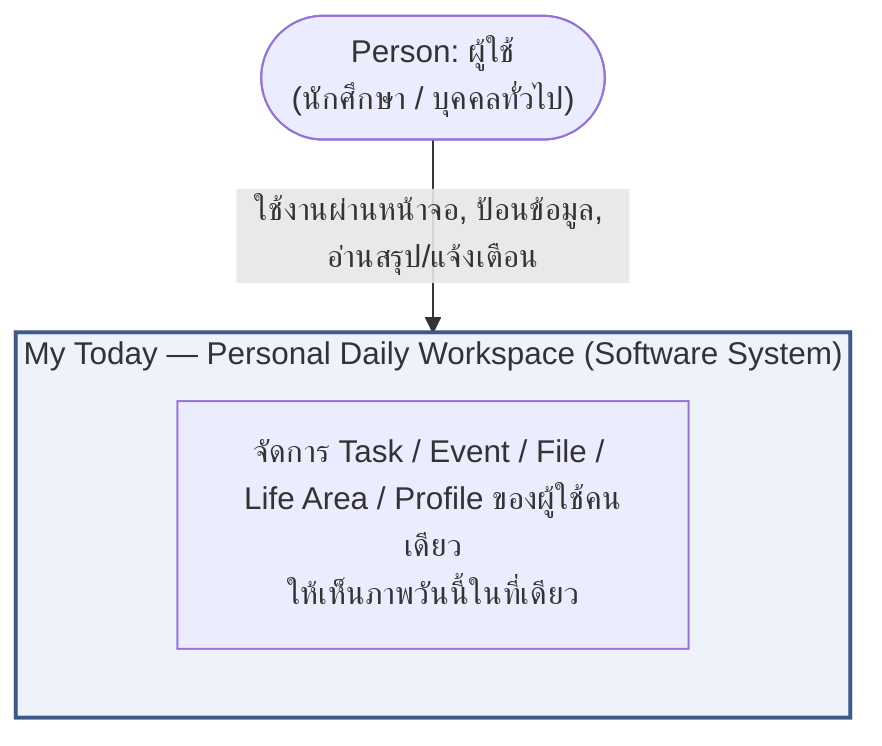
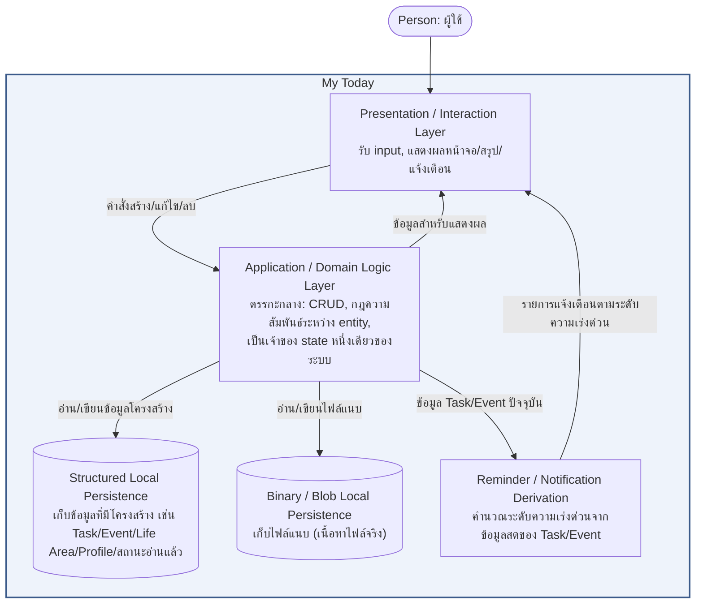
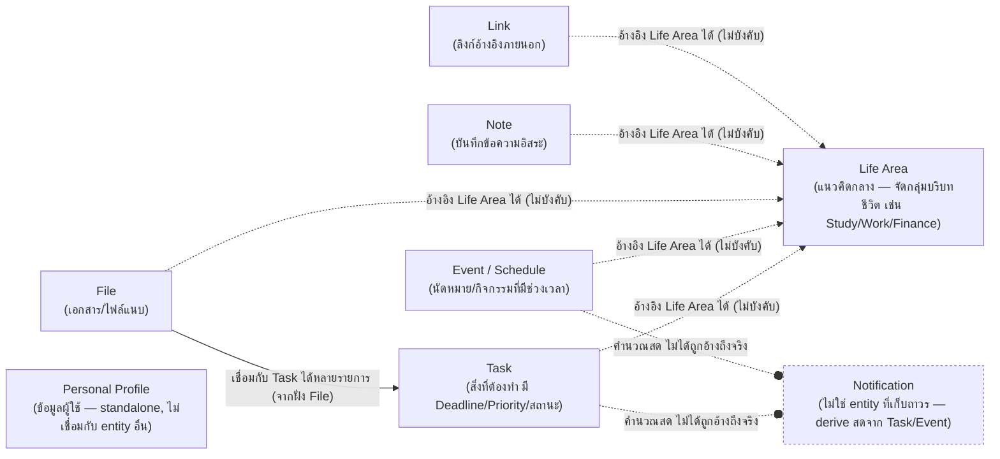

# My Today — High-Level Architecture (Conceptual)

เชื่อมโยงกลับ: [[index|02-technical]], [[../../01-requirements/01-spec/20260806-008-my-today-functional-requirements-master|FR master list]], [[../../01-requirements/01-spec/20260823-013-my-today-non-functional-requirements-master|NFR master list]], [[../../01-requirements/feature-list|feature-list]]

## ขอบเขตของเอกสารนี้

เอกสารนี้เป็น **High-Level Architecture แบบ conceptual และไม่ผูกกับ technology stack** (stack-agnostic) อธิบายระบบในระดับ **C4 Model — Context (Level 1) + Container (Level 2)** เท่านั้น ไม่ลงถึงระดับ Component/Code เจตนาของเอกสารนี้คือให้ยังคงถูกต้องแม้ทีมจะเปลี่ยนไปสร้างแอปนี้ด้วย stack เทคโนโลยีอื่นทั้งหมดในวันพรุ่งนี้ — เนื้อหาหลักจึงจะไม่เอ่ยชื่อภาษา, framework, library, หรือ Web API ใดๆ โดยตรง (รายละเอียดการ implement จริงปัจจุบัน ถ้าเป็นประโยชน์ จะอยู่ในหมายเหตุท้ายหัวข้อที่ระบุชัดเจนว่า "หมายเหตุการ implement ปัจจุบัน" เท่านั้น)

เอกสารเชิงเทคนิคที่ผูกกับ stack จริง (เช่น เลือกใช้ library อะไร, data schema ระดับ field) อาจตามมาเป็นเอกสารแยกอีกฉบับในโฟลเดอร์ [[index|02-technical]] นี้ในภายหลัง — เอกสารนี้ไม่ใช่เอกสารนั้น

## 1. System Context (C4 Level 1)

**ไม่มี external system dependency ใดๆ** — ระบบนี้ไม่เรียก third-party API ภายนอก ไม่มี backend server ของตัวเอง และไม่ผูกกับบริการภายนอกใดๆ (เช่น Google Calendar, ระบบมหาวิทยาลัย, ธนาคาร, GPS/LMS) นี่ไม่ใช่รายละเอียดการ implement แต่เป็น**ข้อกำหนดผลิตภัณฑ์โดยตรง** (client-only by design ตาม Project purpose) — Context diagram ด้านบนจึงมีเพียง Person กับ System เท่านั้น ไม่มีกล่อง external system ใดๆ ให้วาด

## 2. Container View (C4 Level 2)

Container ทั้งหมดตั้งชื่อตาม**หน้าที่รับผิดชอบ** ไม่ใช่ตามเทคโนโลยีที่ใช้ implement:

- **Presentation / Interaction Layer** — ทุกสิ่งที่ผู้ใช้เห็นและโต้ตอบด้วย (หน้าจอ Dashboard/Tasks/Calendar/Files/Notifications/Life Areas/Profile ฯลฯ)
- **Application / Domain Logic Layer** — จุดเดียวที่ถือ state ของระบบและบังคับกฎทางธุรกิจ (เช่น การลบ Life Area ต้องไม่ลบ Task/Event/File ที่อ้างถึงมัน แค่เคลียร์การอ้างอิงทิ้ง) — Presentation Layer ไม่แก้ข้อมูลตรงๆ ต้องผ่านชั้นนี้เสมอ; นอกเหนือจาก CRUD และกฎความสัมพันธ์ระหว่าง entity แล้ว ชั้นนี้ยังทำหน้าที่ **derive มุมมองที่จัดลำดับความสำคัญแล้ว (Now/Next/Later)** และ **สรุปความคืบหน้าการทำงานให้เสร็จ (completion-progress aggregate)** จาก Task/Event ที่มีอยู่แล้วโดยไม่มี state ใหม่ที่ persist เพิ่ม — เป็นตรรกะ derive ที่อยู่ภายในชั้นนี้เอง ในลักษณะเดียวกับที่ Reminder/Notification Derivation derive ระดับความเร่งด่วน แต่ไม่แยกออกไปเป็น container ใหม่ เพราะไม่มี read-state ที่ต้อง persist แยกต่างหากมารองรับ (ต่างจาก Notification ที่มีสถานะ "อ่านแล้ว" ต้อง persist)
- **Structured Local Persistence** — ที่เก็บข้อมูลที่มีโครงสร้างชัดเจน (record/field) แบบถาวรบนเครื่องผู้ใช้เอง
- **Binary / Blob Local Persistence** — ที่เก็บเนื้อหาไฟล์แนบ (ขนาดใหญ่กว่าและมีลักษณะไบนารี จึงแยกจาก Structured Persistence)
- **Reminder / Notification Derivation** — ไม่ใช่ที่เก็บข้อมูลถาวร แต่เป็นตรรกะที่คำนวณ "อะไรใกล้ถึงกำหนด/เลยกำหนดแล้ว" จากข้อมูล Task/Event สดทุกครั้งที่ต้องแสดงผล

Application/Domain Logic Layer ยังเป็นเจ้าของ**แนวคิดสถานะการจัดระเบียบข้อมูล (organization state)** ด้วย — record หนึ่งรายการสามารถอยู่ในสถานะ "รอการจัดระเบียบ" ชั่วคราวได้ โดยฟิลด์ที่ปกติต้องมีค่าถูกเลื่อนให้ยังไม่ต้องระบุตอนสร้าง จนกว่าจะมีการกระทำ "จัดระเบียบ" อย่างชัดเจนมาเติมค่าที่ขาดและล้างสถานะนั้นออก ทำให้ผู้ใช้บันทึกสิ่งที่นึกขึ้นได้ทันทีโดยยังไม่ต้องตัดสินใจรายละเอียดทั้งหมดในตอนนั้น แล้วค่อยกลับมาจัดระเบียบทีหลังได้

> **หมายเหตุการ implement ปัจจุบัน (อ้างอิงรายละเอียดฉบับเต็มที่ [[tech-stack|tech-stack.md]]):** รายละเอียดด้านล่างระบุเทคโนโลยี/เวอร์ชันจริงต่อ container เพื่อความแม่นยำ — ไม่ใช่ส่วนหนึ่งของสถาปัตยกรรมเชิงแนวคิดด้านบน และไม่ผูกมัดว่าต้องคงไว้แบบนี้ตลอดไป
>
> - **Presentation / Interaction Layer** — React `^18.3.1` (+ `react-dom` `^18.3.1`) components ใน `src/pages/` และ `src/components/`; routing ด้วย `react-router-dom` `^7.18.2` (`BrowserRouter`, ประกอบใน `src/main.tsx`); styling เป็น Tailwind CSS `^3.4.4` utility classes ล้วน (ไม่มี CSS-in-JS หรือ component library, ผ่าน `postcss` `^8.4.38` + `autoprefixer` `^10.4.19`); เขียนด้วย TypeScript `^5.5.2` (`strict: true`) และ build/served ผ่าน Vite `^5.3.1` (`@vitejs/plugin-react` `^4.3.1`)
> - **Application / Domain Logic Layer** — `src/App.tsx` (เจ้าของ state เดียวของระบบ กระจายลง props ให้ทุก route โดยไม่มี context/store แยก) ร่วมกับ hooks ใน `src/hooks/` (`useTasks`, `useEvents`, `useFiles`, `useLifeAreas`, `useProfile`, `useNotifications`, และล่าสุด `useNotes`/`useLinks`) และ pure logic ใน `src/lib/`; ทั้งหมดเป็น TypeScript `^5.5.2` (`strict: true`) — React hooks/props ไม่ใช่ Redux/Context หรือ state library ภายนอกใดๆ
> - **Structured Local Persistence** — Browser LocalStorage ผ่าน generic typed read/write helper ที่ `src/lib/storage.ts`; แยก key ต่อ entity (เช่น Task ใช้ key `my-today:tasks:v2` หลัง breaking shape change ของ Sprint 7)
> - **Binary / Blob Local Persistence** — Browser IndexedDB ผ่าน raw wrapper ที่ `src/lib/fileDb.ts` (object store ชื่อ `files` เพียงชุดเดียว เก็บ metadata และ `Blob` เนื้อหาไฟล์รวมกันใน record เดียวกัน คีย์ด้วย id) — เลือกแยกจาก LocalStorage เพราะ LocalStorage มี quota แบบ string-only ประมาณ 5-10MB ไม่พอสำหรับเนื้อหาไฟล์จริง
> - **Reminder / Notification Derivation** — `src/lib/notificationUtils.ts` (ฟังก์ชัน `buildNotifications`) เป็น pure TypeScript function ที่คำนวณใหม่ทุก render จาก `tasks`/`events` สด ไม่ได้เก็บเป็น record แยก — มีเพียงสถานะ "อ่านแล้ว/แจ้งเตือนแล้ว" (`my-today:notifications-read`, `my-today:notifications-notified`) เท่านั้นที่ persist ไปที่ LocalStorage เดียวกันกับ Structured Local Persistence
> - **ภาพรวม deployment (นอกเหนือจาก container ใดๆ โดยเฉพาะ)** — ทั้งระบบ build เป็น static SPA ด้วย Vite แล้ว deploy บน Vercel free tier พร้อม `vercel.json` (SPA rewrite `/(.*)` → `/index.html` เพื่อรองรับ client-side route ของ `BrowserRouter`); lint ด้วย ESLint `^8.57.0`; ยังไม่มี test runner (ยังไม่มี Sprint ใดต้องการ)
> - แนวคิด "organization state" ที่กล่าวถึงข้างต้นถูก implement เป็นฟิลด์ `inInbox: boolean` บน `Task`/`CalendarEvent`/`FileRecord`/`Note`/`Link` ทุกตัว (เพิ่มโดย Sprint 8)
>
> รายละเอียดครบถ้วน รวมถึงเหตุผลการเลือก ตัวเลือกที่พิจารณา และ trade-off ที่ยอมรับ อยู่ที่ [[tech-stack|tech-stack.md]]

## 3. Core Domain Concepts

แนวคิดโดเมนหลักของระบบวางอยู่บน **Life Area เป็นศูนย์กลางการจัดกลุ่ม** — ทุก entity ที่เป็น "เรื่องที่ต้องทำ/เกิดขึ้น/เกี่ยวข้อง" อ้างอิงกลับไปยัง Life Area เดียวกันได้ (แต่ไม่บังคับ):

ประเด็นสำคัญของความสัมพันธ์:

- **Life Area** เป็นแนวคิดเดี่ยว (standalone) ที่ไม่ขึ้นกับ entity อื่น — ลบ Life Area ได้โดยไม่ลบ Task/Event/File ที่เคยอ้างถึงมัน (แค่เคลียร์การอ้างอิงทิ้ง เพราะเป็นความสัมพันธ์แบบ many-to-one ที่ไม่บังคับ)
- **Task / Event / File / Note / Link** แต่ละอย่างอ้างอิง Life Area ได้อย่างมากหนึ่งอัน (optional many-to-one) — **Note และ Link** ถูกสร้างขึ้นจริงแล้ว (Sprint 8) และเข้าสู่โมเดลความสัมพันธ์เดียวกันกับ Task/Event/File ตั้งแต่ต้น ไม่ได้มีรูปแบบความสัมพันธ์แยกต่างหาก
- **File ↔ Task** เป็นความสัมพันธ์ many-to-many ที่ File เป็นฝ่ายถือรายการ Task ที่เชื่อมด้วย — Task เองไม่ได้เก็บรายการไฟล์ของตัวเอง "ไฟล์ที่เกี่ยวข้องกับ Task นี้" เป็นสิ่งที่คำนวณจากฝั่ง File เสมอ ไม่ใช่ field ที่เก็บไว้บน Task
- **Notification** ไม่ใช่ entity ที่ถูกเก็บถาวร — เป็นผลลัพธ์ที่ derive จากข้อมูล Task/Event สดทุกครั้งที่ต้องแสดง (จำแนกเป็น Overdue/Due Today/Due Soon) มีเพียงสถานะ "อ่านแล้วหรือยัง" เท่านั้นที่ถูกเก็บถาวรแยกต่างหาก
- **Personal Profile** เป็นแนวคิดเดี่ยวลักษณะ singleton (มีชุดเดียวต่อผู้ใช้) ไม่มีความสัมพันธ์กับ entity อื่นใดเลย
- **สถานะการจัดระเบียบ (organization state)** — Task/Event/File/Note/Link ทุกตัวสามารถอยู่ในสถานะ "รอการจัดระเบียบ" ได้ตอนเพิ่มแบบรวดเร็ว (ฟิลด์ที่ปกติต้องมีค่า เช่น การอ้างอิง Life Area ถูกเลื่อนให้ยังไม่ต้องระบุ) จนกว่าผู้ใช้จะทำการ "จัดระเบียบ" ให้ครบภายหลัง แนวคิดนี้ใช้ร่วมกันข้าม entity ทั้งห้าแบบเดียวกัน ไม่ใช่กลไกเฉพาะของ entity ใด entity หนึ่ง
- **มุมมองจัดลำดับความสำคัญแบบ derived (Now/Next/Later)** — ไม่มี entity หรือความสัมพันธ์ใหม่เกิดขึ้นจากแนวคิดนี้ ฟิลด์ที่ Task (dueDate/dueTime/status/priority) และ Event (date/startTime) มีอยู่แล้วเดิม ถูกใช้เป็นฐานคำนวณมุมมองที่จัดลำดับความสำคัญ (Now/Next/Later) และสรุปความคืบหน้าการทำงาน (completion progress) เพิ่มเติม โดยไม่มี state ใหม่ใดๆ ถูก persist เพิ่ม — เป็นมุมมองที่คำนวณสดจากข้อมูลเดิม เช่นเดียวกับที่ Notification ถูกคำนวณสดจาก Task/Event เดิมเช่นกัน

## 4. Data Flow per User Journey

หัวข้อนี้อ้างอิง narrative ของ [[../01-prototypes/user-journey-student|User Journey: นักศึกษา]] และ [[../01-prototypes/user-journey-general-person|User Journey: บุคคลทั่วไป]] โดยตรง — ไม่สร้าง narrative ใหม่ เพียง annotate ว่าแต่ละขั้นตอนที่มีอยู่แล้วในสอง journey นั้นไหลผ่าน Container ใดบ้างและทิศทางไหน สถานะ **เสร็จแล้ว/แผนในอนาคต** ของแต่ละขั้นตอนคงไว้ตรงตามที่ระบุใน journey docs (ยึด backlog.md ณ วันที่ตรวจสอบล่าสุด 20260824)

### 4.1 นักศึกษา (Task "ส่งรายงาน HCI", Life Area "Study")

| # | ขั้นตอน (ตาม user-journey-student.md) | Container ที่เกี่ยวข้อง | ทิศทาง | FR อ้างอิง | สถานะ |
|---|---|---|---|---|---|
| 1 | เพิ่ม Task ผ่าน Quick Capture | Presentation → Domain Logic → Structured Persistence | เขียน | FR-13 | เสร็จแล้ว |
| 2 | เข้า My Inbox | Structured Persistence → Domain Logic → Presentation | อ่าน | FR-14 | เสร็จแล้ว |
| 3 | จัดเข้า Life Area "Study" จาก Inbox | Presentation → Domain Logic → Structured Persistence | เขียน (อัปเดตการอ้างอิง Life Area) | FR-14 | เสร็จแล้ว |
| 4 | กำหนด Deadline ของ Task | Presentation → Domain Logic → Structured Persistence | เขียน | FR-04 | เสร็จแล้ว |
| 5 | แนบไฟล์รายงาน (Related Files) | Presentation → Domain Logic → Binary/Blob Persistence (เนื้อหาไฟล์) + Structured Persistence (ความสัมพันธ์ File↔Task) | เขียน | FR-09 | เสร็จแล้ว |
| 6 | เห็น Deadline ปรากฏใน Calendar อัตโนมัติ | Structured Persistence → Domain Logic (รวมมุมมอง Task+Event) → Presentation | อ่าน | FR-07 | เสร็จแล้ว |
| 7 | เห็น Deadline ใน Timeline Now/Next/Later | Structured Persistence → Domain Logic → Presentation | อ่าน | FR-16 | เสร็จแล้ว |
| 8 | เปิดแอปตอนเช้า เห็นงานบน Today Dashboard | Structured Persistence → Domain Logic → Presentation | อ่าน | FR-05, FR-12 | เสร็จแล้ว |
| 9 | ระบบเตือนตาม Reminder lead time ที่ตั้งเอง | Structured Persistence → Domain Logic → Reminder/Notification Derivation → Presentation | อ่าน | FR-19 | แผนในอนาคต |
| 10 | ทำงานเสร็จ กด Done | Presentation → Domain Logic → Structured Persistence | เขียน | FR-03, FR-11 | เสร็จแล้ว |
| 11 | Life Progress อัปเดต | Structured Persistence → Domain Logic (aggregate ตาม Life Area) → Presentation | อ่าน | FR-17 | เสร็จแล้ว |

### 4.2 บุคคลทั่วไป (Task "จ่ายค่าไฟ", Life Area "Finance")

| # | ขั้นตอน (ตาม user-journey-general-person.md) | Container ที่เกี่ยวข้อง | ทิศทาง | FR อ้างอิง | สถานะ |
|---|---|---|---|---|---|
| 1 | เพิ่ม Task ผ่าน Quick Capture | Presentation → Domain Logic → Structured Persistence | เขียน | FR-13 | เสร็จแล้ว |
| 2 | เข้า My Inbox | Structured Persistence → Domain Logic → Presentation | อ่าน | FR-14 | เสร็จแล้ว |
| 3 | จัดเข้า Life Area "Finance" จาก Inbox + กำหนด Deadline | Presentation → Domain Logic → Structured Persistence | เขียน | FR-14 | เสร็จแล้ว |
| 4 | แนบไฟล์ใบแจ้งหนี้ค่าไฟ (Related Files) | Presentation → Domain Logic → Binary/Blob Persistence + Structured Persistence (ความสัมพันธ์ File↔Task) | เขียน | FR-09 | เสร็จแล้ว |
| 5 | เห็น Deadline ใน Timeline Now/Next/Later | Structured Persistence → Domain Logic → Presentation | อ่าน | FR-16 | เสร็จแล้ว |
| 6 | ได้รับการเตือนเมื่อใกล้ถึงกำหนด (Due Soon/Overdue) | Structured Persistence → Domain Logic → Reminder/Notification Derivation → Presentation | อ่าน | FR-10 | เสร็จแล้ว |
| 7 | จ่ายเงินเสร็จ กด Done | Presentation → Domain Logic → Structured Persistence | เขียน | FR-03, FR-11 | เสร็จแล้ว |
| 8 | Life Progress อัปเดต | Structured Persistence → Domain Logic (aggregate ตาม Life Area) → Presentation | อ่าน | FR-17 | เสร็จแล้ว |

ทั้งสอง journey ไหลผ่าน**ชุด Container เดียวกันทุกขั้นตอน** ไม่มี container หรือ data path แยกตาม persona ที่ไหนเลย — สอดคล้องกับหมายเหตุปิดท้ายของทั้งสอง journey docs ที่ย้ำว่าใช้ "กลไกหลักชุดเดียวกัน" โดยไม่มี code path แยกตาม persona

## 5. Cross-cutting Architectural Principles

- **No backend / local-first by design** — ไม่มี server-side component ใดๆ ในสถาปัตยกรรมนี้ ทุก Container ทำงานอยู่บนเครื่องผู้ใช้เพียงเครื่องเดียว นี่คือการตัดสินใจเชิงผลิตภัณฑ์ตั้งแต่ต้น ไม่ใช่ข้อจำกัดชั่วคราว
- **Privacy-by-architecture** — เพราะไม่มี backend และไม่มี external system dependency (ดูข้อ 1) ข้อมูลของผู้ใช้จึงไม่มีทางออกจากเครื่องได้เลยโดยธรรมชาติของสถาปัตยกรรม ไม่ใช่แค่กฎการใช้งานที่ตั้งไว้
- **จุดเดียวเป็นเจ้าของ state** — มี Application/Domain Logic Layer เพียงชุดเดียวในระบบที่ถือ state จริงและกระจายให้ Presentation Layer ใช้ ไม่มีสำเนา state ที่สองที่อาจไม่ตรงกัน (อธิบายเชิงหน้าที่ ไม่ใช่ชื่อ class/file เฉพาะเจาะจง)
- **ไม่มี AI และไม่มี external integration ในขอบเขตปัจจุบัน** — ทั้งสองอย่างถูกระบุเป็น out-of-scope อย่างชัดเจนสำหรับทั้ง Version 1/Core และ Version 2/Competition Track (AI อาจกลับมาเป็น phase หลัง Freeze ในอนาคตแบบ optional "Daily Orchestrator" แต่ไม่ใช่ส่วนหนึ่งของสถาปัตยกรรมนี้)
- **ทิศทางการขยายระบบ** — entity ใหม่ในอนาคต (เช่น Note, Link) เข้าสู่โมเดลความสัมพันธ์แบบเดียวกับที่ Task/Event/File ใช้อยู่แล้ว (อ้างอิง Life Area แบบ optional many-to-one) แทนที่จะสร้างรูปแบบความสัมพันธ์ใหม่ — Life Area ยังคงเป็นแกนกลางของระบบต่อไปแม้ entity จะเพิ่มขึ้น
- **Non-Functional Requirements** — หลักการข้างต้นเป็นเพียงภาพรวมเชิงสถาปัตยกรรม ไม่ได้ลงรายละเอียดครบทุกด้าน ชุด NFR แบบเต็ม (Performance, Reliability/Data Integrity, Usability/UX, Accessibility, Security/Privacy/Compliance, Compatibility/Portability, Offline Capability, Scalability/Capacity, Maintainability) ถูกจัดทำเป็นเอกสารทางการแล้วที่ [[../../01-requirements/01-spec/20260823-013-my-today-non-functional-requirements-master|NFR master list]]

## 6. Known Gaps / Not-yet-built Extensions

รายการนี้คือ container/flow ที่ narrative ของ Sprint 10-11 (Competition Track ที่เหลือ) บอกเป็นนัยว่าจะต้องมี แต่ **ยังไม่ถูกสร้างจริง** ตามสถานะล่าสุดใน backlog.md (ตรวจสอบล่าสุด 20260824 — Sprint 8 และ Sprint 9 มี commit เข้าแล้วและยืนยันเสร็จแล้ว เหลือเฉพาะ Sprint 10-11 ที่ยังไม่มี commit ใดๆ):

- **What/When/Information unified linking + custom reminder lead time** (Sprint 10, FR-18/FR-19) — Domain Logic Layer ปัจจุบันยังไม่รองรับ Task/Event เชื่อมกับ Note/Link (มีแค่ File↔Task) และ Reminder/Notification Derivation ยังใช้ค่า default เดียวกันทั้งระบบ ยังไม่มีการ override เป็นรายรายการ
- **Accessibility Baseline** (Sprint 11, [[../../01-requirements/01-spec/20260823-013-my-today-non-functional-requirements-master|NFR master list]]) — ยังไม่มีการรับประกัน semantic HTML/keyboard-focus/contrast อย่างเป็นระบบใน Presentation/Interaction Layer ปัจจุบัน เป็น requirement ใหม่ที่ยังไม่ถูก build/ตรวจสอบ
- **IndexedDB Quota-Warning** (Sprint 11, [[../../01-requirements/01-spec/20260823-013-my-today-non-functional-requirements-master|NFR master list]]) — Binary/Blob Local Persistence ปัจจุบันยังไม่มีกลไกเตือนผู้ใช้เมื่อใกล้เต็ม quota ของที่เก็บไฟล์แนบ เป็น requirement ใหม่ที่ยังไม่ถูก build

Sprint 11 (Demo/Polish/Freeze) ไม่เพิ่ม container ใหม่ แต่เพิ่มพฤติกรรมใหม่ให้กับ 2 container ที่มีอยู่แล้ว ผ่าน 2 รายการที่ระบุไว้ข้างต้น — Accessibility Baseline กระทบ Presentation/Interaction Layer และ IndexedDB Quota-Warning กระทบ Binary/Blob Local Persistence ส่วน Browser Compatibility Matrix (อีกหนึ่งรายการ NFR ที่ Sprint 11 รับผิดชอบ) ไม่นับเป็นรายการในหัวข้อนี้ เพราะเป็นขอบเขตการทดสอบ ไม่ใช่ gap เชิงสถาปัตยกรรม

## 7. Change Log

- 20260816 — สร้างเอกสารนี้ครั้งแรก: C4 Context + Container diagram, Core Domain Concepts, Data Flow ของทั้งสอง persona journey (นักศึกษา/บุคคลทั่วไป) อ้างอิงจาก user-journey docs ที่มีอยู่แล้ว, cross-cutting principles, และ known gaps จาก Sprint 8-11 ที่ยังไม่ build
- 20260823 — อัปเดตสะท้อน Sprint 8 (Universal Inbox + Quick Capture) เสร็จแล้ว: ย้าย Note/Link จากแผนในอนาคตมาเป็น entity ที่ build จริงแล้วใน Core Domain Concepts (หัวข้อ 3), ปรับสถานะขั้นตอน Quick Capture/Inbox ในทั้งสอง persona journey (หัวข้อ 4) เป็น "เสร็จแล้ว", ตัด known gaps ของ Sprint 8 ออกเหลือเฉพาะ Sprint 9-10 (หัวข้อ 6), และเพิ่มคำอธิบายแนวคิด "organization state" ที่ Application/Domain Logic Layer เป็นเจ้าของ (หัวข้อ 2/3)
- 20260823 — เพิ่มความละเอียดของหมายเหตุการ implement ปัจจุบันในหัวข้อ 2 (Container View) จากหมายเหตุก้อนเดียวรวม เป็นหมายเหตุแยกต่อ container พร้อมชื่อ/เวอร์ชันเทคโนโลยีที่แม่นยำ (React 18.3.1, Vite 5.3.1, TypeScript 5.5.2 strict, React Router 7.18.2, Tailwind CSS 3.4.4, LocalStorage, IndexedDB, Vercel free tier) โดยอ้างอิงจากเอกสารใหม่ [[tech-stack|tech-stack.md]] ที่เพิ่งสร้างขึ้น — ไม่มีการเปลี่ยนเนื้อหาเชิงแนวคิดของหัวข้อ 1/3/4/5/6
- 20260823 — เพิ่ม cross-link ไปยัง [[../../01-requirements/01-spec/20260823-013-my-today-non-functional-requirements-master|NFR master list]] ฉบับใหม่ในหัวข้อเชื่อมโยงกลับ, เพิ่มบรรทัดชี้ในหัวข้อ 5 ว่าชุด NFR แบบเต็มอยู่ที่เอกสารนี้, และเพิ่ม known gap ใหม่ 2 รายการในหัวข้อ 6 (Accessibility Baseline กระทบ Presentation/Interaction Layer, IndexedDB Quota-Warning กระทบ Binary/Blob Local Persistence) — ไม่รวม Browser Compatibility Matrix เพราะเป็นขอบเขตการทดสอบ ไม่ใช่ gap เชิงสถาปัตยกรรม/container — ไม่มีการเปลี่ยนเนื้อหาหัวข้อ 1/2/3/4
- 20260823 — แก้ inconsistency ในหัวข้อ 6: เพิ่มป้ายอ้างอิง "(Sprint 11)" ให้ bullet Accessibility Baseline และ IndexedDB Quota-Warning (Sprint 11 อ้างสิทธิ์ทั้งสองรายการนี้ไว้ในสเปกของตัวเองตามการแก้ไข commit `d6874c3`) และแก้บรรทัดปิดท้ายที่เคยระบุผิดว่า Sprint 11 ไม่กระทบ container ใดๆ ให้ถูกต้องว่า Sprint 11 ไม่เพิ่ม container ใหม่ แต่เพิ่มพฤติกรรมใหม่ให้ 2 container เดิม (Presentation/Interaction Layer, Binary/Blob Local Persistence) — ไม่มีการเปลี่ยนเนื้อหาหัวข้อ 1-5 หรือ bullet Sprint 9/10
- 20260824 — อัปเดตสะท้อน Sprint 9 (Now/Next/Later Timeline + Smart Priority + Life Progress) เสร็จแล้ว: ขยายคำอธิบาย Application/Domain Logic Layer ในหัวข้อ 2 ให้ระบุว่าชั้นนี้ derive มุมมองจัดลำดับความสำคัญ (Now/Next/Later) และ completion-progress aggregate ด้วย โดยไม่ดึงออกเป็น container ใหม่ (ไม่มี read-state ใหม่ที่ต้อง persist ต่างจาก Notification); เพิ่มประโยคในหัวข้อ 3 อธิบายว่าฟิลด์เดิมของ Task/Event เป็นฐานของมุมมอง derived นี้โดยไม่มี entity/ความสัมพันธ์ใหม่เกิดขึ้น; ปรับสถานะแถว FR-16 (Timeline) และ FR-17 (Life Progress) ในทั้งสอง persona journey table ของหัวข้อ 4 จาก "แผนในอนาคต" เป็น "เสร็จแล้ว"; ตัด known gap bullet ของ Sprint 9 ทั้งสองรายการออกจากหัวข้อ 6 และแก้ประโยคเปิดหัวข้อให้เหลือเฉพาะ Sprint 10-11 ที่ยังไม่ build — ไม่มีการเปลี่ยนเนื้อหาหัวข้อ 1, diagram/หมายเหตุ implement ของหัวข้อ 2, หรือหัวข้อ 5
