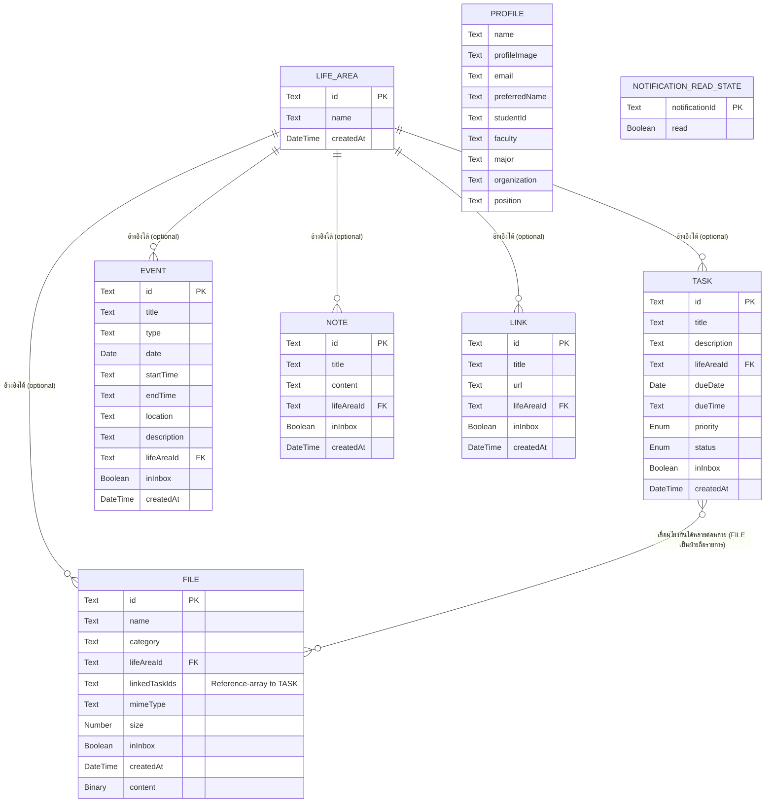

# My Today — Database Schema (Conceptual)

เชื่อมโยงกลับ: [[index|02-technical]], [[architecture|architecture]], [[../../01-requirements/feature-list|feature-list]]

## ขอบเขตของเอกสารนี้

เอกสารนี้เป็น **แบบจำลองข้อมูลเชิงตรรกะ/แนวคิด (conceptual / logical data model)** ของ My Today เท่านั้น **ไม่ใช่ physical schema ของฐานข้อมูลชนิดใดชนิดหนึ่งโดยเฉพาะ** เนื้อหาหลักจะไม่เอ่ยชื่อ SQL dialect, ORM, ผลิตภัณฑ์ NoSQL หรือ Web Storage API ใดๆ โดยตรง — ใช้ประเภทฟิลด์เชิงตรรกะทั่วไปเท่านั้น: **Text, Number, Boolean, Date, DateTime, Enum(ค่าที่เป็นไปได้), Reference(→ Entity)** (และ **Binary** สำหรับเนื้อหาไฟล์แนบโดยเฉพาะ ซึ่งเป็นคุณสมบัติโดยธรรมชาติของ entity File ไม่ใช่ชื่อเทคโนโลยีจัดเก็บ) รายละเอียดการ implement จริงในปัจจุบัน ถ้าเป็นประโยชน์ จะอยู่ในหมายเหตุท้ายเอกสารที่ระบุชัดเจนว่า "หมายเหตุการ implement ปัจจุบัน" เท่านั้น เจตนาคือให้เอกสารนี้ยังคงถูกต้องแม้ทีมจะเปลี่ยนไปใช้เทคโนโลยีจัดเก็บข้อมูลอื่นทั้งหมดในวันพรุ่งนี้

เอกสารนี้อ้างอิง entity list และความสัมพันธ์จากหัวข้อ "3. Core Domain Concepts" ของ [[architecture|architecture.md]] เป็นแหล่งความจริง (source of truth) — ไม่ขัดแย้งกับเอกสารนั้น

## 1. ER Diagram

> **หมายเหตุเรื่อง Notification:** `Notification` **ไม่ใช่ entity ที่ถูกเก็บถาวร** จึงไม่ปรากฏเป็นตารางแบบมีคอลัมน์ครบใน ER diagram ข้างต้น มันคือผลลัพธ์ที่คำนวณสด (derived) จากข้อมูล `Task`/`Event` ปัจจุบันทุกครั้งที่ต้องแสดงผล (ดูหัวข้อ 4 ในเอกสาร [[api-spec|api-spec]]) สิ่งเดียวที่ถูกเก็บถาวรจริงคือ **สถานะอ่านแล้ว/ยังไม่อ่าน** ของ notification แต่ละรายการ ซึ่งมีอัตลักษณ์ (identity) ของตัวเองในรูปแบบ id ที่ประกอบขึ้นจาก `{kind}-{sourceId}-{level}` (ไม่ใช่ FK อ้างอิง Task/Event โดยตรง เพราะ level เปลี่ยนได้ตามเวลา) จึงจำลองเป็น entity เล็กแบบ lookup-style ชื่อ `NOTIFICATION_READ_STATE` แยกต่างหาก ไม่มีความสัมพันธ์ (relationship line) กับ entity อื่นใน ER diagram เพราะเป็น standalone lookup ไม่ใช่ foreign key จริง
>
> `PROFILE` เป็น **singleton** (มีอย่างมากหนึ่ง record ในระบบเสมอ) จึงไม่มี primary key แยกต่างหาก และไม่มีเส้นความสัมพันธ์ไปยัง entity อื่นเลยตามที่ระบุใน architecture.md

## 2. รายละเอียดแต่ละตาราง

### 2.1 Life Area

| Field | Type | Required? | Description |
|---|---|---|---|
| id | Text | ใช่ (Primary Key) | ตัวระบุ Life Area |
| name | Text | ใช่ | ชื่อ Life Area ที่ผู้ใช้ตั้งเอง (เช่น Study, Work, Finance) |
| createdAt | DateTime | ใช่ | วันเวลาที่สร้าง |

**กฎทางธุรกิจที่กระทบ schema:** Life Area เป็น entity เดี่ยว (standalone) ไม่ขึ้นกับ entity อื่น การลบ Life Area **ไม่ cascade ลบ** Task/Event/File/Note/Link ที่เคยอ้างอิงถึงมัน — ระบบจะ **เคลียร์ค่า `lifeAreaId` ของทุก record ที่อ้างอิงให้กลับเป็นค่าว่างก่อน** แล้วจึงลบ Life Area record นั้นทิ้ง (ดู [[api-spec|api-spec]] หัวข้อ 2 "Delete Life Area")

### 2.2 Task

| Field | Type | Required? | Description |
|---|---|---|---|
| id | Text | ใช่ (Primary Key) | ตัวระบุ Task |
| title | Text | ใช่ | ชื่องาน |
| description | Text | ไม่ (ค่าว่างได้) | รายละเอียดงาน |
| lifeAreaId | Reference(→ Life Area) | ไม่ (optional many-to-one) | Life Area ที่ Task นี้อยู่ ค่าว่าง = ยังไม่ระบุ |
| dueDate | Date | ไม่ (ค่าว่างได้ระหว่างอยู่ใน Inbox) | วันที่กำหนดส่ง/ครบกำหนด |
| dueTime | Text (เวลาในรูปแบบ HH:MM) | ไม่ | เวลาที่กำหนดส่ง |
| priority | Enum(High, Medium, Low) | ใช่ | ระดับความสำคัญ |
| status | Enum(To Do, Doing, Done) | ใช่ | สถานะความคืบหน้า |
| inInbox | Boolean | ใช่ | ฟิลด์ organization-state ร่วม — ดูหัวข้อ 3 |
| createdAt | DateTime | ใช่ | วันเวลาที่สร้าง |

**กฎทางธุรกิจที่กระทบ schema:**
- ตอนสร้างผ่าน Quick Capture (Sprint 8), มีแค่ `title` เท่านั้นที่บังคับ — `dueDate`/`dueTime`/`lifeAreaId`/`priority` ปล่อยว่าง/ใช้ค่าเริ่มต้นได้จนกว่าผู้ใช้จะ "จัดระเบียบ" จาก Inbox ภายหลัง
- การลบ Life Area ที่ Task อ้างอิงอยู่ ไม่ลบ Task — แค่เคลียร์ `lifeAreaId` ให้ว่าง (ดู 2.1)
- ความสัมพันธ์กับ File เป็นแบบ many-to-many แต่ **Task ไม่ถือรายการ File ของตัวเอง** — "ไฟล์ที่เกี่ยวข้องกับ Task นี้" คำนวณจากฝั่ง File เสมอ (ดู 2.4)

### 2.3 Event

| Field | Type | Required? | Description |
|---|---|---|---|
| id | Text | ใช่ (Primary Key) | ตัวระบุ Event |
| title | Text | ใช่ | ชื่อกิจกรรม/นัดหมาย |
| type | Text | ไม่ | ประเภทกิจกรรม (ข้อความอิสระ ผู้ใช้กำหนดเอง ไม่ใช่ enum ตายตัว) |
| date | Date | ไม่ (ค่าว่างได้ระหว่างอยู่ใน Inbox) | วันที่จัดกิจกรรม |
| startTime | Text (เวลาในรูปแบบ HH:MM) | ไม่ | เวลาเริ่ม |
| endTime | Text (เวลาในรูปแบบ HH:MM) | ไม่ | เวลาสิ้นสุด |
| location | Text | ไม่ | สถานที่ |
| description | Text | ไม่ | รายละเอียดเพิ่มเติม |
| lifeAreaId | Reference(→ Life Area) | ไม่ (optional many-to-one) | Life Area ที่กิจกรรมนี้อยู่ |
| inInbox | Boolean | ใช่ | ฟิลด์ organization-state ร่วม — ดูหัวข้อ 3 |
| createdAt | DateTime | ใช่ | วันเวลาที่สร้าง |

**กฎทางธุรกิจที่กระทบ schema:** Event **ไม่ duplicate ข้อมูล Task ที่มี Deadline** — Task ที่มี Deadline ปรากฏใน Calendar โดยการรวมมุมมอง (merge view) ที่ query ทั้งสอง entity แล้วเรียงตามเวลา ไม่ใช่การสร้าง Event record แทน Task นั้น (ดู [[api-spec|api-spec]] หัวข้อ 3 "Get Day Items")

### 2.4 File

| Field | Type | Required? | Description |
|---|---|---|---|
| id | Text | ใช่ (Primary Key) | ตัวระบุ File |
| name | Text | ใช่ | ชื่อไฟล์ที่ผู้ใช้ตั้ง |
| category | Text | ไม่ | หมวดหมู่ไฟล์ (ข้อความอิสระ) |
| lifeAreaId | Reference(→ Life Area) | ไม่ (optional many-to-one) | Life Area ที่ไฟล์นี้อยู่ |
| linkedTaskIds | Reference-array(→ Task) | ไม่ (ปล่อยว่าง = ไม่เชื่อมกับ Task ใด) | รายการ Task ที่ไฟล์นี้เกี่ยวข้องด้วย — **many-to-many จากฝั่ง File** |
| mimeType | Text | ใช่ | ประเภทเนื้อหาไฟล์ ใช้ตัดสินวิธี preview |
| size | Number | ใช่ | ขนาดไฟล์ (หน่วย byte) |
| inInbox | Boolean | ใช่ | ฟิลด์ organization-state ร่วม — ดูหัวข้อ 3 |
| createdAt | DateTime | ใช่ | วันเวลาที่สร้าง |
| content | Binary | ใช่ | เนื้อหาไฟล์จริง (binary payload) |

**กฎทางธุรกิจที่กระทบ schema:**
- ความสัมพันธ์ File↔Task เป็น many-to-many แต่ **เก็บทิศทางเดียวที่ File** (`linkedTaskIds`) — Task ไม่มีฟิลด์เก็บรายการไฟล์ของตัวเอง "Related Files ของ Task นี้" จึงเป็นค่าที่ query ได้เสมอด้วยการกรอง File ทั้งหมดที่ `linkedTaskIds` มี id ของ Task นั้นอยู่ ไม่ใช่ field ที่เก็บไว้บน Task โดยตรง
- การลบ Life Area ที่ File อ้างอิงอยู่ ไม่ลบ File — แค่เคลียร์ `lifeAreaId` ให้ว่าง (เหมือน Task/Event)

### 2.5 Note

| Field | Type | Required? | Description |
|---|---|---|---|
| id | Text | ใช่ (Primary Key) | ตัวระบุ Note |
| title | Text | ใช่ | หัวข้อ/ชื่อ Note |
| content | Text | ใช่ | เนื้อหาบันทึก |
| lifeAreaId | Reference(→ Life Area) | ไม่ (optional many-to-one) | Life Area ที่ Note นี้อยู่ |
| inInbox | Boolean | ใช่ | ฟิลด์ organization-state ร่วม — ดูหัวข้อ 3 |
| createdAt | DateTime | ใช่ | วันเวลาที่สร้าง |

**กฎทางธุรกิจที่กระทบ schema:** Note **ไม่มี** field deadline/priority/status เหมือน Task โดยเจตนา (ตาม Business Rule ของ Sprint 8) — เป็นข้อความที่ต้องจำเฉยๆ ไม่มีมิติเวลา/ความคืบหน้า

### 2.6 Link

| Field | Type | Required? | Description |
|---|---|---|---|
| id | Text | ใช่ (Primary Key) | ตัวระบุ Link |
| title | Text | ใช่ | ชื่อ Link |
| url | Text | ใช่ | URL ปลายทาง |
| lifeAreaId | Reference(→ Life Area) | ไม่ (optional many-to-one) | Life Area ที่ Link นี้อยู่ |
| inInbox | Boolean | ใช่ | ฟิลด์ organization-state ร่วม — ดูหัวข้อ 3 |
| createdAt | DateTime | ใช่ | วันเวลาที่สร้าง |

### 2.7 Personal Profile

| Field | Type | Required? | Description |
|---|---|---|---|
| name | Text | ควรบังคับ (ตาม Business Rule เป็นข้อมูลเดียวที่ "ควร" บังคับ) | ชื่อผู้ใช้ |
| profileImage | Text | ไม่ | รูปโปรไฟล์ (อ้างอิง/เนื้อหารูปภาพ) |
| email | Text | ไม่ | อีเมล |
| preferredName | Text | ไม่ | ชื่อเล่น/ชื่อที่อยากให้เรียก |
| studentId | Text | ไม่ (ห้ามบังคับ) | รหัสนักศึกษา — เฉพาะผู้ใช้ที่เป็นนักศึกษา |
| faculty | Text | ไม่ (ห้ามบังคับ) | คณะ |
| major | Text | ไม่ (ห้ามบังคับ) | สาขาวิชา |
| organization | Text | ไม่ (ห้ามบังคับ) | องค์กร/หน่วยงาน — เฉพาะผู้ใช้ที่เป็นพนักงาน/อาชีพอื่น |
| position | Text | ไม่ (ห้ามบังคับ) | ตำแหน่งงาน |

**กฎทางธุรกิจที่กระทบ schema:** Profile เป็น **singleton** — มีอย่างมากหนึ่ง record ต่อผู้ใช้เสมอ ไม่มีความสัมพันธ์กับ entity อื่นใดเลย และห้ามบังคับกรอกฟิลด์การศึกษา (`studentId`/`faculty`/`major`) หรือองค์กร (`organization`/`position`) โดยเด็ดขาด เพื่อไม่ผูกผลิตภัณฑ์กับ persona นักศึกษาเพียงอย่างเดียว

### 2.8 Notification Read State

| Field | Type | Required? | Description |
|---|---|---|---|
| notificationId | Text | ใช่ (Primary Key) | id ที่ประกอบจาก `{kind}-{sourceId}-{level}` ของ notification ที่ derive สดจาก Task/Event — ไม่ใช่ FK ตรงไปยัง Task/Event เพราะ level เปลี่ยนได้ตามเวลาที่ผ่านไป |
| read | Boolean | ใช่ | อ่านแล้วหรือยัง |

**กฎทางธุรกิจที่กระทบ schema:** เพราะ id ผูกกับ `level` (Overdue/DueToday/DueSoon) ด้วย เมื่อรายการเดิมเปลี่ยนระดับความเร่งด่วน (เช่น จาก DueSoon ข้ามไปเป็น Overdue) จะได้ `notificationId` ใหม่โดยอัตโนมัติ — ระบบจึงถือว่าเป็น notification คนละรายการที่ยังไม่อ่าน โดยไม่ต้องมี logic รีเซ็ตสถานะอ่านแยกต่างหาก

## 3. ฟิลด์ข้ามระบบ (Cross-cutting Fields)

ฟิลด์สองชุดต่อไปนี้ซ้ำกันในหลาย entity โดยเจตนา — บันทึกไว้ที่นี่ครั้งเดียวแทนการอธิบายซ้ำทุกหัวข้อย่อยด้านบน:

- **`lifeAreaId` — Reference(→ Life Area), optional**: ปรากฏบน Task, Event, File, Note, Link ทุกตัว เป็นความสัมพันธ์ many-to-one แบบไม่บังคับเสมอ (record ที่ไม่ระบุ Life Area ยังใช้งานได้ปกติ) และเป็นจุดเดียวที่ทุก entity เชื่อมเข้าหากันในเชิงจัดกลุ่ม (ดู [[architecture|architecture.md]] หัวข้อ 3) การลบ Life Area จะเคลียร์ฟิลด์นี้ให้ว่างบนทุก record ที่อ้างอิงถึง ไม่เคย cascade ลบ record นั้นทิ้ง
- **`inInbox` — Boolean, required** (ฟิลด์ organization-state): ปรากฏบน Task, Event, File, Note, Link ทุกตัว เป็นค่าบอกว่า record นี้ยังอยู่ในสถานะ "รอการจัดระเบียบ" (ยังไม่ผ่านการยืนยัน Life Area/รายละเอียดที่ควรมี) หรือกลายเป็นรายการปกติแล้ว — record ที่ `inInbox = true` ได้รับการยกเว้นไม่ต้องกรอกฟิลด์ที่ตามปกติควรมีค่า (เช่น `dueDate` ของ Task) จนกว่าจะมีการกระทำ "จัดระเบียบ" มาเปลี่ยนค่านี้เป็น `false` อย่างชัดเจน กลไกนี้ใช้ร่วมกันข้าม entity ทั้งห้าแบบเดียวกันทุกประการ ไม่ใช่ logic เฉพาะของ entity ใด entity หนึ่ง

## 4. Known Gaps / ส่วนขยายที่ยังไม่ถูกสร้าง

รายการนี้คือฟิลด์/entity ที่ narrative ของ Sprint ที่ยังไม่เริ่ม (ตาม backlog.md ณ วันที่ 20260823 — Sprint 9-10 ยังไม่มี commit ใดๆ) บอกเป็นนัยว่าจะต้องมี แต่ **ยังไม่มีอยู่ใน schema ปัจจุบัน**:

- **Task.linkedNoteIds / Task.linkedLinkIds — Reference-array(→ Note) / Reference-array(→ Link), optional** (Sprint 10, FR-18): ขยายความสัมพันธ์ Task ให้เชื่อมกับ Note และ Link ได้โดยตรง นอกเหนือจาก File ที่เชื่อมได้อยู่แล้ว (ผ่าน `File.linkedTaskIds`) เพื่อรวม What/When/Information ในหน้าเดียว
- **Event.linkedNoteIds / Event.linkedLinkIds — Reference-array(→ Note) / Reference-array(→ Link), optional** (Sprint 10, Business Rule ข้อ 4): Event เชื่อมกับ Note/Link/File ได้เช่นเดียวกับ Task ด้วยกลไกเดียวกัน
- **Task.reminderLeadTime / Event.reminderLeadTime — Number (นาทีหรือชั่วโมงล่วงหน้า), optional** (Sprint 10, FR-19): ค่า override ระยะเวลาแจ้งเตือนล่วงหน้าเฉพาะรายการ แทนค่า default เดียวกันทั้งระบบที่ Reminder/Notification Derivation ใช้อยู่ปัจจุบัน (Sprint 5)
- **Timeline (Now/Next/Later) และ Life Progress (Sprint 9, FR-16/FR-17)** ไม่ต้องการฟิลด์ schema ใหม่ — เป็น query/aggregation ที่คำนวณจาก field ที่มีอยู่แล้ว (`dueDate`/`dueTime`/`status`/`lifeAreaId`) ดูรายละเอียดใน [[api-spec|api-spec]] หัวข้อ 4 แทน

**ข้อควรระวังเรื่องความสอดคล้องของ spec:** เอกสาร Sprint 10 (`20260806-011-my-today-sprint10-task-event-file-linking.md`) ระบุว่า Task "เพิ่ม field ความสัมพันธ์ใหม่: `linkedNoteIds` และ `linkedLinkIds` (เพิ่มจาก `linkedFileIds` **ที่มีอยู่แล้วจาก Sprint 4**)" — ถ้อยคำนี้สื่อว่า Task ปัจจุบันมีฟิลด์ `linkedFileIds` อยู่แล้ว แต่ทั้ง `src/types.ts` และ architecture.md ยืนยันตรงกันว่าความสัมพันธ์ File↔Task ปัจจุบันถือทิศทางเดียวที่ **File** (`FileRecord.linkedTaskIds`) ไม่ใช่ที่ Task เอกสารนี้จึงยึดตาม architecture.md/types.ts (ไม่มี `Task.linkedFileIds`) และถือว่าถ้อยคำใน spec Sprint 10 เป็นความไม่สอดคล้องเล็กน้อยของเอกสารที่ยังไม่เริ่มพัฒนา ไม่ใช่การตัดสินใจ schema ใหม่ — หากทีมต้องการเปลี่ยนทิศทางความสัมพันธ์นี้จริงตอนพัฒนา Sprint 10 ควรแก้ spec Sprint 10 ให้ตรงกับ schema ที่ตั้งใจจะใช้ก่อน

## 5. Change Log

- 20260823 — สร้างเอกสารนี้ครั้งแรก: ER diagram ครอบคลุม Life Area/Task/Event/File/Note/Link/Personal Profile/Notification Read State, รายละเอียดฟิลด์ต่อ entity พร้อมกฎทางธุรกิจ, ฟิลด์ข้ามระบบ (`lifeAreaId`/`inInbox`), known gaps จาก Sprint 9-10, และหมายเหตุความไม่สอดคล้องของ spec Sprint 10 เรื่อง `linkedFileIds`

---

> **หมายเหตุการ implement ปัจจุบัน:** แบบจำลองแนวคิดข้างต้นถูก implement จริงโดยแบ่งการจัดเก็บเป็นสองส่วนตามที่ architecture.md container view ระบุไว้ (Structured vs Binary/Blob Local Persistence) — **Life Area, Task, Event, Note, Link, Personal Profile, และ Notification Read State** เก็บด้วย LocalStorage ผ่าน `src/lib/storage.ts` (คีย์ปัจจุบัน: `my-today:tasks:v2`, `my-today:events`, `my-today:notes`, `my-today:links`, `my-today:life-areas`, `my-today:profile`, `my-today:notifications-read`) ส่วน **File** (รวมเนื้อหาไฟล์จริง/`content`) เก็บด้วย IndexedDB ผ่าน `src/lib/fileDb.ts` เพราะเนื้อหาไฟล์เป็น binary และมีขนาดใหญ่กว่าที่ LocalStorage (จำกัดที่ string ล้วนๆ ประมาณ 5-10MB) จะรองรับได้ดี ฟิลด์ `Task.dueTime`/`Event.startTime`/`Event.endTime` เก็บเป็น string รูปแบบ `HH:MM` ตรงๆ ไม่มี Time type แยกในภาษาที่ใช้ implement จริง มีคีย์ภายในเพิ่มอีกหนึ่งคีย์ (`my-today:notifications-notified`) ที่ไม่ได้อยู่ใน conceptual model ข้างต้น เพราะเป็นกลไก dedup ภายในล้วนๆ (กันไม่ให้ยิง native Browser Notification ซ้ำสำหรับรายการเดิม) ไม่ใช่แนวคิดโดเมนที่ผู้ใช้รับรู้
