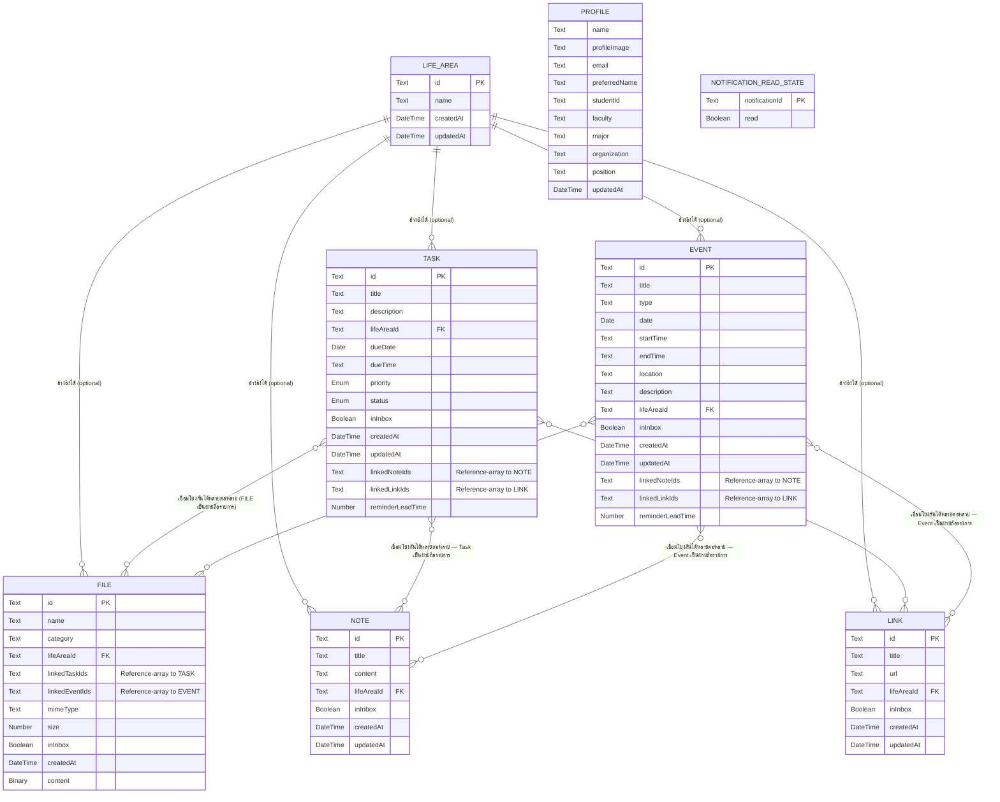

# My Today — Database Schema (Conceptual)

เชื่อมโยงกลับ: [[index|02-technical]], [[architecture|architecture]], [[../../01-requirements/feature-list|feature-list]], [[tech-stack|tech-stack]] (เอกสาร stack-specific ที่ใช้เป็นแหล่งอ้างอิงของหมายเหตุ "การ implement ปัจจุบัน" ท้ายเอกสารนี้เท่านั้น), [[../../01-requirements/01-spec/20260823-013-my-today-non-functional-requirements-master|NFR master list]]

## ขอบเขตของเอกสารนี้

เอกสารนี้เป็น **แบบจำลองข้อมูลเชิงตรรกะ/แนวคิด (conceptual / logical data model)** ของ My Today เท่านั้น **ไม่ใช่ physical schema ของฐานข้อมูลชนิดใดชนิดหนึ่งโดยเฉพาะ** เนื้อหาหลักจะไม่เอ่ยชื่อ SQL dialect, ORM, ผลิตภัณฑ์ NoSQL หรือ Web Storage API ใดๆ โดยตรง — ใช้ประเภทฟิลด์เชิงตรรกะทั่วไปเท่านั้น: **Text, Number, Boolean, Date, DateTime, Enum(ค่าที่เป็นไปได้), Reference(→ Entity)** (และ **Binary** สำหรับเนื้อหาไฟล์แนบโดยเฉพาะ ซึ่งเป็นคุณสมบัติโดยธรรมชาติของ entity File ไม่ใช่ชื่อเทคโนโลยีจัดเก็บ) รายละเอียดการ implement จริงในปัจจุบัน ถ้าเป็นประโยชน์ จะอยู่ในหมายเหตุท้ายเอกสารที่ระบุชัดเจนว่า "หมายเหตุการ implement ปัจจุบัน" เท่านั้น เจตนาคือให้เอกสารนี้ยังคงถูกต้องแม้ทีมจะเปลี่ยนไปใช้เทคโนโลยีจัดเก็บข้อมูลอื่นทั้งหมดในวันพรุ่งนี้

เอกสารนี้อ้างอิง entity list และความสัมพันธ์จากหัวข้อ "3. Core Domain Concepts" ของ [[architecture|architecture.md]] เป็นแหล่งความจริง (source of truth) — ไม่ขัดแย้งกับเอกสารนั้น

## 1. ER Diagram

> **หมายเหตุเรื่อง Notification:** `Notification` **ไม่ใช่ entity ที่ถูกเก็บถาวร** จึงไม่ปรากฏเป็นตารางแบบมีคอลัมน์ครบใน ER diagram ข้างต้น มันคือผลลัพธ์ที่คำนวณสด (derived) จากข้อมูล `Task`/`Event` ปัจจุบันทุกครั้งที่ต้องแสดงผล (ดูหัวข้อ 4 ในเอกสาร [[api-spec|api-spec]]) สิ่งเดียวที่ถูกเก็บถาวรจริงคือ **สถานะอ่านแล้ว/ยังไม่อ่าน** ของ notification แต่ละรายการ ซึ่งมีอัตลักษณ์ (identity) ของตัวเองในรูปแบบ id ที่ประกอบขึ้นจาก `{kind}-{sourceId}-{level}` (ไม่ใช่ FK อ้างอิง Task/Event โดยตรง เพราะ level เปลี่ยนได้ตามเวลา) จึงจำลองเป็น entity เล็กแบบ lookup-style ชื่อ `NOTIFICATION_READ_STATE` แยกต่างหาก ไม่มีความสัมพันธ์ (relationship line) กับ entity อื่นใน ER diagram เพราะเป็น standalone lookup ไม่ใช่ foreign key จริง
>
> `PROFILE` เป็น **singleton** (มีอย่างมากหนึ่ง record ในระบบเสมอ) จึงไม่มี primary key แยกต่างหาก และไม่มีเส้นความสัมพันธ์ไปยัง entity อื่นเลยตามที่ระบุใน architecture.md

## 2. รายละเอียดแต่ละตาราง

### 2.1 Life Area

| Field | Type | Required? | Description |
|---|---|---|---|
| id | Text | ใช่ (Primary Key) | ตัวระบุ Life Area |
| name | Text | ใช่ | ชื่อ Life Area ที่ผู้ใช้ตั้งเอง (เช่น Study, Work, Finance) |
| createdAt | DateTime | ใช่ | วันเวลาที่สร้าง |
| updatedAt | DateTime | ใช่ | วันเวลาที่แก้ไขล่าสุด — ใช้เป็นฐาน last-write-wins ตอน sync กับ Cloud Data Store (Sprint 12, ดูหัวข้อ 3) |

**กฎทางธุรกิจที่กระทบ schema:** Life Area เป็น entity เดี่ยว (standalone) ไม่ขึ้นกับ entity อื่น การลบ Life Area **ไม่ cascade ลบ** Task/Event/File/Note/Link ที่เคยอ้างอิงถึงมัน — ระบบจะ **เคลียร์ค่า `lifeAreaId` ของทุก record ที่อ้างอิงให้กลับเป็นค่าว่างก่อน** แล้วจึงลบ Life Area record นั้นทิ้ง (ดู [[api-spec|api-spec]] หัวข้อ 2 "Delete Life Area")

### 2.2 Task

| Field | Type | Required? | Description |
|---|---|---|---|
| id | Text | ใช่ (Primary Key) | ตัวระบุ Task |
| title | Text | ใช่ | ชื่องาน |
| description | Text | ไม่ (ค่าว่างได้) | รายละเอียดงาน |
| lifeAreaId | Reference(→ Life Area) | ไม่ (optional many-to-one) | Life Area ที่ Task นี้อยู่ ค่าว่าง = ยังไม่ระบุ |
| dueDate | Date | ไม่ (ค่าว่างได้ระหว่างอยู่ใน Inbox) | วันที่กำหนดส่ง/ครบกำหนด |
| dueTime | Text (เวลาในรูปแบบ HH:MM) | ไม่ | เวลาที่กำหนดส่ง |
| priority | Enum(High, Medium, Low) | ใช่ | ระดับความสำคัญ |
| status | Enum(To Do, Doing, Done) | ใช่ | สถานะความคืบหน้า |
| inInbox | Boolean | ใช่ | ฟิลด์ organization-state ร่วม — ดูหัวข้อ 3 |
| createdAt | DateTime | ใช่ | วันเวลาที่สร้าง |
| updatedAt | DateTime | ใช่ | วันเวลาที่แก้ไขล่าสุด — ใช้เป็นฐาน last-write-wins ตอน sync กับ Cloud Data Store (Sprint 12, ดูหัวข้อ 3) |
| linkedNoteIds | Reference-array(→ Note) | ไม่ (ปล่อยว่าง = ไม่เชื่อมกับ Note ใด) | รายการ Note ที่ Task นี้เชื่อมไว้ — **many-to-many จากฝั่ง Task** (Sprint 10) |
| linkedLinkIds | Reference-array(→ Link) | ไม่ (ปล่อยว่าง = ไม่เชื่อมกับ Link ใด) | รายการ Link ที่ Task นี้เชื่อมไว้ — **many-to-many จากฝั่ง Task** (Sprint 10) |
| reminderLeadTime | Number (นาทีล่วงหน้า) | ไม่ (ค่าว่าง/null = ใช้ default ของระบบ) | ระยะเวลาแจ้งเตือนล่วงหน้าเฉพาะ Task นี้ (Sprint 10) — เมื่อไม่ตั้งค่า (`null`) ระบบใช้ threshold default กลางจาก Reminder/Notification Derivation container (สองระดับ: early-warning + imminent ตาม Sprint 5); เมื่อตั้งค่าไว้ จะ override เฉพาะ Task นี้ด้วย threshold เดียว (ดู [[api-spec|api-spec]] หัวข้อ 1.2 "Set Custom Reminder Lead Time") |

**กฎทางธุรกิจที่กระทบ schema:**
- ตอนสร้างผ่าน Quick Capture (Sprint 8), มีแค่ `title` เท่านั้นที่บังคับ — `dueDate`/`dueTime`/`lifeAreaId`/`priority` ปล่อยว่าง/ใช้ค่าเริ่มต้นได้จนกว่าผู้ใช้จะ "จัดระเบียบ" จาก Inbox ภายหลัง
- การลบ Life Area ที่ Task อ้างอิงอยู่ ไม่ลบ Task — แค่เคลียร์ `lifeAreaId` ให้ว่าง (ดู 2.1)
- ความสัมพันธ์กับ File เป็นแบบ many-to-many แต่ **Task ไม่ถือรายการ File ของตัวเอง** — "ไฟล์ที่เกี่ยวข้องกับ Task นี้" คำนวณจากฝั่ง File เสมอ (ดู 2.4)
- ความสัมพันธ์กับ Note และ Link เป็น many-to-many เช่นกัน แต่ **ทิศทางตรงข้ามกับ File↔Task** — Task เป็นฝ่ายถือรายการ (`linkedNoteIds`/`linkedLinkIds`) โดยตรง ไม่ใช่ Note/Link ที่ถือรายการ Task (Sprint 10 การตัดสินใจออกแบบใหม่ ไม่ใช่การขยายกลไก File↔Task เดิม — ดูหมายเหตุความไม่สอดคล้องของ spec Sprint 10 ท้ายหัวข้อ 4)

### 2.3 Event

| Field | Type | Required? | Description |
|---|---|---|---|
| id | Text | ใช่ (Primary Key) | ตัวระบุ Event |
| title | Text | ใช่ | ชื่อกิจกรรม/นัดหมาย |
| type | Text | ไม่ | ประเภทกิจกรรม (ข้อความอิสระ ผู้ใช้กำหนดเอง ไม่ใช่ enum ตายตัว) |
| date | Date | ไม่ (ค่าว่างได้ระหว่างอยู่ใน Inbox) | วันที่จัดกิจกรรม |
| startTime | Text (เวลาในรูปแบบ HH:MM) | ไม่ | เวลาเริ่ม |
| endTime | Text (เวลาในรูปแบบ HH:MM) | ไม่ | เวลาสิ้นสุด |
| location | Text | ไม่ | สถานที่ |
| description | Text | ไม่ | รายละเอียดเพิ่มเติม |
| lifeAreaId | Reference(→ Life Area) | ไม่ (optional many-to-one) | Life Area ที่กิจกรรมนี้อยู่ |
| inInbox | Boolean | ใช่ | ฟิลด์ organization-state ร่วม — ดูหัวข้อ 3 |
| createdAt | DateTime | ใช่ | วันเวลาที่สร้าง |
| updatedAt | DateTime | ใช่ | วันเวลาที่แก้ไขล่าสุด — ใช้เป็นฐาน last-write-wins ตอน sync กับ Cloud Data Store (Sprint 12, ดูหัวข้อ 3) |
| linkedNoteIds | Reference-array(→ Note) | ไม่ (ปล่อยว่าง = ไม่เชื่อมกับ Note ใด) | รายการ Note ที่ Event นี้เชื่อมไว้ — **many-to-many จากฝั่ง Event** (Sprint 10, กลไกเดียวกับ Task↔Note) |
| linkedLinkIds | Reference-array(→ Link) | ไม่ (ปล่อยว่าง = ไม่เชื่อมกับ Link ใด) | รายการ Link ที่ Event นี้เชื่อมไว้ — **many-to-many จากฝั่ง Event** (Sprint 10, กลไกเดียวกับ Task↔Link) |
| reminderLeadTime | Number (นาทีล่วงหน้า) | ไม่ (ค่าว่าง/null = ใช้ default ของระบบ) | ระยะเวลาแจ้งเตือนล่วงหน้าเฉพาะ Event นี้ (Sprint 10) — เมื่อไม่ตั้งค่า (`null`) ระบบใช้ threshold default กลางจาก Reminder/Notification Derivation container (สองระดับ ตาม Sprint 5); เมื่อตั้งค่าไว้ จะ override เฉพาะ Event นี้ด้วย threshold เดียว (ดู [[api-spec|api-spec]] หัวข้อ 1.3 "Set Custom Reminder Lead Time") |

**กฎทางธุรกิจที่กระทบ schema:**
- ความสัมพันธ์กับ Note และ Link เป็น many-to-many ที่ **Event เป็นฝ่ายถือรายการ** โดยตรง (`linkedNoteIds`/`linkedLinkIds`) — ทิศทางตรงข้ามกับ File↔Event ที่ File เป็นฝ่ายถือรายการแทน (Sprint 10 การตัดสินใจออกแบบใหม่ เหมือน Task↔Note/Task↔Link — ดูหมายเหตุความไม่สอดคล้องของ spec Sprint 10 ท้ายหัวข้อ 4)
- Event **ไม่ duplicate ข้อมูล Task ที่มี Deadline** — Task ที่มี Deadline ปรากฏใน Calendar โดยการรวมมุมมอง (merge view) ที่ query ทั้งสอง entity แล้วเรียงตามเวลา ไม่ใช่การสร้าง Event record แทน Task นั้น (ดู [[api-spec|api-spec]] หัวข้อ 3 "Get Day Items")

### 2.4 File

| Field | Type | Required? | Description |
|---|---|---|---|
| id | Text | ใช่ (Primary Key) | ตัวระบุ File |
| name | Text | ใช่ | ชื่อไฟล์ที่ผู้ใช้ตั้ง |
| category | Text | ไม่ | หมวดหมู่ไฟล์ (ข้อความอิสระ) |
| lifeAreaId | Reference(→ Life Area) | ไม่ (optional many-to-one) | Life Area ที่ไฟล์นี้อยู่ |
| linkedTaskIds | Reference-array(→ Task) | ไม่ (ปล่อยว่าง = ไม่เชื่อมกับ Task ใด) | รายการ Task ที่ไฟล์นี้เกี่ยวข้องด้วย — **many-to-many จากฝั่ง File** |
| linkedEventIds | Reference-array(→ Event) | ไม่ (ปล่อยว่าง = ไม่เชื่อมกับ Event ใด) | รายการ Event ที่ไฟล์นี้เกี่ยวข้องด้วย — **many-to-many จากฝั่ง File** (Sprint 10, กลไกเดียวกับ `linkedTaskIds`) |
| mimeType | Text | ใช่ | ประเภทเนื้อหาไฟล์ ใช้ตัดสินวิธี preview |
| size | Number | ใช่ | ขนาดไฟล์ (หน่วย byte) |
| inInbox | Boolean | ใช่ | ฟิลด์ organization-state ร่วม — ดูหัวข้อ 3 |
| createdAt | DateTime | ใช่ | วันเวลาที่สร้าง |
| content | Binary | ใช่ | เนื้อหาไฟล์จริง (binary payload) |

**กฎทางธุรกิจที่กระทบ schema:**
- ความสัมพันธ์ File↔Task และ File↔Event เป็น many-to-many แบบเดียวกันทั้งคู่ แต่ **เก็บทิศทางเดียวที่ File** (`linkedTaskIds`/`linkedEventIds`) — Task/Event ไม่มีฟิลด์เก็บรายการไฟล์ของตัวเอง "Related Files ของ Task/Event นี้" จึงเป็นค่าที่ query ได้เสมอด้วยการกรอง File ทั้งหมดที่ `linkedTaskIds`/`linkedEventIds` มี id ของ Task/Event นั้นอยู่ ไม่ใช่ field ที่เก็บไว้บน Task/Event โดยตรง (File↔Event เป็นการขยายกลไกเดิมของ File↔Task ในทิศทางเดียวกัน — Sprint 10, ตรงข้ามกับ Task↔Note/Task↔Link/Event↔Note/Event↔Link ที่เป็นทิศทางใหม่)
- การลบ Life Area ที่ File อ้างอิงอยู่ ไม่ลบ File — แค่เคลียร์ `lifeAreaId` ให้ว่าง (เหมือน Task/Event)

### 2.5 Note

| Field | Type | Required? | Description |
|---|---|---|---|
| id | Text | ใช่ (Primary Key) | ตัวระบุ Note |
| title | Text | ใช่ | หัวข้อ/ชื่อ Note |
| content | Text | ใช่ | เนื้อหาบันทึก |
| lifeAreaId | Reference(→ Life Area) | ไม่ (optional many-to-one) | Life Area ที่ Note นี้อยู่ |
| inInbox | Boolean | ใช่ | ฟิลด์ organization-state ร่วม — ดูหัวข้อ 3 |
| createdAt | DateTime | ใช่ | วันเวลาที่สร้าง |
| updatedAt | DateTime | ใช่ | วันเวลาที่แก้ไขล่าสุด — ใช้เป็นฐาน last-write-wins ตอน sync กับ Cloud Data Store (Sprint 12, ดูหัวข้อ 3) |

**กฎทางธุรกิจที่กระทบ schema:** Note **ไม่มี** field deadline/priority/status เหมือน Task โดยเจตนา (ตาม Business Rule ของ Sprint 8) — เป็นข้อความที่ต้องจำเฉยๆ ไม่มีมิติเวลา/ความคืบหน้า

### 2.6 Link

| Field | Type | Required? | Description |
|---|---|---|---|
| id | Text | ใช่ (Primary Key) | ตัวระบุ Link |
| title | Text | ใช่ | ชื่อ Link |
| url | Text | ใช่ | URL ปลายทาง |
| lifeAreaId | Reference(→ Life Area) | ไม่ (optional many-to-one) | Life Area ที่ Link นี้อยู่ |
| inInbox | Boolean | ใช่ | ฟิลด์ organization-state ร่วม — ดูหัวข้อ 3 |
| createdAt | DateTime | ใช่ | วันเวลาที่สร้าง |
| updatedAt | DateTime | ใช่ | วันเวลาที่แก้ไขล่าสุด — ใช้เป็นฐาน last-write-wins ตอน sync กับ Cloud Data Store (Sprint 12, ดูหัวข้อ 3) |

### 2.7 Personal Profile

| Field | Type | Required? | Description |
|---|---|---|---|
| name | Text | ควรบังคับ (ตาม Business Rule เป็นข้อมูลเดียวที่ "ควร" บังคับ) | ชื่อผู้ใช้ |
| profileImage | Text | ไม่ | รูปโปรไฟล์ (อ้างอิง/เนื้อหารูปภาพ) |
| email | Text | ไม่ | อีเมล |
| preferredName | Text | ไม่ | ชื่อเล่น/ชื่อที่อยากให้เรียก |
| studentId | Text | ไม่ (ห้ามบังคับ) | รหัสนักศึกษา — เฉพาะผู้ใช้ที่เป็นนักศึกษา |
| faculty | Text | ไม่ (ห้ามบังคับ) | คณะ |
| major | Text | ไม่ (ห้ามบังคับ) | สาขาวิชา |
| organization | Text | ไม่ (ห้ามบังคับ) | องค์กร/หน่วยงาน — เฉพาะผู้ใช้ที่เป็นพนักงาน/อาชีพอื่น |
| position | Text | ไม่ (ห้ามบังคับ) | ตำแหน่งงาน |
| updatedAt | DateTime | ใช่ | วันเวลาที่แก้ไขล่าสุด — ใช้เป็นฐาน last-write-wins ตอน sync กับ Cloud Data Store (Sprint 12, ดูหัวข้อ 3) |

**กฎทางธุรกิจที่กระทบ schema:** Profile เป็น **singleton** — มีอย่างมากหนึ่ง record ต่อผู้ใช้เสมอ ไม่มีความสัมพันธ์กับ entity อื่นใดเลย และห้ามบังคับกรอกฟิลด์การศึกษา (`studentId`/`faculty`/`major`) หรือองค์กร (`organization`/`position`) โดยเด็ดขาด เพื่อไม่ผูกผลิตภัณฑ์กับ persona นักศึกษาเพียงอย่างเดียว

### 2.8 Notification Read State

| Field | Type | Required? | Description |
|---|---|---|---|
| notificationId | Text | ใช่ (Primary Key) | id ที่ประกอบจาก `{kind}-{sourceId}-{level}` ของ notification ที่ derive สดจาก Task/Event — ไม่ใช่ FK ตรงไปยัง Task/Event เพราะ level เปลี่ยนได้ตามเวลาที่ผ่านไป |
| read | Boolean | ใช่ | อ่านแล้วหรือยัง |

**กฎทางธุรกิจที่กระทบ schema:** เพราะ id ผูกกับ `level` (Overdue/DueToday/DueSoon) ด้วย เมื่อรายการเดิมเปลี่ยนระดับความเร่งด่วน (เช่น จาก DueSoon ข้ามไปเป็น Overdue) จะได้ `notificationId` ใหม่โดยอัตโนมัติ — ระบบจึงถือว่าเป็น notification คนละรายการที่ยังไม่อ่าน โดยไม่ต้องมี logic รีเซ็ตสถานะอ่านแยกต่างหาก

## 3. ฟิลด์ข้ามระบบ (Cross-cutting Fields)

ฟิลด์สองชุดต่อไปนี้ซ้ำกันในหลาย entity โดยเจตนา — บันทึกไว้ที่นี่ครั้งเดียวแทนการอธิบายซ้ำทุกหัวข้อย่อยด้านบน:

- **`lifeAreaId` — Reference(→ Life Area), optional**: ปรากฏบน Task, Event, File, Note, Link ทุกตัว เป็นความสัมพันธ์ many-to-one แบบไม่บังคับเสมอ (record ที่ไม่ระบุ Life Area ยังใช้งานได้ปกติ) และเป็นจุดเดียวที่ทุก entity เชื่อมเข้าหากันในเชิงจัดกลุ่ม (ดู [[architecture|architecture.md]] หัวข้อ 3) การลบ Life Area จะเคลียร์ฟิลด์นี้ให้ว่างบนทุก record ที่อ้างอิงถึง ไม่เคย cascade ลบ record นั้นทิ้ง
- **`inInbox` — Boolean, required** (ฟิลด์ organization-state): ปรากฏบน Task, Event, File, Note, Link ทุกตัว เป็นค่าบอกว่า record นี้ยังอยู่ในสถานะ "รอการจัดระเบียบ" (ยังไม่ผ่านการยืนยัน Life Area/รายละเอียดที่ควรมี) หรือกลายเป็นรายการปกติแล้ว — record ที่ `inInbox = true` ได้รับการยกเว้นไม่ต้องกรอกฟิลด์ที่ตามปกติควรมีค่า (เช่น `dueDate` ของ Task) จนกว่าจะมีการกระทำ "จัดระเบียบ" มาเปลี่ยนค่านี้เป็น `false` อย่างชัดเจน กลไกนี้ใช้ร่วมกันข้าม entity ทั้งห้าแบบเดียวกันทุกประการ ไม่ใช่ logic เฉพาะของ entity ใด entity หนึ่ง
- **`updatedAt` — DateTime, required** (Sprint 12): ปรากฏบน **Life Area, Task, Event, Note, Link, Personal Profile** — 6 entity ที่เป็น "sync-eligible" ตามที่ [[architecture|architecture.md]] หัวข้อ 3 อธิบายไว้ (**ไม่ปรากฏบน File** เพราะ Sprint 12 ระบุชัดว่าไม่รวม FileRecord/blob ไว้ในขอบเขต sync — ดูหัวข้อ 4; และ**ไม่ปรากฏบน Notification Read State** เพราะไม่ใช่ entity ที่ sync) ใช้เป็นฐานตัดสินว่าสำเนาฝั่งไหน (local หรือ cloud) ใหม่กว่ากันตอน merge เมื่อผู้ใช้เปิด Cloud Sync (last-write-wins) — ฟิลด์นี้ถูกอัปเดตทุกครั้งที่มีการแก้ไข record นั้นๆ **โดยไม่มีผลใดๆ ต่อผู้ใช้ที่ไม่เปิด Cloud Sync เลย** เป็นเพียงการเตรียมพร้อมไว้เฉยๆ (metadata เสริมของ record เดิม ไม่ใช่ entity หรือความสัมพันธ์ใหม่)

## 4. Known Gaps / ส่วนขยายที่ยังไม่ถูกสร้าง

รายการนี้คือฟิลด์/entity ที่ narrative ของ Sprint ที่ยังไม่เริ่ม (ตาม backlog.md ณ วันที่ 20260825 — Sprint 1-10 ทั้งหมด verified เสร็จแล้ว, Sprint 11 "กำลังดำเนินการ" โดย IndexedDB Quota-Warning เป็นชิ้นแรกที่ build เสร็จแล้ว ส่วนที่เหลือของ Sprint 11 ยังไม่เสร็จ) บอกเป็นนัยว่าจะต้องมี แต่ **ยังไม่มีอยู่ใน schema ปัจจุบัน**:

(ไม่มี known gap คงเหลือในหัวข้อนี้ ณ ตอนนี้ — ดู Change Log หัวข้อ 5 สำหรับการเคลื่อนย้าย "IndexedDB Quota-Warning" ออกจากหัวข้อนี้เมื่อ 20260825)

**หมายเหตุกันความสับสน — Sprint 13 (Smart Capture จากรูปภาพ) ไม่ต้องการฟิลด์ schema ใหม่เลย:** Sprint 13 (มีแค่ spec ยังไม่มีโค้ด ณ วันที่ 20260830 — ดู [[architecture|architecture.md]] หัวข้อ 6 สำหรับ known gap เชิง container/external system ของ Sprint นี้) เพียงเติมค่าให้ฟิลด์ `Event.title`/`Event.date`/`Event.startTime`/`Event.location` ที่**มีอยู่แล้ว**ผ่านช่องทางป้อนข้อมูลใหม่ (วิเคราะห์รูปภาพ) ไม่ใช่ entity หรือ field ใหม่ใดๆ บน schema นี้ — จึงไม่มี known gap ระดับ schema ให้บันทึกไว้ในหัวข้อนี้สำหรับ Sprint 13

**ข้อควรระวังเรื่องความสอดคล้องของ spec (แก้ไขแล้ว):** เดิมเอกสาร Sprint 10 (`20260806-011-my-today-sprint10-task-event-file-linking.md`) เคยระบุว่า Task "เพิ่ม field ความสัมพันธ์ใหม่: `linkedNoteIds` และ `linkedLinkIds` (เพิ่มจาก `linkedFileIds` **ที่มีอยู่แล้วจาก Sprint 4**)" — ถ้อยคำนี้สื่อผิดว่า Task ปัจจุบันมีฟิลด์ `linkedFileIds` อยู่แล้ว ทั้งที่ `src/types.ts` และ architecture.md ยืนยันตรงกันว่าความสัมพันธ์ File↔Task ถือทิศทางเดียวที่ **File** (`FileRecord.linkedTaskIds`) ไม่ใช่ที่ Task ประเด็นนี้ได้รับการแก้ไขแล้วผ่าน commit `83a38ee` ("Correct Sprint 10 spec's incorrect Task.linkedFileIds claim") ซึ่งเพิ่มหัวข้อ `## เพิ่มเติม (20260823): แก้ไขข้อความคลาดเคลื่อนเรื่อง Task↔File relationship (linkedFileIds)` ต่อท้าย spec Sprint 10 ยืนยันความสัมพันธ์ที่ถูกต้อง (File→Task ผ่าน `linkedTaskIds`) และชี้แจงว่า `linkedNoteIds`/`linkedLinkIds` ของ Sprint 10 เป็นการตัดสินใจออกแบบใหม่บน Task เอง ไม่ใช่การขยายฟิลด์ที่มีอยู่เดิม การแก้ไขนี้ยืนยันว่า schema ที่บันทึกไว้ในเอกสารนี้ (Task ได้ `linkedNoteIds`/`linkedLinkIds` เป็นฟิลด์ใหม่บน Task เอง, ส่วน File↔Task ยังคงเดิมผ่าน `linkedTaskIds`) ถูกต้องมาตั้งแต่แรก **ไม่ต้องแก้ไข schema ใดๆ เพิ่มเติม** — ที่ผิดคือถ้อยคำของ spec Sprint 10 เท่านั้น ไม่ใช่การออกแบบที่ตั้งใจไว้ คงหมายเหตุนี้ไว้เป็นบันทึกประวัติความไม่สอดคล้องและการแก้ไข แทนการลบทิ้ง

## 5. Change Log

- 20260823 — สร้างเอกสารนี้ครั้งแรก: ER diagram ครอบคลุม Life Area/Task/Event/File/Note/Link/Personal Profile/Notification Read State, รายละเอียดฟิลด์ต่อ entity พร้อมกฎทางธุรกิจ, ฟิลด์ข้ามระบบ (`lifeAreaId`/`inInbox`), known gaps จาก Sprint 9-10, และหมายเหตุความไม่สอดคล้องของ spec Sprint 10 เรื่อง `linkedFileIds`
- 20260823 (อัปเดตภายหลัง) — อัปเดตหมายเหตุความไม่สอดคล้องของ spec Sprint 10 ในหัวข้อ 4 จากคำแนะนำเชิง forward-looking ให้เป็นบันทึกแบบ resolved: spec Sprint 10 ถูกแก้ไขแล้ว (commit `83a38ee`) ยืนยันว่า schema เดิมถูกต้อง ไม่ต้องแก้ schema เพิ่ม
- 20260823 (อัปเดตภายหลังอีกครั้ง) — เพิ่มความละเอียดของหมายเหตุ "การ implement ปัจจุบัน" ท้ายเอกสาร โดยอ้างอิง [[tech-stack|tech-stack.md]] ที่เพิ่งถูกสร้างขึ้น (ระบุเวอร์ชัน API/เหตุผลของ quota constraint ที่มาของการแยก storage เป็นสองระบบ) ไม่มีการแก้ไข ER diagram/รายละเอียดตาราง/ฟิลด์ข้ามระบบ/known gaps ใดๆ
- 20260823 (อัปเดตอีกครั้ง — NFR master list) — เพิ่ม cross-link ไปยัง [[../../01-requirements/01-spec/20260823-013-my-today-non-functional-requirements-master|NFR master list]] ในหัวข้อเชื่อมโยงกลับ และเพิ่ม known gap ใหม่ในหัวข้อ 4: IndexedDB Quota-Warning (NFR-08) — ไม่ต้องการฟิลด์ schema ใหม่บน `File` ไม่มีการแก้ไข ER diagram/รายละเอียดตาราง/ฟิลด์ข้ามระบบอื่นใด
- 20260823 (แก้ citation ให้สอดคล้องกับ architecture.md) — เพิ่ม "Sprint 11" เข้าไปใน citation ของ known gap "IndexedDB Quota-Warning" ในหัวข้อ 4 (จาก "(NFR-08, ...)" เป็น "(Sprint 11, NFR-08, ...)") ให้ตรงกับ commit `9ee5476` ที่แก้ architecture.md ไม่มีการแก้ไข ER diagram/รายละเอียดตาราง/ฟิลด์ข้ามระบบ/เนื้อหา known gap อื่นใด
- 20260824 (Sprint 9 เสร็จแล้ว) — ลบ bullet "Timeline (Now/Next/Later) และ Life Progress (Sprint 9, FR-16/FR-17)" ออกจากหัวข้อ 4 Known Gaps เนื่องจาก Sprint 9 verified และ "เสร็จแล้ว" ใน backlog.md แล้ว ไม่ใช่ gap อีกต่อไป — ไม่มีการแก้ไข ER diagram/รายละเอียดตาราง/ฟิลด์ข้ามระบบใดๆ เพราะ Sprint 9 ไม่เพิ่มฟิลด์หรือ entity ใหม่เลย (เป็น derived/computed logic ล้วนๆ บน field ที่มีอยู่แล้ว ดู [[api-spec|api-spec]] หัวข้อ 3 สำหรับ operation ที่ย้ายไปจาก Known Gaps)
- 20260824 (Sprint 10 เสร็จแล้ว) — เพิ่มความสัมพันธ์ใหม่ในหัวข้อ 1 ER Diagram: `TASK }o--o{ NOTE`, `TASK }o--o{ LINK`, `EVENT }o--o{ NOTE`, `EVENT }o--o{ LINK` (เก็บฝั่ง Task/Event) และ `EVENT }o--o{ FILE` (เก็บฝั่ง File เหมือน Task↔File เดิม); เพิ่มฟิลด์ `linkedNoteIds`/`linkedLinkIds`/`reminderLeadTime` ในตาราง TASK และ EVENT ของ ER diagram และในหัวข้อ 2.2/2.3 พร้อมกฎทางธุรกิจใหม่ (ทิศทางการถือรายการของ Task/Event↔Note/Link สวนทางกับ File↔Task/Event โดยเจตนา); เพิ่มฟิลด์ `linkedEventIds` ในตาราง FILE ของ ER diagram และหัวข้อ 2.4; ลบ bullet Sprint 10 ทั้งสามรายการออกจากหัวข้อ 4 Known Gaps (เหลือเฉพาะ IndexedDB Quota-Warning ที่ผูกกับ Sprint 11) — สอดคล้องกับ architecture.md หัวข้อ 3 ที่อัปเดตแล้วเมื่อ 20260824 ไม่พบ conflict ใดๆ
- 20260825 (IndexedDB Quota-Warning สร้างจริงแล้ว — Sprint 11 ยังกำลังดำเนินการ ไม่ใช่เสร็จทั้ง Sprint) — ลบ bullet "IndexedDB Quota-Warning" ออกจากหัวข้อ 4 Known Gaps เนื่องจาก build จริงแล้วและ verify ผ่านเบราว์เซอร์แล้ว (`src/lib/storageQuota.ts` ใหม่, `src/hooks/useFiles.ts` เช็คตอนโหลด+หลัง add ไฟล์ทุกครั้ง, `src/pages/FilesPage.tsx` แสดง banner คำเตือนแบบปิดได้) ยืนยันว่าข้อสรุปเดิมระดับ schema ถูกต้องมาตั้งแต่แรก — ไม่ต้องเพิ่มฟิลด์ใหม่ใดๆ เพราะเป็นการ query ความจุของกลไกจัดเก็บเอง ไม่ใช่ข้อมูลต่อ record ไม่มีการแก้ไข ER diagram/รายละเอียดตาราง/ฟิลด์ข้ามระบบ/known gap อื่นใด
- 20260830 (Sprint 12 Cloud Sync build เสร็จแล้ว — field ใหม่จริง; Sprint 13 Smart Capture มีแค่ spec — ไม่ต้องการ field ใหม่) — **Sprint 12:** เพิ่มฟิลด์ `updatedAt: DateTime` (required) ให้ LIFE_AREA, TASK, EVENT, NOTE, LINK, PROFILE ทั้งใน ER diagram (หัวข้อ 1) และตารางฟิลด์ของหัวข้อ 2.1-2.3/2.5-2.7 — **ไม่เพิ่มให้ FILE** (Sprint 12 ไม่รวม FileRecord/blob ในขอบเขต sync) และไม่เพิ่มให้ NOTIFICATION_READ_STATE (ไม่ sync); เพิ่ม bullet ใหม่อธิบายแนวคิด `updatedAt` เป็น cross-cutting field ร่วมของ 6 entity ที่ sync ได้ในหัวข้อ 3 (ใช้เทียบ last-write-wins ตอน merge, ไม่มีผลต่อผู้ใช้ที่ไม่เปิด sync); เพิ่มย่อหน้าใหม่ในหมายเหตุ "การ implement ปัจจุบัน" ท้ายเอกสาร อธิบายการ mirror ข้อมูล 6 entity นี้ไปยัง Cloud Data Store ภายนอก (Firebase Cloud Firestore ตาม spec Sprint 12/`backlog.md` — `tech-stack.md` ยังไม่ครอบคลุม) เป็นส่วนเสริมนอกเหนือจาก LocalStorage เดิม ไม่ใช่การแทนที่ **Sprint 13:** เพิ่มบรรทัดสั้นในหัวข้อ 4 Known Gaps ยืนยันว่า Smart Capture จากรูปภาพไม่ต้องการฟิลด์/entity schema ใหม่ใดๆ (แค่เติมค่าฟิลด์ Event ที่มีอยู่แล้วผ่านช่องทางใหม่) — ตรวจสอบกับ architecture.md ที่อัปเดตวันเดียวกันแล้ว ไม่พบ conflict ใดๆ

---

> **หมายเหตุการ implement ปัจจุบัน:** แบบจำลองแนวคิดข้างต้นถูก implement จริงโดยแบ่งการจัดเก็บเป็นสองส่วนตามที่ architecture.md container view ระบุไว้ (Structured vs Binary/Blob Local Persistence) — ดู [[tech-stack|tech-stack.md]] หัวข้อ 3 "การตัดสินใจ (Decision)" สำหรับรายการเวอร์ชันเต็มและเหตุผลประกอบทุกข้อที่สรุปไว้ที่นี่ **Life Area, Task, Event, Note, Link, Personal Profile, และ Notification Read State** เก็บด้วย **Browser LocalStorage** (Web Storage API มาตรฐานของ browser ไม่มีเลขเวอร์ชันของตัวเอง — เป็น browser-native capability ไม่ใช่ library ที่ pin เวอร์ชันใน `package.json`) ผ่าน wrapper ที่เขียนเอง `src/lib/storage.ts` (คีย์ปัจจุบัน: `my-today:tasks:v2`, `my-today:events`, `my-today:notes`, `my-today:links`, `my-today:life-areas`, `my-today:profile`, `my-today:notifications-read`) ส่วน **File** (รวมเนื้อหาไฟล์จริง/`content`) เก็บด้วย **Browser IndexedDB** ผ่าน wrapper ดิบที่เขียนเอง `src/lib/fileDb.ts` (object store เดียว เก็บ metadata + `Blob` รวมกัน)
>
> **เหตุผลของการแยก storage เป็นสองระบบ (อ้างอิงตรงจาก [[tech-stack|tech-stack.md]] หัวข้อ 4 "Trade-offs ที่ยอมรับ"):** "LocalStorage's ~5-10MB quota (string-only) — ยอมรับความซับซ้อนเพิ่มขึ้นเล็กน้อยจากการต้องแยก persistence layer เป็นสองระบบ (LocalStorage + IndexedDB) แทนที่จะใช้ที่เก็บข้อมูลเดียวที่จัดการทุกอย่างได้ (เช่น hosted database) แลกกับการคงต้นทุน infrastructure ไว้ที่ศูนย์ตามงบ free-tier-only" — กล่าวคือข้อจำกัด **string-only quota ประมาณ 5-10MB ของ LocalStorage** คือสิ่งที่บังคับให้ entity เดียวที่มี binary payload (`FILE.content`) ต้องแยกไปเก็บที่ IndexedDB แทน ไม่ใช่การเลือกโดยพลการ — entity อื่นทั้งหมดเป็น structured JSON record ล้วนๆ ขนาดเล็ก จึงพอดีกับ LocalStorage ตามที่ [[tech-stack|tech-stack.md]] หัวข้อ 1 "Hosting & Data" สรุปไว้ว่า "เป็น record/blob storage แบบง่าย ไม่ใช่ relational ที่ต้องมี complex joins หรือ ACID multi-table transaction"
>
> ฟิลด์ `Task.dueTime`/`Event.startTime`/`Event.endTime` เก็บเป็น string รูปแบบ `HH:MM` ตรงๆ ไม่มี Time type แยกในภาษาที่ใช้ implement จริง (TypeScript `^5.5.2`, `strict: true`) มีคีย์ภายในเพิ่มอีกหนึ่งคีย์ (`my-today:notifications-notified`) ที่ไม่ได้อยู่ใน conceptual model ข้างต้น เพราะเป็นกลไก dedup ภายในล้วนๆ (กันไม่ให้ยิง native Browser Notification ซ้ำสำหรับรายการเดิม) ไม่ใช่แนวคิดโดเมนที่ผู้ใช้รับรู้ ทั้งหมดนี้รันอยู่บน React `^18.3.1` + Vite `^5.3.1` build เดียว deploy เป็น static SPA บน Vercel free tier (`vercel.json` SPA rewrite) — ไม่มี backend server ใดๆ มาเกี่ยวข้องกับการอ่าน/เขียนข้อมูลเลยแม้แต่ขั้นตอนเดียว ตรงตาม Fixed Constraint "client-only" ที่ [[tech-stack|tech-stack.md]] ยืนยันไว้
>
> **Cloud Sync mirroring (Sprint 12, opt-in — เพิ่มเติมนอกเหนือจากด้านบน ไม่ใช่แทนที่):** เมื่อผู้ใช้เปิด Cloud Sync เอง (ปิดโดย default) ทั้ง 6 entity ที่มีฟิลด์ `updatedAt` ข้างต้น (**Life Area, Task, Event, Note, Link, Personal Profile**) จะถูก mirror ไปยัง **Cloud Data Store ภายนอก** ด้วย — เทคโนโลยีจริงคือ **Cloud Firestore** (ส่วนหนึ่งของ Firebase Authentication + Cloud Firestore ตามที่ spec Sprint 12 ([[../../01-requirements/01-spec/20260829-014-my-today-sprint12-cloud-sync|Sprint 12 spec]]) และ `backlog.md`/log การ implement จริงระบุไว้ — **หมายเหตุ:** `tech-stack.md` เขียนไว้ 2026-08-23 ก่อน Sprint 12 จะเริ่ม จึงยังไม่ครอบคลุมรายละเอียดนี้ ควรรัน `tech-stack-advisor` อีกรอบเพื่อ source-of-truth เดียวในอนาคต) เก็บใต้ path `users/{uid}/{collection}/{id}` แยกตาม user (เช่น `users/{uid}/tasks/{taskId}`) — **FileRecord (IndexedDB) ไม่อยู่ในขอบเขตนี้เลย** (Sprint 12 Business Rule ข้อ 4: Firestore จำกัด 1MB/document ไม่พอสำหรับ blob เนื้อหาไฟล์ ต้องใช้ Firebase Storage แยกต่างหากซึ่งเป็น future work) การ mirror นี้เป็น**ส่วนเสริมเท่านั้น** — **Browser LocalStorage ยังเป็น source of truth หลักเสมอ** ทุกการเขียนต้องลง LocalStorage ก่อนเสมอ (Sprint 12 Business Rule ข้อ 1 "Local-first เสมอ") แล้วจึง push ขึ้น Cloud Firestore แบบ background/best-effort ทีหลัง ไม่เคยสลับบทบาทกัน
