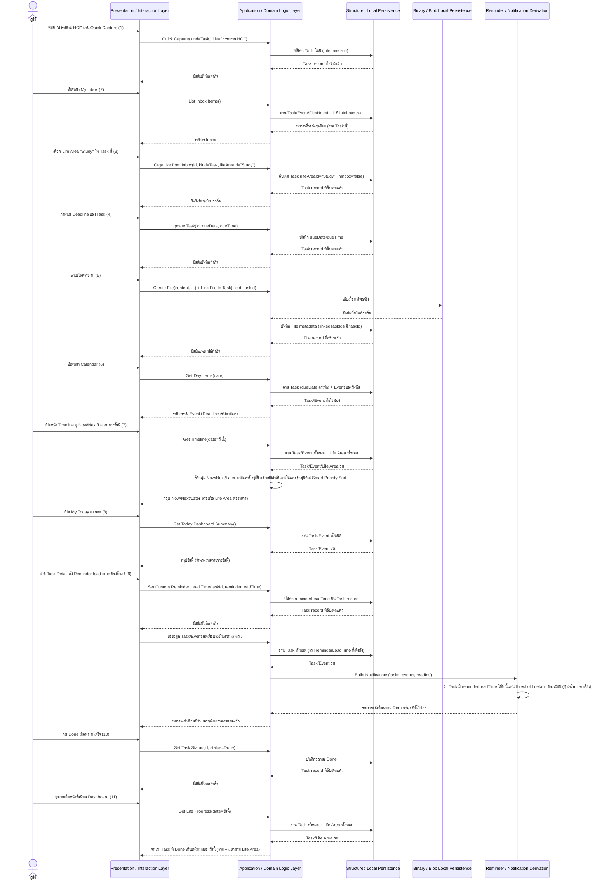
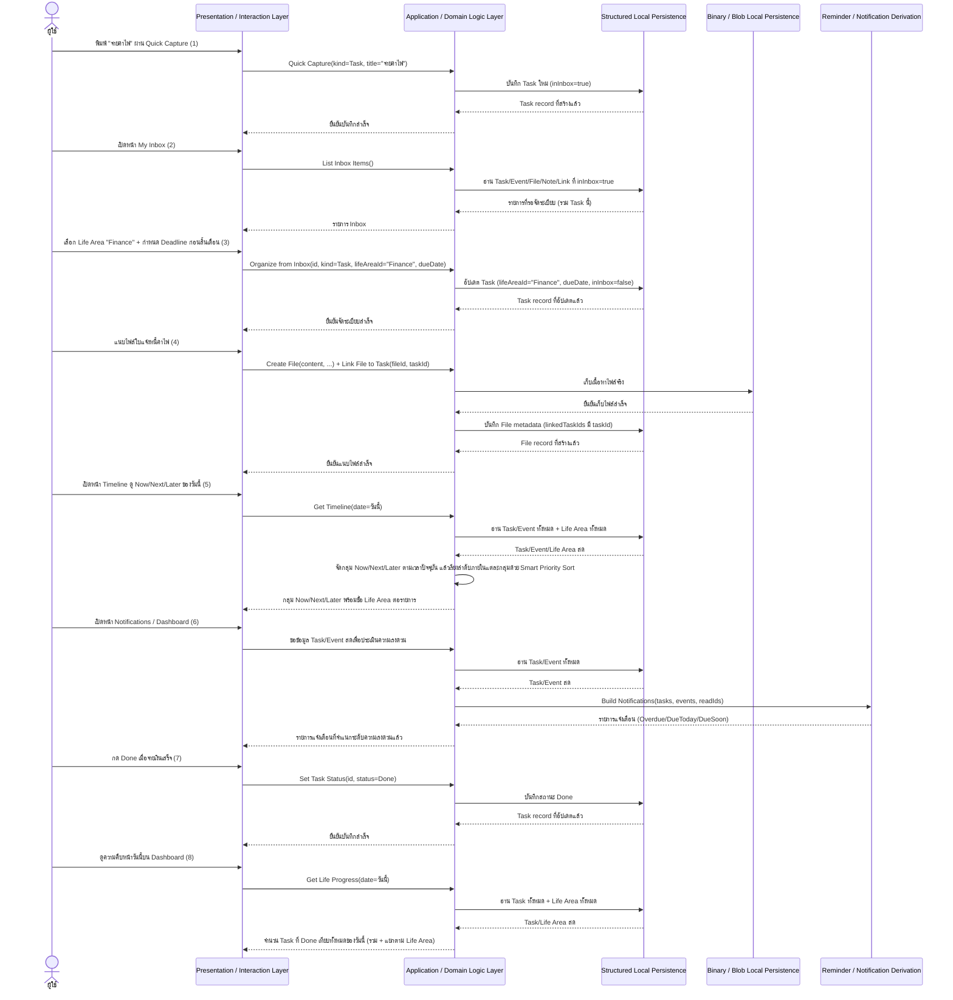
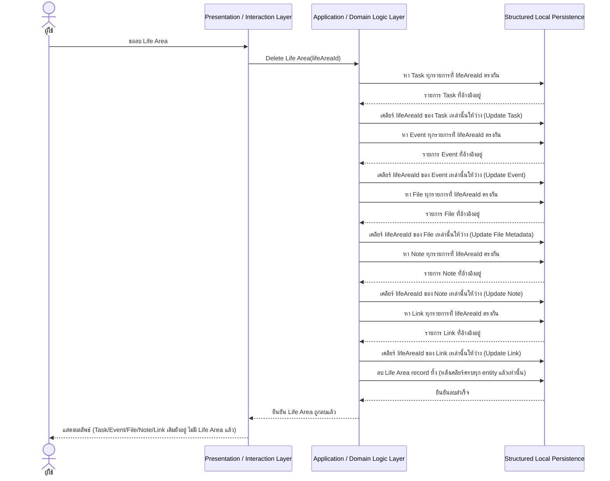
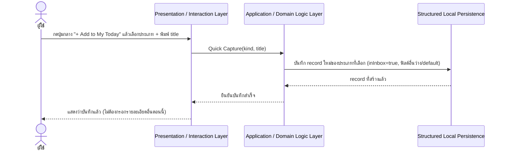
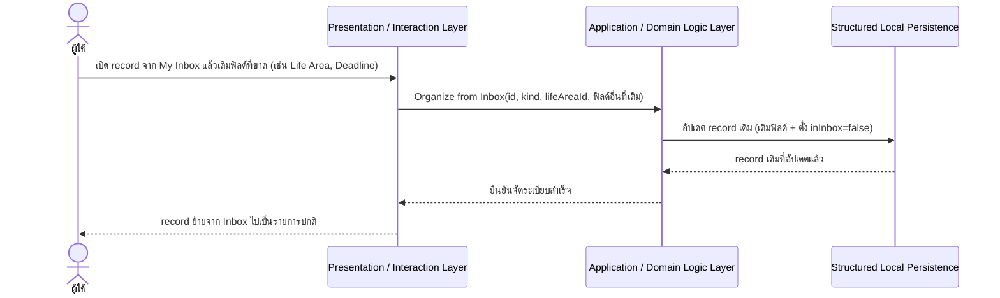
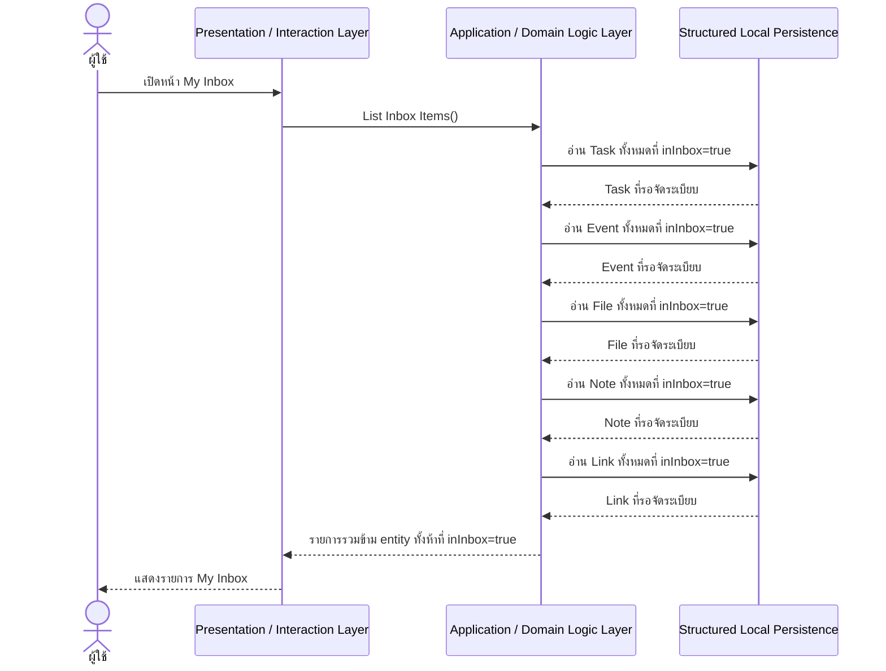
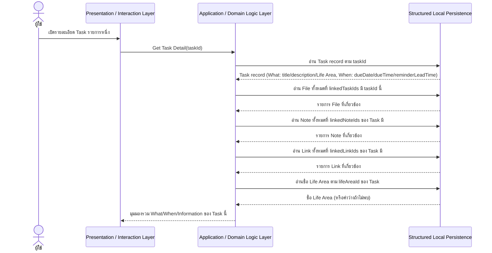

# My Today — Detailed Design (Conceptual Sequence Flows)

เชื่อมโยงกลับ: [[index|02-technical]], [[architecture|architecture]], [[api-spec|api-spec]], [[database-schema|database-schema]], [[../01-prototypes/user-journey-student|user-journey-student]], [[../01-prototypes/user-journey-general-person|user-journey-general-person]], [[../../01-requirements/01-spec/20260823-013-my-today-non-functional-requirements-master|NFR master list]]

## ขอบเขตของเอกสารนี้

เอกสารนี้เป็น **Detailed Design แบบ conceptual และไม่ผูกกับ technology stack** (stack-agnostic) อยู่ในระดับ **sequence-flow** — ขยาย Container View ของ [[architecture|architecture.md]] (หัวข้อ 2) และ operation contract ของ [[api-spec|api-spec.md]] ให้เห็นเป็นลำดับข้อความ (message) ทีละขั้นระหว่าง Container จริงๆ ว่าแต่ละ user journey/operation ไหลผ่านใครบ้างตามลำดับ ไม่ใช่แค่ระบุทิศทางรวมแบบที่ architecture.md หัวข้อ 4 ทำไว้แล้ว

เนื้อหาหลัก (รวม sequence diagram ทุกอัน) **จะไม่เอ่ยชื่อภาษา, framework, library, หรือ Web API ใดๆ โดยตรง** — participant ของทุกไดอะแกรมจำกัดอยู่ที่ชุด Container คงที่จาก [[architecture|architecture.md]] หัวข้อ 2 เท่านั้น (Presentation / Interaction Layer, Application / Domain Logic Layer, Structured Local Persistence, Binary / Blob Local Persistence, Reminder / Notification Derivation) บวก User person จากหัวข้อ 1 ไม่มีการเพิ่ม container ใหม่ในเอกสารนี้ รายละเอียดการ implement จริงปัจจุบัน ถ้าเป็นประโยชน์ จะอยู่ในหมายเหตุที่ระบุชัดเจนว่า "หมายเหตุการ implement ปัจจุบัน" เท่านั้น

ทุกไดอะแกรมแสดง **happy path เท่านั้น** — พฤติกรรมกรณี error/edge-case อยู่แยกเป็นข้อความสั้นๆ ใต้แต่ละไดอะแกรมในหัวข้อ 3 แทนการวาดเป็น `alt`/`opt` block ในไดอะแกรม

## 1. Sequence Diagrams — Persona Journeys

ทั้งสองไดอะแกรมด้านล่างเดินตามลำดับขั้นตอนที่มีอยู่แล้วใน [[../01-prototypes/user-journey-student|user-journey-student.md]] และ [[../01-prototypes/user-journey-general-person|user-journey-general-person.md]] ทุกประการ ไม่สร้าง narrative ใหม่ — วาด message เฉพาะขั้นตอนที่มีสถานะ "เสร็จแล้ว" ในเอกสารนั้นๆ (ตรวจสอบล่าสุด 20260824 — Sprint 9 และ Sprint 10 ยืนยันเสร็จแล้วในรอบ backlog-sync-check วันเดียวกัน ทำให้ทั้งสอง journey ไม่มีขั้นตอนใดเหลือเป็น "แผนในอนาคต" อีกต่อไป) ส่วนขั้นตอนที่เป็น "แผนในอนาคต" ถูกข้ามไปตามกฎของเอกสารนี้ และระบุไว้เป็นหมายเหตุใต้ไดอะแกรมแทน

### 1.1 นักศึกษา (Task "ส่งรายงาน HCI", Life Area "Study")

**mapping กลับ journey-doc (user-journey-student.md):**

1. ขั้นตอนที่ 1 (FR-13) — เพิ่ม Task ผ่าน Quick Capture
2. ขั้นตอนที่ 2 (FR-14) — เข้า My Inbox
3. ขั้นตอนที่ 3 (FR-14) — จัดเข้า Life Area "Study" จาก Inbox
4. ขั้นตอนที่ 4 (FR-04) — กำหนด Deadline ของ Task
5. ขั้นตอนที่ 5 (FR-09) — แนบไฟล์รายงาน (Related Files)
6. ขั้นตอนที่ 6 (FR-07) — เห็น Deadline ใน Calendar โดยอัตโนมัติ
7. ขั้นตอนที่ 7 (FR-16) — เห็น Deadline ใน Timeline Now/Next/Later — เสร็จแล้ว
8. ขั้นตอนที่ 8 (FR-05, FR-12) — เปิด My Today ตอนเช้า เห็นงานบน Today Dashboard
9. ขั้นตอนที่ 9 (FR-19, Sprint 10) — ระบบเตือนตาม Reminder lead time ที่ตั้งไว้เอง — เสร็จแล้ว
10. ขั้นตอนที่ 10 (FR-03, FR-11) — ทำงานเสร็จ กด Done
11. ขั้นตอนที่ 11 (FR-17) — Life Progress อัปเดต — เสร็จแล้ว

ไม่มีขั้นตอนใดใน journey นี้ที่ยังเป็น "แผนในอนาคต" อีกต่อไป (ขั้นตอนที่ 9, Custom Reminder Lead Time, ยืนยันเสร็จแล้วตาม Sprint 10 ใน backlog.md ณ 20260824 — เดิมเป็นขั้นตอนเดียวที่ยังข้ามไดอะแกรมนี้)

### 1.2 บุคคลทั่วไป (Task "จ่ายค่าไฟ", Life Area "Finance")

**mapping กลับ journey-doc (user-journey-general-person.md):**

1. ขั้นตอนที่ 1 (FR-13) — เพิ่ม Task ผ่าน Quick Capture
2. ขั้นตอนที่ 2 (FR-14) — เข้า My Inbox
3. ขั้นตอนที่ 3 (FR-14) — จัดเข้า Life Area "Finance" จาก Inbox + กำหนด Deadline
4. ขั้นตอนที่ 4 (FR-09) — แนบไฟล์ใบแจ้งหนี้ค่าไฟ (Related Files)
5. ขั้นตอนที่ 5 (FR-16) — เห็น Deadline ใน Timeline Now/Next/Later — เสร็จแล้ว
6. ขั้นตอนที่ 6 (FR-10) — ได้รับการเตือนเมื่อใกล้ถึงกำหนด (Due Soon/Overdue)
7. ขั้นตอนที่ 7 (FR-03, FR-11) — จ่ายเงินเสร็จ กด Done
8. ขั้นตอนที่ 8 (FR-17) — Life Progress อัปเดต — เสร็จแล้ว

ไม่มีขั้นตอนใดใน journey นี้ที่ยังเป็น "แผนในอนาคต" อีกต่อไป (Journey นี้ไม่มีขั้นตอนที่อ้างอิง Sprint 10 ตั้งแต่ต้น ต่างจาก journey นักศึกษาที่ยังมีขั้นตอนที่ 9)

## 2. Sequence Diagrams — Cross-cutting Operations

สี่ operation แรก (2.1-2.4) อยู่ใน [[api-spec|api-spec.md]] หัวข้อ 2 และ build เสร็จแล้วทั้งหมดตาม backlog.md ณ 20260823 (Delete Life Area ตั้งแต่ Sprint 7, อีกสามอย่างตั้งแต่ Sprint 8) จึงวาดไดอะแกรมเต็มให้ครบทุกอัน — เพิ่มเติม 20260824: Get Task Detail/Get Event Detail (2.5) จาก Sprint 10 ที่เพิ่ง build เสร็จ ก็มีลักษณะ cross-cutting เช่นกัน จึงวาดไดอะแกรมให้ในหัวข้อนี้ด้วยแม้จะถูกจัดอยู่ใน [[api-spec|api-spec.md]] หัวข้อ 3 (Derived/Read-only Operations) ไม่ใช่หัวข้อ 2 ก็ตาม — เพิ่มเติม 20260825: Get Storage Usage Estimate / Warn Near Quota (2.6) จาก Sprint 11 ที่เพิ่ง build เสร็จบางส่วนแล้ว (ดูหัวข้อ 4) ก็ถูกกล่าวถึงในหัวข้อนี้เช่นกัน แต่เป็นเพียงคำอธิบาย flow แบบร้อยแก้วสั้นๆ ไม่มี sequence diagram เต็มรูปแบบ เพราะเป็น derived/read-only check ต่อความจุของ container เดียว (Binary/Blob Local Persistence) ที่เรียบง่ายแบบเดียวกับ "Build Notifications" ไม่ใช่การประกอบผลลัพธ์ข้าม entity หลายตัวแบบ List Inbox Items/Get Task Detail จึงไม่คุ้มที่จะบังคับวาดไดอะแกรมเต็ม

### 2.1 Delete Life Area (cascade-safe, two-phase)

อ้างอิง: [[api-spec|api-spec.md]] หัวข้อ 2 แถว "Delete Life Area" และ [[database-schema|database-schema.md]] หัวข้อ 2.1 (Business Rule ของ Sprint 7 Acceptance Criteria) — ลำดับ phase 1 (เคลียร์การอ้างอิงทุก entity) ต้องเสร็จก่อน phase 2 (ลบ record) เสมอ ไม่สลับลำดับ

### 2.2 Quick Capture

อ้างอิง: [[api-spec|api-spec.md]] หัวข้อ 2 แถว "Quick Capture" — ต้องการแค่ `kind` + `title` เท่านั้น ห้ามมี AI แยกวิเคราะห์ข้อความอิสระใดๆ (Sprint 8 Business Rule ข้อ 5)

### 2.3 Organize from Inbox

อ้างอิง: [[api-spec|api-spec.md]] หัวข้อ 2 แถว "Organize from Inbox" — เป็นการอัปเดต record เดิมให้ `inInbox` เปลี่ยนจาก `true` เป็น `false` เท่านั้น ไม่สร้าง entity ใหม่ซ้อนสองชุด (Sprint 8 Business Rule ข้อ 2)

### 2.4 List Inbox Items

อ้างอิง: [[api-spec|api-spec.md]] หัวข้อ 2 แถว "List Inbox Items" — เป็น query ข้าม entity ทั้งห้า ไม่ใช่ operation เฉพาะของ entity ใดเดียว ใช้กับหน้า "My Inbox" (FR-14)

### 2.5 Get Task Detail / Get Event Detail (What/When/Information รวมหน้าเดียว)

แม้จะอยู่ใน [[api-spec|api-spec.md]] หัวข้อ 3 (Derived/Read-only Operations) ไม่ใช่หัวข้อ 2 แต่ operation คู่นี้มีลักษณะ cross-cutting เช่นเดียวกับ "List Inbox Items" ข้างต้น (ประกอบผลลัพธ์ข้าม Task/Event + File + Note + Link + Life Area ในคำขอเดียว) จึงวาดไดอะแกรมไว้ในหัวข้อนี้ด้วย — เป็น read-only ล้วนๆ ไม่มีการเขียนข้อมูลใดๆ (ยกตัวอย่างฐานเป็น Task; Get Event Detail ใช้กลไกเดียวกันทุกประการเพียงสลับ entity ฐานเป็น Event)

อ้างอิง: [[api-spec|api-spec.md]] หัวข้อ 3 แถว "Get Task Detail (What/When/Information unified view)" / "Get Event Detail (What/When/Information unified view)" (Sprint 10, Business Rule ข้อ 3) — ไม่ใช่ CRUD ต่อ record ที่เก็บถาวรตรงๆ เป็นการประกอบ (compose) ผลลัพธ์จาก Task/Event record หนึ่งตัว บวกกับ query ข้าม entity อีกสามครั้งให้เป็นมุมมองเดียว ไม่มี field ใหม่ใดถูกเก็บถาวรเพิ่มจาก operation นี้

### 2.6 Get Storage Usage Estimate / Warn Near Quota (ไม่มี sequence diagram — คำอธิบาย flow แบบร้อยแก้ว)

Operation นี้ (Sprint 11, NFR-08, [[../../01-requirements/01-spec/20260823-013-my-today-non-functional-requirements-master|NFR master list]]) เป็น derived/read-only check ต่อความจุที่เหลือของ Binary/Blob Local Persistence เอง ไม่อ่าน record ของ entity ใดเลย จึงมีลักษณะเรียบง่ายพอที่จะไม่วาดเป็นไดอะแกรมเต็ม (เทียบเคียงกับที่ "Build Notifications" ก็ไม่มีไดอะแกรมของตัวเองในหัวข้อนี้ มีแค่ปรากฏเป็น message ภายใน persona journey diagram) — flow โดยสรุป: Presentation / Interaction Layer ขอค่าประมาณพื้นที่ใช้ไปจาก Application / Domain Logic Layer ในสองจังหวะ คือตอนเปิดหน้าที่เกี่ยวข้องกับไฟล์แนบ และหลังจากบันทึกไฟล์ใหม่สำเร็จทุกครั้ง; Domain Logic Layer สอบถามความจุ/พื้นที่ใช้ไปจาก Binary/Blob Local Persistence โดยตรง (ไม่ผ่าน Structured Local Persistence เลย เพราะไม่ใช่ query ต่อ entity ใด); ถ้าสัดส่วนที่ใช้ไปข้าม threshold ประมาณ 80% ของความจุ Domain Logic Layer ส่งค่าประมาณพร้อม flag คำเตือนกลับไปให้ Presentation แสดงเป็นแบนเนอร์ที่ยกเลิกได้ (dismissible); ถ้าต่ำกว่า threshold หรือกลไกจัดเก็บของเบราว์เซอร์นั้นไม่รองรับความสามารถนี้เลย (progressive enhancement) ก็ไม่มีคำเตือนปรากฏขึ้น และ operation อื่นทั้งหมดของระบบยังทำงานได้ตามปกติ ไม่ถูก block ไม่ว่ากรณีใด

อ้างอิง: [[api-spec|api-spec.md]] หัวข้อ 3 แถว "Get Storage Usage Estimate / Warn Near Quota" (Sprint 11, NFR-08) — ย้ายจาก Known Gaps มาไว้ในหัวข้อ Derived/Read-only Operations แล้วเมื่อ 20260825 เนื่องจาก build จริงและ verify ผ่านเบราว์เซอร์แล้ว

## 3. Error / Edge-case Notes

- **Quick Capture / Organize from Inbox (2.2, 2.3):** ถ้าการเขียนลง Structured Local Persistence ล้มเหลว Application/Domain Logic Layer แจ้ง error กลับ Presentation Layer โดยไม่เปลี่ยนสถานะ `inInbox` ของ record เดิม (record ยังค้างอยู่ใน Inbox เหมือนก่อนพยายามบันทึก ไม่ถูกปล่อยอยู่ในสถานะครึ่งๆ กลางๆ)
- **แนบไฟล์ (1.1 ขั้นตอนที่ 5 / 1.2 ขั้นตอนที่ 4):** ถ้า Binary/Blob Local Persistence เขียนเนื้อหาไฟล์ไม่สำเร็จ ระบบแสดง error กลับที่ Presentation Layer แบบ dismissible โดยไม่สร้าง File record ใน Structured Local Persistence ค้างไว้ (ไม่มี metadata ที่ไม่มีเนื้อหาไฟล์จริงคู่กัน)
- **Delete Life Area (2.1):** ถ้าขั้นตอนเคลียร์การอ้างอิงของ entity ใด entity หนึ่งล้มเหลวระหว่างทาง ระบบต้องไม่ดำเนินการลบ Life Area record ต่อ (phase 2 เกิดขึ้นได้ก็ต่อเมื่อ phase 1 เคลียร์ครบทุก entity สำเร็จเท่านั้น) เพื่อป้องกัน orphaned reference ที่ยังชี้ไปยัง Life Area ที่ถูกลบไปแล้ว
- **Build Notifications (1.2 ขั้นตอนที่ 6):** เป็นการคำนวณสดทุกครั้ง ไม่มีสถานะกลางที่ค้างพังได้ — ถ้าไม่มี Task/Event ที่เข้าเงื่อนไข Overdue/DueToday/DueSoon ผลลัพธ์คือรายการว่างเปล่า ไม่ใช่ error
- **Get Day Items / Get Today Dashboard Summary (1.1 ขั้นตอนที่ 6, 8):** เป็น read-only query ล้วนๆ ไม่มีผลข้างเคียงต่อข้อมูล ถ้าไม่มี Task/Event ของวันนั้นก็แสดงรายการว่างตามจริง ไม่ถือเป็นสถานะ error
- **Get Timeline (Now/Next/Later) + Smart Priority Sort / Get Life Progress (1.1 ขั้นตอนที่ 7, 11 / 1.2 ขั้นตอนที่ 5, 8):** เช่นเดียวกับ Build Notifications เป็นการคำนวณสดจาก Task/Event ทุกครั้งที่เรียก ไม่มีสถานะกลางที่ค้างพังได้และไม่มีผลข้างเคียงต่อข้อมูลเดิม — ถ้าวันนี้ไม่มี Task/Event ที่เข้าเงื่อนไข (Timeline) หรือไม่มี Task ที่ครบกำหนดวันนี้เลย (Life Progress) ผลลัพธ์คือกลุ่มว่างเปล่า/สัดส่วน 0 จาก 0 ไม่ใช่ error
- **Link/Unlink Note/Link ↔ Task/Event, Set Custom Reminder Lead Time (1.1 ขั้นตอนที่ 9, 2.5):** ทั้งสามอย่างนี้เป็นการอัปเดตฟิลด์ธรรมดาบน Task/Event record เดิม (`linkedNoteIds`/`linkedLinkIds`/`reminderLeadTime`) ไม่มี relationship record แยกต่างหากถูกเก็บไว้ที่ Structured Local Persistence เหมือนกรณี File (ซึ่งอยู่คนละ container คือ Binary/Blob Local Persistence + metadata คู่กัน) จึงไม่มีกรณี partial-failure ใหม่เกินไปจากที่ระบุไว้แล้วทั่วไป — ถ้าการเขียนลง Structured Local Persistence ล้มเหลว Application/Domain Logic Layer แจ้ง error กลับ Presentation Layer โดย Task/Event record เดิมไม่เปลี่ยนแปลง (เหมือนกรณี Quick Capture/Organize from Inbox ด้านบน)
- **Get Task Detail / Get Event Detail (2.5):** เป็น read-only query ล้วนๆ เช่นเดียวกับ Get Day Items/Get Today Dashboard Summary ไม่มีผลข้างเคียงต่อข้อมูล — ถ้า Task/Event นั้นไม่มี File/Note/Link ที่เชื่อมไว้เลย หรือไม่มี Life Area ที่อ้างอิง (ถูกลบไปแล้ว) ผลลัพธ์คือรายการว่าง/ชื่อ Life Area ว่างตามจริง ไม่ใช่ error

## 4. Known Gaps / Not-yet-built Flows

รายการนี้สอดคล้องกับ known gaps ใน [[architecture|architecture.md]] หัวข้อ 6 และ [[api-spec|api-spec.md]] หัวข้อ 4 — ตรวจสอบล่าสุด 20260825: ตาม backlog.md สถานะ Sprint 11 เปลี่ยนเป็น "กำลังดำเนินการ" (ไม่ใช่ "ยังไม่เริ่ม" เหมือนที่บันทึกไว้ก่อนหน้า) มีความคืบหน้าจริงบางส่วนใน `src/` แล้ว — **นี่ไม่ใช่การประกาศว่า Sprint 11 เสร็จสมบูรณ์**:

**ไม่มี known gap คงเหลือในหัวข้อนี้ ณ ตอนนี้** — รายการเดียวที่เคยค้างอยู่ ("IndexedDB Quota-Warning", Sprint 11, NFR-08) ถูกตัดออกแล้ว เพราะ operation ที่รองรับ ("Get Storage Usage Estimate / Warn Near Quota") build จริงและ verify ผ่านเบราว์เซอร์แล้ว (mocked 85% usage เห็นแบนเนอร์เตือน กดยกเลิกได้ ไม่มี error ใน console) จึงย้ายจากที่นี่ไปมีคำอธิบาย flow แบบร้อยแก้วในหัวข้อ 2.6 ด้านบนแล้ว (ไม่ใช่ sequence diagram เต็มรูปแบบ ตามเหตุผลที่อธิบายไว้ในหัวข้อนั้น)

ส่วนที่เหลือของ Sprint 11 ที่ backlog.md ระบุว่ายังไม่เสร็จ (Browser Compatibility Matrix/NFR-06, การตรวจสอบ Accessibility Baseline/NFR-04 อย่างเป็นทางการส่วน keyboard-focus/contrast, Competition Demo script, Black Box Testing เป็นทางการ, Gate 11) ไม่ใช่ flow หรือ operation ใหม่ระดับ persona journey/cross-cutting operation ที่ต้องมี sequence diagram ของตัวเอง — เป็นงานด้าน testing/verification/polish ที่ไม่กระทบรูปร่างของ message flow ใดๆ ที่บันทึกไว้ในเอกสารนี้ จึงไม่มีบรรทัดเพิ่มในหัวข้อ Known Gaps นี้สำหรับรายการเหล่านั้น

## 5. หมายเหตุการ implement ปัจจุบัน

> เนื้อหาส่วนนี้ผูกกับ stack เทคโนโลยีจริง (อ้างอิงรายละเอียดฉบับเต็มที่ [[tech-stack|tech-stack.md]]) — ไม่ใช่ส่วนหนึ่งของ sequence diagram เชิงแนวคิดในหัวข้อ 1/2 ด้านบน และไม่ผูกมัดว่าต้อง implement แบบนี้ตลอดไป ระบุไว้ที่นี่รวมศูนย์เดียว (แทนที่จะแทรกในทุกไดอะแกรม) เพื่อบอกว่าแต่ละ participant ในแต่ละ sequence diagram ถูก implement ด้วยฟังก์ชัน/component/ไฟล์จริงตัวไหน สอดคล้องกับหมายเหตุแบบเดียวกันใน [[architecture|architecture.md]] หัวข้อ 2 และ [[api-spec|api-spec.md]] หัวข้อ 5

### 1.1 นักศึกษา (persona journey)

- **Quick Capture (ขั้นตอนที่ 1):** Presentation = `src/components/QuickCaptureModal.tsx` (type picker เลือก Task แล้ว delegate ไปที่ `TaskFormModal` พร้อม prop `quickCapture`); Domain = `useTasks` hook's create function ที่ `App.tsx` เป็นเจ้าของ instance เดียว (ตั้ง `inInbox: Boolean(quickCapture)`); Structured Persistence = `src/lib/storage.ts` เขียนลง LocalStorage key `my-today:tasks:v2` — ทั้งหมดเขียนด้วย **React `^18.3.1`** + **TypeScript `^5.5.2` (`strict: true`)** ตาม [[tech-stack|tech-stack.md]] หัวข้อ 3
- **เปิด My Inbox (ขั้นตอนที่ 2):** Presentation = `src/pages/InboxPage.tsx` (แท็บ "Inbox"); Domain = logic กรอง `tasks`/`events`/`files`/`notes`/`links` props ที่ `inInbox === true` ภายใน `InboxPage.tsx` เอง (ไม่ใช่ hook แยก)
- **จัดเข้า Life Area จาก Inbox (ขั้นตอนที่ 3):** Presentation = `InboxPage.tsx` เปิด `TaskFormModal` แบบ non-quickCapture pre-filled จาก record เดิม; Domain = `useTasks`'s `updateTask` (ตั้ง `lifeAreaId` และ `inInbox=false`)
- **กำหนด Deadline (ขั้นตอนที่ 4):** Presentation = `TaskFormModal`; Domain = `useTasks`'s `updateTask` (`dueDate`/`dueTime`)
- **แนบไฟล์ (ขั้นตอนที่ 5):** Presentation = `FileFormModal.tsx` (ส่วน "Related Files"/attach-existing-file picker); Domain = `useFiles`'s create function + `updateFile` (ตั้ง `linkedTaskIds`); Binary/Blob Persistence = `src/lib/fileDb.ts`'s `putFile` เขียนลง IndexedDB object store `files` (metadata + `Blob` รวม record เดียว) — `useFiles` ยังเป็น hook เดียวที่ expose flag `loaded` ให้ page เช็คก่อน render เพราะ IndexedDB อ่าน/เขียนแบบ asynchronous
- **เปิด Calendar (ขั้นตอนที่ 6):** Presentation = `src/pages/CalendarPage.tsx` + `DayAgenda`; Domain = `getDayItems` ใน `src/lib/calendarUtils.ts`
- **เปิด Timeline Now/Next/Later (ขั้นตอนที่ 7, Sprint 9):** Presentation = `src/pages/TimelinePage.tsx` (route `/timeline`, เรนเดอร์ผ่าน `src/components/TimelineSection.tsx` สามชุด — Now/Next/Later); Domain = `getTimelineEntries` ใน `src/lib/timelineUtils.ts` เป็น pure function ที่คำนวณใหม่ทุกครั้งที่ component render (ไม่มี hook/state แยกเป็นเจ้าของ ไม่มี record persist ใหม่ใดๆ) เรียก `smartPriorityTier` ภายในตัวเองเพื่อจัดลำดับรายการในแต่ละกลุ่มตามกฎ 5-tier ของ Sprint 9 (Overdue → Due Today → Upcoming → High Priority → Normal) — ฟังก์ชันเดียวกันนี้ยังถูกเรียกซ้ำผ่าน `sortTasksBySmartPriority` ที่ `DashboardPage.tsx` ใช้เรียง `TodayTasks` ด้วย จึงเป็น derivation ชุดเดียวที่ใช้ร่วมกันสองที่ ไม่ใช่ตรรกะแยกกันสองชุด — เพราะเป็น pure function ที่รับ props สดของ `tasks`/`events` ล้วนๆ (ไม่มี `useEffect`/state ภายใน) การอัปเดต Task/Event ที่หน้าอื่น (เช่นกด Done ที่ขั้นตอนที่ 10) จะสะท้อนใน Timeline ทันทีที่ re-render รอบถัดไปโดยไม่ต้อง refetch เพิ่ม
- **เปิด My Today ตอนเช้า (ขั้นตอนที่ 8):** Presentation = `src/pages/DashboardPage.tsx` (`SummaryCards`, `TodayTasks`, `TodaySchedule`, `Upcoming`); Domain = pure function ใน `src/lib/taskUtils.ts`/`src/lib/calendarUtils.ts` ที่คำนวณสรุปจาก `tasks`/`events` props สด
- **ระบบเตือนตาม Reminder lead time ที่ตั้งไว้เอง (ขั้นตอนที่ 9, Sprint 10):** Presentation = `src/components/TaskDetailModal.tsx` (ส่วน "When" — `<select>` ตัวเลือก lead time จาก `reminderLeadTimeOptions` ใน `src/lib/taskUtils.ts`, แสดงค่าที่ตั้งไว้ด้วย `formatLeadTime`); Domain = เรียก `onUpdateTask` ที่ `App.tsx` ส่งลงมาเป็น `useTasks`'s `updateTask` ทั่วไป (ตั้งฟิลด์ `reminderLeadTime`) — **ไม่มี hook method เฉพาะแยกต่างหาก** สำหรับ "Set Custom Reminder Lead Time" แม้ [[api-spec|api-spec.md]] จะจัดเป็น operation แยกเพื่อให้อ่านง่ายก็ตาม; Reminder/Notification Derivation = `taskLevel`/`eventLevel` ใน `src/lib/notificationUtils.ts` เช็ค `task.reminderLeadTime != null` ก่อน แล้วยุบเหลือ tier เดียว (`DueSoon`, threshold = `reminderLeadTime / 60` ชั่วโมง) แทนสอง tier default เดิมของ Sprint 5 (`DueToday`/`DueSoon`) — เป็น pure function เช่นเดียวกับ `getTimelineEntries`/`getLifeProgress` จึงเห็นค่าที่เพิ่งเขียนทันทีที่ `useNotifications` re-render รอบถัดไป ไม่มี batching ที่ทำให้ค่าหายไปจากการอ่านครั้งถัดไปในหน้าเดียวกัน
- **กด Done (ขั้นตอนที่ 10):** Presentation = `TaskCard.tsx` (ปุ่ม/checkbox Done ใช้ร่วมกันทั้งใน `TodayTasks` และ `TasksPage`); Domain = `useTasks`'s `updateTask` (ตั้ง `status="Done"`)
- **Life Progress อัปเดต (ขั้นตอนที่ 11, Sprint 9):** Presentation = `src/components/LifeProgress.tsx` (เรนเดอร์อยู่บน `DashboardPage.tsx` เอง ไม่ใช่หน้าแยก); Domain = `getLifeProgress` ใน `src/lib/timelineUtils.ts` เป็น pure function เช่นกัน ไม่มี state/record ใหม่ที่ persist — คำนวณจาก `tasks` props สดของ `App.tsx` ทุกครั้งที่ `DashboardPage` render (หมายเหตุ: เพราะ `App.tsx`/`useTasks` เป็น React state เดียวที่ทุก route ใช้ร่วมกัน การกด Done ที่ `TaskCard` (ขั้นตอนที่ 10) จะ trigger re-render ของ `DashboardPage` รอบถัดไปให้ `getLifeProgress` เห็นค่า `status="Done"` ใหม่ทันที — ไม่มี batching ที่ทำให้ค่าที่เพิ่งเขียนหายไปจากการอ่านครั้งถัดไปในหน้าเดียวกัน เพราะทั้งสองฝั่งอยู่ใน render tree เดียวกันของ React)

### 1.2 บุคคลทั่วไป (persona journey)

- ขั้นตอนที่ 1-4, 7 implement ด้วยฟังก์ชัน/component ชุดเดียวกันกับ 1.1 ข้างต้นทุกประการ (ไม่มี code path แยกตาม persona ตามที่ [[architecture|architecture.md]] หัวข้อ 4 ยืนยันไว้แล้ว)
- **เห็น Deadline ใน Timeline Now/Next/Later (ขั้นตอนที่ 5, Sprint 9):** implement ด้วยฟังก์ชัน/component ชุดเดียวกันกับ 1.1 ขั้นตอนที่ 7 ข้างต้นทุกประการ — `src/pages/TimelinePage.tsx` + `getTimelineEntries`/`smartPriorityTier` ใน `src/lib/timelineUtils.ts` ไม่มี code path แยกตาม persona
- **เปิดหน้า Notifications/Dashboard ประเมินความเร่งด่วน (ขั้นตอนที่ 6):** Presentation = `NotificationBell.tsx`/`NotificationList.tsx`/`src/pages/DashboardPage.tsx`; Domain = `src/hooks/useNotifications.ts` (เรียกทุก render, ไม่เก็บ record แยก); Reminder/Notification Derivation = `buildNotifications` ใน `src/lib/notificationUtils.ts` (pure TypeScript function คำนวณ Overdue/DueToday/DueSoon สดจาก `tasks`/`events`) — สถานะ "อ่านแล้ว/แจ้งเตือนแล้ว" เท่านั้นที่ persist ผ่าน `src/lib/storage.ts` (key `my-today:notifications-read`, `my-today:notifications-notified`)
- **Life Progress อัปเดต (ขั้นตอนที่ 8, Sprint 9):** implement ด้วยฟังก์ชัน/component ชุดเดียวกันกับ 1.1 ขั้นตอนที่ 11 ข้างต้นทุกประการ — `src/components/LifeProgress.tsx` + `getLifeProgress` ใน `src/lib/timelineUtils.ts` ไม่มี code path แยกตาม persona

### 2.1 Delete Life Area

Presentation = `src/pages/LifeAreasPage.tsx` (ปุ่มลบ ไม่เรียก hook ตรงๆ); Domain = `App.tsx`'s `handleDeleteLifeArea` เป็นจุดเดียวที่ implement ลำดับ two-phase clear-then-delete จริง — เรียก `updateTask`/`updateEvent`/`useFiles().updateFileLifeArea`/`updateNote`/`updateLink` ให้ครบทุก entity ก่อน (phase 1) แล้วจึงเรียก `deleteLifeArea` จาก `useLifeAreas` (phase 2); Structured Persistence = `src/lib/storage.ts` เขียนทับ key ของแต่ละ entity ตามลำดับเดียวกัน

### 2.2 Quick Capture / 2.3 Organize from Inbox

Presentation ของทั้งสอง operation implement อยู่ใน `src/components/QuickCaptureModal.tsx` (type picker + delegate ไปยัง `TaskFormModal`/`EventFormModal`/`FileFormModal`/`NoteFormModal`/`LinkFormModal` ตัวใดตัวหนึ่งพร้อม prop `quickCapture`) และ `src/pages/InboxPage.tsx` (เปิด modal ชุดเดียวกันแบบ non-quickCapture pre-filled เพื่อ "จัดระเบียบ") ตามลำดับ; Domain = create function (`inInbox: Boolean(quickCapture)`) หรือ update function (ตั้ง `inInbox=false`) ของ `useTasks`/`useEvents`/`useFiles`/`useNotes`/`useLinks` แล้วแต่ประเภทที่เลือก — กลไก "relaxed-then-full validation" implement เป็น `canSubmit` check ที่ผ่อนคลายลงในแต่ละ `*FormModal` เมื่อได้รับ prop `quickCapture`

### 2.4 List Inbox Items

Presentation = `src/pages/InboxPage.tsx`; Domain = logic รวม (aggregate) `tasks`/`events`/`files`/`notes`/`links` props ที่ `inInbox === true` ภายใน `InboxPage.tsx` เอง — ไม่มี hook หรือฟังก์ชันรวมศูนย์แยกต่างหากสำหรับ operation นี้ในปัจจุบัน (เป็น derived computation ระดับ page component)

### 2.5 Get Task Detail / Get Event Detail (Sprint 10)

Presentation = `src/components/TaskDetailModal.tsx` / `src/components/EventDetailModal.tsx` — ทั้งคู่รับ props `files`/`notes`/`links`/`lifeAreas` เต็มชุดจาก `App.tsx` มาแล้ว `filter`/`includes` เอาเองภายใน component เพื่อประกอบมุมมอง What/When/Information (`linkedFiles = files.filter(f => f.linkedTaskIds.includes(task.id))` และเทียบเคียงกันสำหรับ `linkedNotes`/`linkedLinks` ผ่าน `task.linkedNoteIds`/`task.linkedLinkIds`) แทนที่จะมี query function กลางแยกต่างหากใน `src/lib/`; Domain = ไม่มีฟังก์ชัน "Get Task Detail" แยกเป็นเอกเทศ — เป็นการอ่าน `tasks`/`files`/`notes`/`links`/`lifeAreas` props สดที่ `App.tsx` ส่งลงมาโดยตรงแล้วประกอบที่ Presentation Layer เอง; การเพิ่ม/ลบ `linkedNoteIds`/`linkedLinkIds` (ปุ่ม "+ แนบบันทึกที่มีอยู่.../ลบออก" ในโมดัลเดียวกัน) เรียกผ่าน `onUpdateTask`/`onUpdateEvent` เดียวกับที่ `TaskFormModal`/`EventFormModal` ใช้ทั่วไป (ยืนยันแล้วจากซอร์สโค้ด `src/components/TaskDetailModal.tsx`/`EventDetailModal.tsx`) ไม่ใช่ dedicated hook method แยก

### 2.6 Get Storage Usage Estimate / Warn Near Quota (Sprint 11)

Presentation = `src/pages/FilesPage.tsx` (เรนเดอร์แบนเนอร์เตือนแบบ dismissible เพิ่มเติมจาก error banner เดิมของ Sprint 4); Domain = `src/hooks/useFiles.ts` (เรียกตรวจสอบ quota สองจังหวะ — ตอน hook โหลดข้อมูลครั้งแรก และหลังจาก `addFile` สำเร็จทุกครั้ง — เก็บผลเป็น state ภายใน hook เดียวกับ `error`/`loaded` เดิม ไม่มี record ใหม่ persist ลง Structured/Binary Persistence ใดๆ); Binary/Blob Local Persistence = `src/lib/storageQuota.ts` (ไฟล์ใหม่ของ Sprint 11 — wrap ความสามารถวัดพื้นที่เก็บข้อมูลของเบราว์เซอร์เป็น progressive enhancement โดยเจตนา: ถ้าเบราว์เซอร์ไม่รองรับความสามารถนี้ ฟังก์ชันคืนค่า `undefined`/`null` เงียบๆ ไม่ throw error และ `useFiles`/`FilesPage.tsx` ก็ไม่แสดงคำเตือนใดๆ แทนที่จะ block การทำงานส่วนอื่น) — threshold คำเตือนอยู่ที่ประมาณ 80% ของความจุตามที่ระบุใน [[api-spec|api-spec.md]] หัวข้อ 3 ยืนยันแล้วจาก browser verification จริง (mocked 85% usage เห็นแบนเนอร์ ยกเลิกได้ ไม่มี error ใน console)

### เหตุผลที่ทุก message ในไดอะแกรมเป็น local call

อ้างอิงตรงจาก [[tech-stack|tech-stack.md]] หัวข้อ 1 "Fixed Constraints" ("client-only, ไม่มี backend") และหัวข้อ 3 (Hosting = Vercel free tier, static SPA เท่านั้น) — ทุกลูกศรระหว่าง participant ในไดอะแกรมข้างต้น implement เป็น TypeScript function call ภายใน process เดียวกัน (synchronous สำหรับ entity ที่ backed ด้วย LocalStorage, asynchronous ผ่าน Promise เฉพาะ entity File ที่ backed ด้วย IndexedDB) ไม่มีขั้นตอนใดข้าม network ออกจากเครื่องผู้ใช้เลย ทั้งหมด build ด้วย **Vite `^5.3.1`** และ deploy เป็น static SPA เดียวบน **Vercel free tier**

## 6. Change Log

- 20260823 — สร้างเอกสารนี้ครั้งแรก: sequence diagram ของทั้งสอง persona journey (นักศึกษา/บุคคลทั่วไป) ครอบคลุมเฉพาะขั้นตอนที่ build เสร็จแล้ว, sequence diagram ของ cross-cutting operations ทั้งสี่ (Delete Life Area, Quick Capture, Organize from Inbox, List Inbox Items), error/edge-case notes ต่อไดอะแกรม, และ known gaps จาก Sprint 9-10 ที่ยังไม่ build (ไม่มี diagram ให้ ตามกฎ)
- 20260823 (อัปเดตภายหลัง) — เพิ่มหัวข้อ 5 "หมายเหตุการ implement ปัจจุบัน" ใหม่ทั้งหมด (เดิมเอกสารนี้ไม่มีกลไก implementation-footnote เลย ต่างจาก [[architecture|architecture.md]]/[[api-spec|api-spec.md]]/[[database-schema|database-schema.md]] ที่มีอยู่แล้ว) โดยอ้างอิง [[tech-stack|tech-stack.md]] ที่เพิ่งถูกสร้างขึ้น ระบุฟังก์ชัน/component/ไฟล์จริงที่ implement แต่ละ participant ของทุกไดอะแกรมในหัวข้อ 1 และ 2 พร้อมเลื่อน Change Log เดิมมาเป็นหัวข้อ 6 — ไม่มีการแก้ไขเนื้อหาของหัวข้อ 1/2/3/4
- 20260823 (อัปเดตภายหลังอีกครั้ง) — เพิ่มลิงก์ [[../../01-requirements/01-spec/20260823-013-my-today-non-functional-requirements-master|NFR master list]] ในหัวข้อ cross-link ด้านบน และเพิ่มประโยคใน §4 Known Gaps สำหรับ IndexedDB Quota-Warning (NFR-08) ให้สอดคล้องกับ known gap ใหม่ที่เพิ่งเพิ่มใน [[api-spec|api-spec.md]] หัวข้อ 4 — ไม่มีการแก้ไขหัวข้อ 1/2/3/5
- 20260823 (แก้ inconsistency เรื่อง Sprint 11 scope) — แก้ citation ของ bullet "IndexedDB Quota-Warning" ใน §4 จาก "(NFR-08)" เป็น "(Sprint 11, NFR-08, ...)" ให้ตรงกับ [[api-spec|api-spec.md]]/[[database-schema|database-schema.md]] และแก้ประโยคปิดท้าย §4 ที่เคยระบุผิดว่า "Sprint 11 ไม่เพิ่ม flow ใหม่ จึงไม่มีรายการเพิ่มในหัวข้อนี้" (ไม่ตรงกับ spec Sprint 11 ที่ถูกแก้ไขในคอมมิต `d6874c3` ให้รับ scope ของ IndexedDB Quota-Warning ไว้แล้ว) เป็นประโยคที่ยืนยันว่า Sprint 11 เป็นเจ้าของ operation ที่ยังไม่ build นี้จริง — ไม่มีการแก้ไขหัวข้อ 1/2/3/5 หรือ bullet อื่นใน §4
- 20260824 (Sprint 9 เสร็จแล้ว) — เพิ่ม message จริงสำหรับขั้นตอนที่ 7 (Timeline Now/Next/Later) และ 11 (Life Progress) ในไดอะแกรม persona นักศึกษา (§1.1) และขั้นตอนที่ 5/8 ในไดอะแกรม persona บุคคลทั่วไป (§1.2) แทนที่โน้ต "ยังไม่รวมในไดอะแกรมนี้" เดิม พร้อมอัปเดต mapping list ทั้งสองให้ระบุ FR-16/FR-17 และสถานะ "เสร็จแล้ว"; คงเหลือเฉพาะขั้นตอนที่ 9 ของ persona นักศึกษา (Custom Reminder Lead Time, Sprint 10) เป็นขั้นตอนเดียวที่ยังข้ามไดอะแกรม — เพิ่มโน้ตใหม่ใน §3 สำหรับ Get Timeline/Smart Priority Sort/Get Life Progress (read-only derivation ล้วนๆ ไม่มีสถานะพังค้างได้ เหมือน Build Notifications) — ลบ known-gap bullet 2 รายการของ Sprint 9 ออกจาก §4 (ย้ายไปมี diagram จริงใน §1 แล้ว) และแก้ประโยคเปิด §4 ให้เหลือเฉพาะ Sprint 10 ที่ยังไม่ build สอดคล้องกับการแก้ไขแบบเดียวกันใน [[architecture|architecture.md]] หัวข้อ 6/7 เมื่อ 20260824 — เพิ่มหมายเหตุการ implement ใหม่ใน §5 สำหรับทั้งสองไดอะแกรม persona อ้างอิงฟังก์ชันจริง (`getTimelineEntries`, `smartPriorityTier`, `sortTasksBySmartPriority`, `getLifeProgress` ใน `src/lib/timelineUtils.ts`, เรนเดอร์โดย `src/pages/TimelinePage.tsx`/`src/components/TimelineSection.tsx`/`src/components/LifeProgress.tsx`) เป็น pure function ที่คำนวณใหม่ทุก render ไม่มี state/record persist แยก — ไม่มีการแก้ไขไดอะแกรม/mapping ของหัวข้อ 2 (cross-cutting operations) ใดๆ
- 20260824 (Sprint 10 เสร็จแล้ว) — เพิ่ม message จริงสำหรับขั้นตอนที่ 9 (Reminder lead time ที่ตั้งเอง) ในไดอะแกรม persona นักศึกษา (§1.1): Presentation ส่ง "Set Custom Reminder Lead Time" ให้ Domain บันทึกลง Structured Persistence แล้ว "Build Notifications" ยุบเหลือ tier เดียวเมื่อมีค่านี้ แทนที่โน้ต "ยังไม่รวมในไดอะแกรมนี้" เดิม พร้อมอัปเดต mapping list ให้ระบุ FR-19 และสถานะ "เสร็จแล้ว" — journey บุคคลทั่วไป (§1.2) ตรวจสอบแล้วไม่มีขั้นตอนที่อ้างอิง Sprint 10 จึงไม่มีการแก้ไข; เพิ่ม §2.5 ใหม่ (Get Task Detail / Get Event Detail, What/When/Information รวมหน้าเดียว) เป็น sequence diagram ที่ 5 ของหัวข้อ 2 เนื่องจากมีลักษณะ cross-cutting เช่นเดียวกับ List Inbox Items แม้จะถูกจัดอยู่ใน [[api-spec|api-spec.md]] หัวข้อ 3 (Derived/Read-only) ก็ตาม — เพิ่มโน้ตใหม่ใน §3 สำหรับ Link/Unlink Note/Link ↔ Task/Event + Set Custom Reminder Lead Time (เป็นแค่ field update ธรรมดา ไม่มี relationship record แยกเหมือน File จึงไม่มี partial-failure ใหม่) และสำหรับ Get Task/Event Detail (read-only ล้วนๆ) — ลบ known-gap bullet ทั้งสามรายการของ Sprint 10 ออกจาก §4 (ย้ายไปมี diagram จริงใน §1/§2 แล้ว) และแก้ประโยคเปิด §4 ให้เหลือเฉพาะ Sprint 11 ที่ยังไม่ build คงบรรทัด NFR-08 (IndexedDB Quota-Warning) ไว้ไม่แตะต้อง สอดคล้องกับการแก้ไขแบบเดียวกันใน [[architecture|architecture.md]] หัวข้อ 6/7 และ [[api-spec|api-spec.md]] หัวข้อ 3/4 เมื่อ 20260824 — เพิ่มหมายเหตุการ implement ใหม่ใน §5 อ้างอิงฟังก์ชัน/component จริงที่ตรวจสอบจากซอร์สโค้ดโดยตรง (`src/components/TaskDetailModal.tsx`/`EventDetailModal.tsx` สำหรับ Get Task/Event Detail, `taskLevel`/`eventLevel` ใน `src/lib/notificationUtils.ts` สำหรับ custom reminder lead time override, ยืนยันว่า Link/Unlink Note/Link ใช้ `onUpdateTask`/`onUpdateEvent` ทั่วไป ไม่ใช่ dedicated hook method แยก) — ไม่พบ conflict กับ [[architecture|architecture.md]]/[[api-spec|api-spec.md]]/[[database-schema|database-schema.md]] ที่อัปเดตแล้วเมื่อ 20260824
- 20260825 (Get Storage Usage Estimate / Warn Near Quota สร้างจริงแล้ว — **partial-progress update ของ Sprint 11 เท่านั้น ไม่ใช่การประกาศว่า Sprint 11 เสร็จทั้ง Sprint** ตาม backlog.md ที่ยังระบุสถานะ "กำลังดำเนินการ") — ลบ bullet "IndexedDB Quota-Warning" ออกจาก §4 Known Gaps ทั้งหมด (build จริงแล้ว: `src/lib/storageQuota.ts`, `useFiles.ts`, `FilesPage.tsx`, verify ผ่านเบราว์เซอร์แล้ว) และแก้กรอบเนื้อหา §4 ให้ระบุว่าไม่มี known gap คงเหลือในหัวข้อนี้ ณ ตอนนี้ พร้อมอธิบายว่าส่วนที่เหลือของ Sprint 11 (Browser Compatibility Matrix, การตรวจสอบ Accessibility Baseline อย่างเป็นทางการ, Demo script, Black Box Testing, Gate 11) เป็นงาน testing/polish ไม่ใช่ flow ใหม่ที่ต้องมี diagram — เพิ่มหัวข้อ 2.6 ใหม่ (Get Storage Usage Estimate / Warn Near Quota) เป็นคำอธิบาย flow แบบร้อยแก้วสั้นๆ **ไม่มี sequence diagram เต็มรูปแบบ** (เหตุผล: เป็น derived/read-only check ต่อความจุของ container เดียวเหมือน Build Notifications ไม่ใช่การประกอบข้าม entity หลายตัว) พร้อมอัปเดตประโยคเปิดหัวข้อ 2 ให้กล่าวถึง 2.6 นี้ด้วย — เพิ่มหมายเหตุการ implement ใหม่ใน §5 สำหรับ 2.6 อ้างอิง `src/lib/storageQuota.ts` (wrap ความสามารถวัดพื้นที่เก็บข้อมูลของเบราว์เซอร์เป็น progressive enhancement), `useFiles.ts` (ตรวจตอนโหลด + หลัง `addFile` ทุกครั้ง), `FilesPage.tsx` (แบนเนอร์เตือนแบบ dismissible) — **ไม่มีการแก้ไข §1 persona diagrams, ไดอะแกรม cross-cutting operations อื่นใน §2 (2.1-2.5), หรือ §3 error/edge-case notes ใดๆ ตามที่ตกลงไว้**
